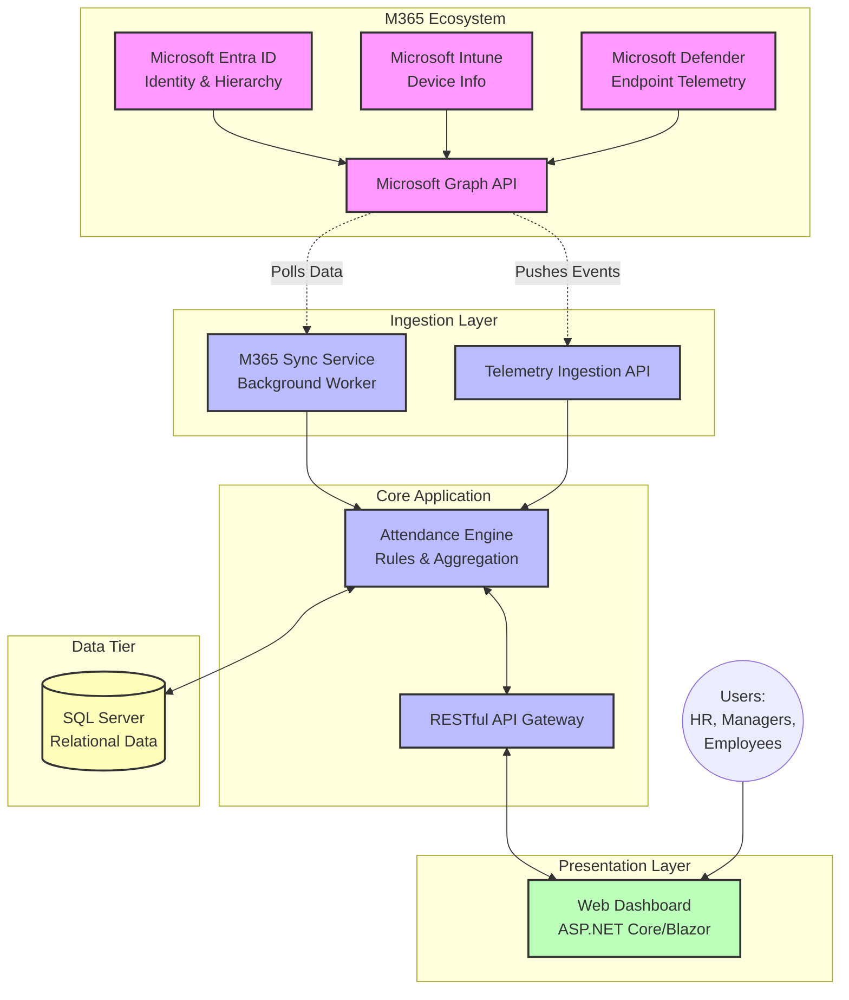

# 01_Project_Overview
**Enterprise Attendance & Workforce Analytics Platform**

## 1. Executive Summary
The Enterprise Attendance & Workforce Analytics Platform is a state-of-the-art, agentless solution designed to automatically and silently track office presence for employees. Built specifically for the Indian deployment (Phase 1), this platform seamlessly integrates with the existing Microsoft 365 ecosystem (including Entra ID, Intune, Defender for Endpoint, and Graph API) alongside corporate network infrastructure. By correlating device network telemetry (Wi-Fi SSID, IP Subnet, VLAN) against configured corporate office network identifiers, the system accurately determines whether employees are working from the office or remotely, without requiring any manual input or endpoint agent installation. 

The core philosophy of this platform is to measure physical **Office Presence**, not productivity. In an era of hybrid work, management requires accurate data to understand office utilization, enforce hybrid work policies, and ensure employee well-being, while maintaining a frictionless experience for the workforce.

## 2. Project Background & Business Context
Ramboll operates with a modern hybrid work culture across its Indian offices. While this flexibility empowers employees, it introduces significant challenges for management and HR in gaining visibility into actual office attendance. Current mechanisms for tracking whether employees are physically in the office versus working from home (WFH) rely on manual entry, access card swipes (which are often incomplete or siloed), or honor-based reporting. These methods are error-prone, administratively burdensome, and lack real-time accuracy.

To effectively manage real estate, optimize office resources, and ensure compliance with the company's hybrid work policy (which expects employees to be in the office a configurable number of days per week, defaulting to 3 days), a reliable, automated tracking system is essential. The Enterprise Attendance Platform addresses this need by leveraging existing Microsoft infrastructure to silently detect office presence, transforming raw network data into actionable workforce analytics.

## 3. Project Objectives
The primary objective of the Enterprise Attendance Platform is to provide accurate, automated attendance data. Key capabilities and metrics to be delivered include:

*   **Office Days Calculation:** Accurately counting the number of days an employee physically attends a corporate office.
*   **WFH Days Calculation:** Inferring work-from-home days based on activity outside corporate network boundaries.
*   **Office Presence Hours:** Calculating the total duration (hours and minutes) an employee spends in the office on a given day.
*   **First Seen / Last Seen:** Recording the precise time of the first network connection and the last network activity within the corporate environment each day.
*   **Daily, Weekly, and Monthly Attendance:** Aggregating attendance data across different time horizons.
*   **Attendance Percentage:** Calculating the ratio of office days to expected office days (or total working days).
*   **Department / Organization Attendance:** Aggregating metrics up the organizational hierarchy for departmental and organizational visibility.
*   **Employee / Team History:** Providing historical attendance records for individual employees and their respective teams.
*   **Executive Analytics:** Delivering high-level dashboards and reports for executive management to drive strategic decisions regarding real estate and workforce policies.

## 4. Project Scope

### 4.1 In Scope
*   **Geographic Scope:** Deployment restricted to Indian offices (Chennai, Noida, Hyderabad, Gurugram, Bangalore).
*   **Integration:** Deep integration with the Microsoft 365 ecosystem (Entra ID for identity and hierarchy, Intune/Defender for endpoint telemetry, Graph API for data access).
*   **Detection Mechanism:** Network-based office detection utilizing SSIDs, IP Subnets, and VLANs to confirm physical presence.
*   **Organizational Context:** Multi-level organizational chart synchronization from Microsoft Entra ID (e.g., Manager A → Manager B → Employee C).
*   **Role-Based Access Control (RBAC):** Implementation of distinct roles (Employee, Manager, Department Head, HR, Administrator, Executive Management) with tailored data visibility.
*   **User Interfaces:** Comprehensive dashboards for all defined roles.
*   **Notifications:** Automated email notifications (e.g., policy compliance alerts, weekly summaries).
*   **Reporting:** Exportable reports (CSV, PDF) for attendance and analytics.

### 4.2 Out of Scope
*   **Global Expansion:** Deployment to offices outside of India is deferred to Phase 2.
*   **Productivity Monitoring:** The system will *not* track active work time, application usage, or productivity metrics.
*   **Activity Tracking:** Keyboard strokes, mouse movement tracking, and screen scraping are strictly excluded.
*   **Mobile Devices:** Tracking presence via mobile devices (smartphones, tablets) is excluded from Phase 1 and slated for Phase 2.
*   **Physical Hardware Integration:** Direct integration with turnstiles or physical access control systems (badge readers) is out of scope for this phase.

## 5. Stakeholders & Actors

| Role | Description | Key Responsibilities/Interests |
| :--- | :--- | :--- |
| **Executive Management** | C-level executives, Regional Directors | High-level analytics, real estate optimization, policy effectiveness. |
| **Human Resources (HR)** | HR Business Partners, HR Managers | Policy compliance, employee well-being, organizational attendance trends. |
| **Department Heads** | Leaders of specific business units | Departmental compliance, resource allocation, team attendance overviews. |
| **Managers** | Direct supervisors of employees | Team attendance tracking, exception management, direct report visibility. |
| **Employees** | Standard workforce members | Viewing own attendance records, ensuring data accuracy. |
| **IT Administration** | System Administrators, Network Engineers | System configuration, network identifier management, health monitoring. |
| **M365 Tenant Admin** | Global Administrators for Microsoft 365 | Configuring API permissions, Entra ID synchronization, security compliance. |

## 6. Key Business Decisions
To ensure project clarity and alignment with organizational values, the following critical business decisions have been made:

1.  **Attendance Definition:** "Work from Office" is strictly defined as physical presence on the corporate office network (LAN/Wi-Fi). It is a measure of location, not productivity.
2.  **VPN Exclusion:** Connecting to the corporate network via VPN from a remote location (e.g., home) does *not* constitute office presence and will not be counted as an office day.
3.  **Silent Tracking:** The tracking mechanism must be entirely agentless from the user's perspective. No software will be installed specifically for this purpose on endpoints, and no user-facing notifications regarding tracking will be presented on the device. All tracking relies on background telemetry correlation.
4.  **Geographic Focus:** The initial rollout is exclusively limited to the defined Indian office locations.
5.  **Multi-Device Merging:** If an employee uses multiple devices within the office (e.g., a laptop and a secondary workstation), all sessions will merge into a single daily attendance record for that employee.

## 7. High-Level Architecture Diagram

## 8. Technology Stack

| Component | Technology | Description |
| :--- | :--- | :--- |
| **Frontend UI** | ASP.NET Core MVC / Blazor | Web interface for dashboards and reporting. |
| **Backend Framework** | ASP.NET Core 8 | High-performance, cross-platform backend services. |
| **Programming Language** | C# 12 | Primary language for backend and business logic. |
| **Database** | Microsoft SQL Server | Relational database for structured data storage. |
| **ORM** | Entity Framework Core 8 | Object-Relational Mapper for database interactions. |
| **Authentication/Authorization**| Microsoft Entra ID, OAuth 2.0, OpenID Connect, JWT | Enterprise identity management and API security. |
| **API Documentation** | Swagger / OpenAPI | Automatic documentation for REST APIs. |
| **Background Processing** | Hosted Services, Quartz.NET | Scheduling and executing background synchronization tasks. |
| **Logging & Monitoring** | Serilog | Structured application logging. |
| **Architecture Pattern** | Clean Architecture, CQRS, DI, SOLID | Ensuring a maintainable, scalable, and testable codebase. |

## 9. Indian Office Locations

| Office Name | City | State | Timezone |
| :--- | :--- | :--- | :--- |
| Ramboll Chennai | Chennai | Tamil Nadu | IST (UTC+5:30) |
| Ramboll Noida | Noida | Uttar Pradesh | IST (UTC+5:30) |
| Ramboll Hyderabad | Hyderabad | Telangana | IST (UTC+5:30) |
| Ramboll Gurugram | Gurugram | Haryana | IST (UTC+5:30) |
| Ramboll Bangalore | Bangalore | Karnataka | IST (UTC+5:30) |

## 10. Project Phases

1.  **Phase 1: Proof of Concept (POC) with Mock Data:** Development of the core engine, database schema, and initial dashboards using simulated network telemetry and organization structures to validate the logic and user interfaces.
2.  **Phase 2: Live M365 Integration:** Connecting the system to the live Microsoft Graph API, Entra ID, and endpoint telemetry sources for a limited pilot group within the Indian offices.
3.  **Phase 3: Production Deployment (India):** Full-scale rollout to all employees across the five specified Indian offices. Activation of all RBAC roles and scheduled reporting.
4.  **Phase 4: Global Expansion (Future):** Scaling the architecture and configuring network identifiers to support global offices and potentially mobile device tracking.

## 11. Project Parameters

### 11.1 Assumptions
*   All employees in scope are assigned a corporate device (laptop) managed by Microsoft Intune and monitored by Defender for Endpoint.
*   The corporate network infrastructure (Wi-Fi, LAN) at all Indian offices is reliable and accurately configured with identifiable SSIDs, subnets, and VLANs.
*   Microsoft Entra ID contains an accurate and up-to-date organizational hierarchy (manager-employee relationships).
*   Necessary API permissions (read-only) will be granted by the M365 Tenant Administrator to access directory and telemetry data.

### 11.2 Risks
*   **Data Latency:** Delays in telemetry data ingestion from Microsoft Graph could result in non-real-time attendance reporting.
*   **Network Changes:** Unannounced modifications to office network configurations (e.g., new SSIDs or subnets) will cause inaccurate tracking until the system is updated.
*   **Privacy Concerns:** Despite being limited to presence tracking, employees may perceive the system as invasive. Clear communication regarding the scope (presence vs. productivity) is crucial.
*   **API Throttling:** High-frequency polling of the Microsoft Graph API may lead to rate limiting.

### 11.3 Dependencies
*   Continuous availability and performance of Microsoft 365 services (Entra ID, Intune, Defender, Graph API).
*   Accurate maintenance of user data and reporting structures within the HRIS/Entra ID.
*   Approval from Infosec and Legal teams regarding data privacy and processing.

### 11.4 Constraints
*   The solution must not install any new agents or software on end-user devices.
*   The system must strictly adhere to the defined "Work from Office" business rules (VPN exclusion).

### 11.5 Future Enhancements
*   Mobile device integration to track presence for employees who primarily use smartphones or tablets.
*   Integration with physical access control systems (turnstiles/badges) for a secondary point of verification.
*   Predictive analytics to forecast office occupancy and assist with real estate planning.
*   Global expansion to all Ramboll locations.

### 11.6 Acceptance Criteria
*   The system accurately identifies office presence with 95%+ accuracy compared to physical verification for a pilot group.
*   VPN connections from outside the office are successfully filtered out and not counted as office days.
*   The multi-level organizational chart correctly limits data visibility based on RBAC rules.
*   Dashboards load within acceptable performance thresholds (e.g., < 3 seconds).
*   End-of-day processes successfully merge multiple device sessions into single daily records.

## 12. References
*   Ramboll Hybrid Work Policy (Internal Document)
*   Microsoft Graph API Documentation
*   Clean Architecture Principles

## 13. Document Revision History

| Version | Date | Author | Changes Made |
| :--- | :--- | :--- | :--- |
| 1.0 | 2026-07-27 | Enterprise Solution Architect | Initial Draft - Project Overview |
