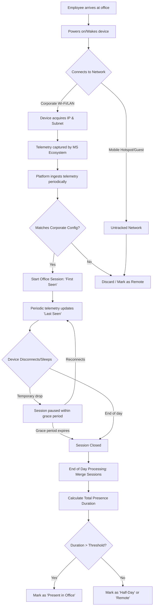
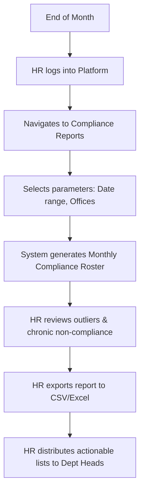
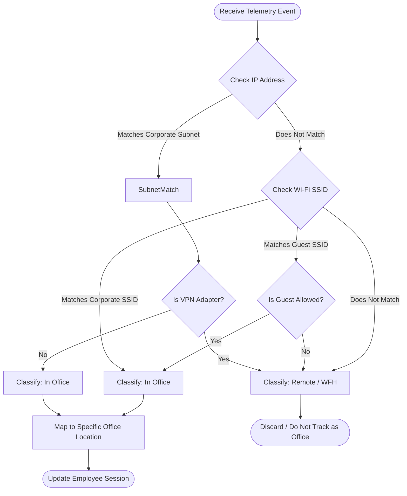

# Enterprise Attendance & Workforce Analytics Platform
## Business Requirements Document (BRD)

---

### 1. Executive Summary

In the post-pandemic era, Ramboll India has instituted a hybrid work policy requiring employees to work from a designated corporate office a minimum of three days per week. However, the organization currently lacks an automated, reliable system to verify physical office attendance. Existing manual tracking mechanisms (such as self-reporting or manager observation) are labor-intensive, error-prone, and inconsistent.

The Enterprise Attendance & Workforce Analytics Platform is a strategic initiative designed to automatically, accurately, and silently track employee physical presence in Ramboll's Indian offices (Chennai, Noida, Hyderabad, Gurugram, and Bangalore). By correlating device network telemetry with known corporate network identifiers (SSIDs, Subnets, VLANs), the system determines whether an employee is working from a corporate office or working remotely (WFH). 

Crucially, the system operates without the need for any endpoint agent installation, relying instead on seamless integration with the Microsoft 365 ecosystem and corporate network infrastructure. The platform will calculate office presence hours, track hybrid policy compliance, provide managers with team visibility, and generate executive-level analytics, thereby enabling data-driven workforce management while minimizing administrative overhead.

---

### 2. Business Problem Statement

Ramboll India's workforce operates under a hybrid model, balancing remote work flexibility with the collaborative benefits of in-office presence. The current policy mandates physical office attendance for a minimum of three days per week. 

**The Core Problems:**
1. **Lack of Automated Verification:** There is no automated mechanism to verify if an employee is physically present in the office. Swiping access cards provides only a partial picture (entry/exit) and does not accurately reflect hours worked at the desk, nor is it consistently integrated with IT systems.
2. **Unreliable Manual Tracking:** Relying on employees to self-report their location or managers to manually take attendance is highly inefficient, subjective, and prone to inaccuracies.
3. **VPN Ambiguity:** Existing IT reports often conflate "connected to VPN from home" with "connected to corporate network in the office," leading to inflated and inaccurate office attendance figures.
4. **Lack of Compliance Visibility:** HR and executive management do not have real-time or historical dashboards to track compliance with the hybrid work policy across different offices, departments, or teams.
5. **Operational Overhead:** The absence of a unified system results in significant administrative burden for HR personnel who must manually collate data for reporting and compliance purposes.

To solve these issues, Ramboll India requires an automated, silent, network-based tracking solution that accurately distinguishes between physical office presence and remote work.

---

### 3. Business Objectives

The project aims to achieve the following primary business objectives, accompanied by measurable Key Performance Indicators (KPIs):

| ID | Objective | Measurable KPI |
|:---|:---|:---|
| **BR-001** | **Automatically determine office vs. WFH days per employee** | 100% of employees in the 5 Indian offices tracked daily with >95% accuracy compared to physical security logs. |
| **BR-002** | **Calculate office presence hours** | Accurately compute total office duration (First Seen to Last Seen minus standard break deductions) for 100% of detected office days. |
| **BR-003** | **Track hybrid policy compliance** | Provide daily/weekly compliance scoring (target: 3 days/week) for all employees, teams, and departments. |
| **BR-004** | **Provide manager visibility into team attendance** | 100% of managers can access a unified dashboard displaying their direct and indirect reports' attendance status. |
| **BR-005** | **Generate automated weekly/monthly reports** | Zero manual effort required by HR to generate standard compliance reports by the 1st of every month. |
| **BR-006** | **Enable executive-level workforce analytics** | Executives have access to aggregated, anonymized (where required), high-level trends across all 5 offices. |
| **BR-007** | **Zero endpoint agent installation** | 0 new software agents deployed to employee devices specifically for this tracking purpose. |

---

### 4. Business Actors & Their Goals

The system will serve multiple stakeholders, each with distinct roles, goals, and access levels based on the Role-Based Access Control (RBAC) matrix.

| Role | Description | Primary Goals | Access Level |
|:---|:---|:---|:---|
| **Employee** | Standard staff member in an Indian office. | - View their own attendance records and compliance status.<br>- Understand their hybrid work metrics.<br>- Raise discrepancies or exceptions (e.g., client site visits). | **Self-Service:** Can view only their own data. |
| **Manager** | Immediate supervisor of employees (multi-level). | - Monitor daily/weekly office attendance of direct & indirect reports.<br>- Identify patterns of non-compliance.<br>- Approve/reject attendance exception requests. | **Team View:** Can view data for all downstream reports in the Entra ID hierarchy. |
| **Department Head** | Leader of a specific business unit or practice. | - Monitor overall department compliance with the hybrid policy.<br>- Compare team performance within the department.<br>- Optimize department workspace utilization. | **Department View:** Can view aggregated and detailed data for the entire department. |
| **HR Partner** | Human Resources representative. | - Track company-wide policy adherence.<br>- Identify chronic non-compliance cases for intervention.<br>- Generate official compliance reports for payroll/disciplinary actions. | **Global Read:** Can view data for all employees across all Indian offices. |
| **Administrator** | IT or System Admin responsible for the platform. | - Configure corporate network identifiers (SSIDs, Subnets).<br>- Manage system settings (grace periods, break deductions).<br>- Monitor system health and synchronization logs. | **System Admin:** Full read/write access to all configurations and data. |
| **Executive** | C-Level or Senior Management. | - Analyze high-level workforce trends.<br>- Make data-driven decisions on office real estate and capacity planning.<br>- Assess the overall success of the hybrid work model. | **Executive Analytics:** High-level dashboards, aggregated data, trend analysis. |

---

### 5. Business Process Workflows

#### 5.1 Employee Daily Attendance Lifecycle



#### 5.2 Manager Weekly Review Workflow

```mermaid
flowchart TD
    A[Manager receives weekly summary email] --> B[Logs into Attendance Platform]
    B --> C[Views Team Dashboard]
    C --> D{Reviews Compliance}
    D -->|Compliant| E[No action needed]
    D -->|Non-Compliant| F[Drill down to specific employee]
    F --> G[Review detailed daily logs]
    G --> H{Discuss with Employee?}
    H -->|Yes| I[Schedule 1:1 meeting]
    H -->|No| J[Monitor for future weeks]
    I --> K[Employee submits exception (e.g., Client Visit)]
    K --> L[Manager approves exception in system]
    L --> M[System recalculates compliance score]
```

#### 5.3 HR Monthly Compliance Workflow



#### 5.4 Admin Configuration Workflow

```mermaid
flowchart TD
    A[New Office Network Segment Added] --> B[Admin logs into Platform]
    B --> C[Navigates to Network Configuration]
    C --> D[Selects Office Location (e.g., Chennai)]
    D --> E[Adds new Subnet / VLAN / SSID]
    E --> F[Saves Configuration]
    F --> G[System clears cached routing rules]
    G --> H[New telemetry evaluated against updated rules immediately]
```

---

### 6. Business Rules

The system must strictly adhere to the following business rules to ensure accurate, fair, and consistent tracking.

#### 6.1 Network Classification Rules
- **BR-001:** An employee is classified as "In Office" ONLY if their device's active network connection matches a pre-configured corporate network identifier (SSID, IP Subnet, or VLAN) for one of the Indian office locations.
- **BR-002:** Connections via VPN (Virtual Private Network) from a remote location MUST NOT be classified as "In Office," even if the VPN assigns an IP address from a corporate subnet. The system must distinguish between physical LAN/WLAN connections and virtual VPN adapters.
- **BR-003:** Connections to "Guest" Wi-Fi networks at the office DO NOT count towards office presence unless explicitly configured by the Administrator.
- **BR-004:** If an employee visits an office other than their base location (e.g., a Chennai employee visits the Bangalore office), their presence MUST be recorded and credited as an "In Office" day.

#### 6.2 Session Management Rules
- **BR-005:** A daily attendance session begins ("First Seen") the moment a device connects to a recognized corporate network and telemetry is recorded.
- **BR-006:** The session remains active and the "Last Seen" timestamp is continuously updated as long as subsequent telemetry confirms connection to the corporate network.
- **BR-007:** If telemetry indicates a disconnection (e.g., device sleep, moving out of range), the session is temporarily paused.
- **BR-008:** At the end of the calendar day (23:59:59 IST), all active or paused sessions for the day are permanently closed.

#### 6.3 Grace Period Rules
- **BR-009:** A configurable "Network Drop Grace Period" (default: 30 minutes) shall be applied to handle brief disconnections (e.g., walking between meeting rooms, rebooting, brief network outages).
- **BR-010:** If a device disconnects and reconnects within the Grace Period, the session is treated as continuous, and the gap is included in the total presence duration.
- **BR-011:** If a device disconnects and reconnects after the Grace Period has expired, a new distinct session is created for that day. The gap time between sessions is NOT included in the total presence duration.

#### 6.4 Multi-Device Rules
- **BR-012:** If an employee uses multiple corporate devices (e.g., a primary laptop and a secondary test laptop) on the corporate network simultaneously, their sessions MUST be merged.
- **BR-013:** An employee cannot accrue more than 1 hour of presence for 1 hour of real time, regardless of how many devices are connected. Overlapping sessions from multiple devices are flattened into a single timeline.

#### 6.5 Compliance Calculation Rules
- **BR-014:** To be marked as "Present - Full Day," an employee must accumulate a minimum of 4.5 hours of net presence duration in a single day.
- **BR-015:** To be marked as "Present - Half Day," an employee must accumulate between 2.0 and 4.49 hours of net presence duration in a single day.
- **BR-016:** Any presence under 2.0 hours is considered insufficient and the day is marked as "Remote/Absent."
- **BR-017:** The default hybrid policy target is 3 "Present - Full Day" equivalents per calendar week (Monday to Sunday). Two "Half Days" equate to one "Full Day".
- **BR-018:** Approved exceptions (e.g., Client Visit, Sick Leave logged in HRMS) shall offset the 3-day target for that specific week.

#### 6.6 Reporting Rules
- **BR-019:** All reports must default to the IST (Indian Standard Time) timezone.
- **BR-020:** Reports must clearly delineate between Net Presence Hours (actual time on network) and Gross Duration (First Seen to Last Seen).
- **BR-021:** Managers can only view aggregated and detailed reports for their organizational sub-tree.

#### 6.7 Email Notification Rules
- **BR-022:** The system shall automatically send a weekly attendance summary email to all managers on Monday at 9:00 AM IST, detailing the previous week's compliance for their direct reports.
- **BR-023:** The system shall automatically send a monthly compliance digest to Department Heads and HR Partners on the 1st of every month.

#### 6.8 Role-Based Access Control (RBAC) Rules
- **BR-024:** Organization hierarchy must be automatically synchronized daily from Microsoft Entra ID.
- **BR-025:** Access to employee data is strictly governed by the synced Entra ID reporting structure. Manager A can see Employee B only if B rolls up to A in the Entra ID hierarchy.
- **BR-026:** Manual override of roles (e.g., assigning HR privileges) is permitted only by System Administrators.

#### 6.9 Data Retention Rules
- **BR-027:** Raw telemetry data shall be retained for 90 days.
- **BR-028:** Aggregated daily attendance records (First Seen, Last Seen, Duration, Status) shall be retained for 3 years to support historical compliance reporting.

---

### 7. Office Network Classification Logic

The core logic of the platform revolves around correctly classifying network connections. This section details how physical presence is determined.

#### 7.1 Classification Decision Tree



#### 7.2 Network Identification Methods

The system will utilize multiple datapoints from the Microsoft ecosystem (Intune, Defender for Endpoint) to evaluate the network connection.

| Method | Reliability | Description | Handling |
|:---|:---|:---|:---|
| **Wi-Fi SSID** | High | Matches the name of the wireless network. | Primary method for wireless users. E.g., `Ramboll-Corp-Wifi`. |
| **IP Subnet** | High | Matches the client IP against known CIDR blocks. | Primary method for wired (LAN) users. |
| **Default Gateway MAC (BSSID)** | Very High | Matches the MAC address of the physical access point or router. | Used to prevent SSID spoofing at home (e.g., user names their home wifi `Ramboll-Corp-Wifi`). |
| **Network Adapter Type** | High | Identifies virtual adapters (VPN, Hyper-V) vs. physical Wi-Fi/Ethernet adapters. | Crucial for filtering out VPN connections that assign corporate IPs. |

#### 7.3 Per-Office Network Configuration Examples

The Administrator must maintain a mapping table similar to the following to define the physical boundaries of each office.

| Office Location | Recognized SSIDs | Recognized Subnets (CIDR) | Excluded Subnets (VPN/Guest) |
|:---|:---|:---|:---|
| **Chennai** | `RAM-CHN-CORP`, `RAM-SECURE` | `10.101.0.0/16`, `10.102.0.0/16` | `10.101.250.0/24` (VPN), `RAM-CHN-GUEST` |
| **Noida** | `RAM-NDA-CORP` | `10.201.0.0/16` | `10.201.250.0/24` (VPN) |
| **Hyderabad** | `RAM-HYD-CORP`, `RAM-HYD-ENG`| `10.301.0.0/16`, `10.302.0.0/16` | `10.301.250.0/24` (VPN) |
| **Gurugram** | `RAM-GUR-CORP` | `10.401.0.0/16` | `10.401.250.0/24` (VPN) |
| **Bangalore** | `RAM-BLR-CORP` | `10.501.0.0/16` | `10.501.250.0/24` (VPN) |

*(Note: Data above is illustrative. Actual subnets must be configured during deployment).*

---

### 8. Indian Office Attendance Policies

The platform's calculations must align with Ramboll India's standard working hours and policies.

- **Standard Working Hours:** 9:30 AM to 6:30 PM IST (9 hours).
- **Mandatory Break Deduction:** A standard 1-hour lunch/break deduction is applied to any continuous presence exceeding 6 hours.
  - *Example:* First Seen 9:00 AM, Last Seen 6:00 PM = 9 hours gross. Net Presence = 8 hours.
- **Flexibility:** Employees are not strictly required to arrive by 9:30 AM, provided they meet the minimum net presence hours (4.5 hours for a full day) within the calendar day.
- **Weekends and Public Holidays:** Attendance on Saturdays, Sundays, and official Indian public holidays is NOT required for compliance, but if an employee attends, it counts positively towards their weekly total.

---

### 9. Edge Cases & Expected Behavior

| Case ID | Scenario | Expected System Behavior |
|:---|:---|:---|
| **EC-01** | Employee works from a cafe and connects to VPN. | Connection is classified as Remote. Zero office hours logged. |
| **EC-02** | Employee forgets laptop and works on a colleague's machine. | Unless the colleague's machine is authenticated as the employee in Entra, no attendance is logged. (Platform tracks *devices* tied to *users*). |
| **EC-03** | Employee uses multiple devices (Laptop + Mobile via Intune). | Sessions are merged. Overlapping time is flattened. Max 1 hour logged per 1 real hour. |
| **EC-04** | Employee works 3 hours in the morning, leaves, and returns for 3 hours in the afternoon. | Two sessions are recorded. Gap time is excluded. Total presence = 6 hours. Result: Full Day Present. |
| **EC-05** | Network outage in the office prevents telemetry upload. | Devices cache telemetry and upload when the connection is restored. Backend processes historical logs asynchronously and updates attendance retroactively. |
| **EC-06** | User changes their home Wi-Fi name to match the corporate SSID. | System detects the mismatch in Default Gateway MAC/BSSID or IP Subnet and rejects the telemetry as spoofed. |
| **EC-07** | Employee leaves device on desk overnight. | End of day job cuts the session at 23:59:59. If the device remains active, a new session starts at 00:00:00 the next day. |
| **EC-08** | Employee moves to a new manager mid-week. | Entra ID sync updates the hierarchy. The new manager sees the employee's data for the entire week; the old manager loses access. |

---

### 10. Constraints and Dependencies

#### Constraints
1. **No Agent Installation:** The solution must rely entirely on existing infrastructure (Microsoft 365, Entra ID, Intune, Defender) and cannot require custom software installation on employee endpoints.
2. **Privacy Compliance:** The system must not track physical location (GPS) outside the office, nor monitor application usage, keystrokes, or productivity metrics. It is strictly an "office network presence" tracker.
3. **Microsoft API Limits:** The platform must respect rate limits and throttling guidelines imposed by the Microsoft Graph API.

#### Dependencies
1. **Microsoft 365 Licensing:** Requires employees to have appropriate M365 licenses (e.g., E3/E5) that provide Intune/Defender telemetry.
2. **Entra ID Accuracy:** The accuracy of the Manager Dashboard is 100% dependent on the accuracy of the organizational hierarchy maintained in Microsoft Entra ID.
3. **Network Infrastructure:** Network engineering teams must provide accurate, up-to-date lists of all corporate subnets, VLANs, and SSIDs.

---

### 11. Assumptions

1. All employees utilize company-issued devices that are enrolled in Microsoft Intune and/or Microsoft Defender for Endpoint.
2. The network telemetry generated by these Microsoft services is near-real-time (typically within 15-30 minutes).
3. Employees connect to the corporate network via Wi-Fi or LAN when in the office. If they rely exclusively on personal 4G/5G mobile hotspots while physically in the office, the system will not detect them as present.
4. The Indian offices operate on a standard Monday-Friday work week for compliance calculation purposes.

---

### 12. Risks and Mitigation

| Risk | Impact | Likelihood | Mitigation Strategy |
|:---|:---|:---|:---|
| **Data Latency:** Microsoft APIs delay telemetry delivery by several hours. | High | Medium | Build a robust backend processor that can asynchronously recalculate attendance when late data arrives. Dashboards must indicate "Data as of [Time]". |
| **Hierarchy Data Issues:** Entra ID manager data is outdated or incorrect. | High | High | Implement a fallback mechanism and provide HR with an exception report for "Orphaned Employees" (no manager assigned). |
| **False Positives (Spoofing):** Employees bypass the system by renaming home networks. | Medium | Low | Utilize secondary validation (BSSID, Subnet checks, Intune network type properties) to prevent simple SSID spoofing. |
| **API Deprecation:** Microsoft changes or deprecates the APIs used for telemetry. | High | Low | Use stable, versioned Microsoft Graph API endpoints. Decouple the ingestion layer from the core business logic via Clean Architecture. |

---

### 13. Future Enhancements

While outside the scope of Phase 1, the following features are considered for future iterations:
1. **HRMS Integration:** Direct, automated bidirectional sync with the HR Management System (e.g., Workday) to automatically pull approved leaves (annual, sick) and offset attendance targets without manual exception entry.
2. **Physical Security Integration:** Correlation with turnstile / access card badge data to cross-reference network presence with physical entry logs.
3. **Space Utilization Analytics:** Heatmaps showing peak occupancy times across different office floors or zones to assist Real Estate teams.
4. **Mobile App:** A companion mobile application for managers to quickly view team compliance on the go.

---

### 14. Acceptance Criteria

The project will be considered successful and ready for production deployment when the following criteria are met:
1. The platform correctly identifies office vs. remote connections for a pilot group of 100 users across 3 offices for a continuous 2-week period with >95% accuracy.
2. The platform successfully filters out all VPN connections, logging zero false-positive office hours for remote VPN users.
3. The Manager Dashboard correctly displays the organizational hierarchy as defined in Entra ID, applying strict data boundaries based on RBAC rules.
4. End-of-day batch processing (session merging and compliance calculation) completes successfully for a load test of 10,000 simulated users in under 60 minutes.
5. All required documentation (Architecture, Deployment, Operations Manuals) is completed and handed over to the support team.
6. A penetration test yields zero high or critical security vulnerabilities.

---
*Document Version: 1.0*
*Status: Approved*
*Date: 27-July-2026*
