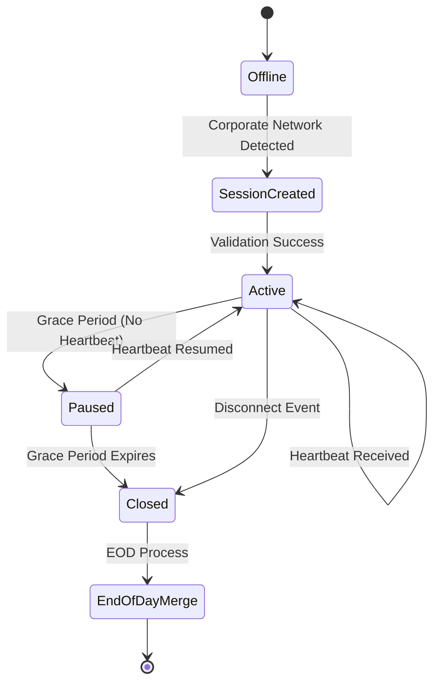
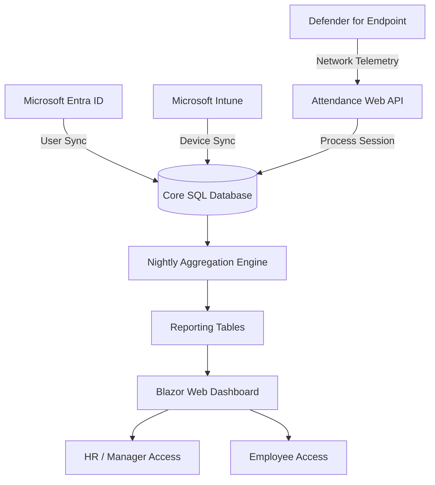
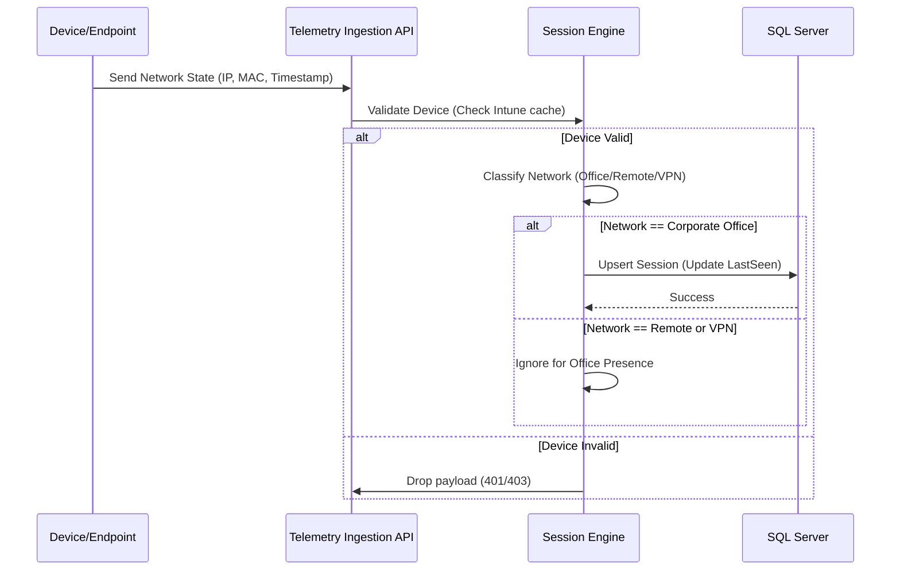

# Enterprise Attendance & Workforce Analytics Platform
## Software Requirements Specification: Functional Requirements

---

## 1. Executive Summary

This Functional Requirements Specification (FRS) outlines the detailed functional capabilities, behaviors, and features of the **Enterprise Attendance & Workforce Analytics Platform**. The platform is designed to track, manage, and analyze employee presence in corporate office environments, specifically targeting the Indian office locations (Chennai, Noida, Hyderabad, Gurugram, and Bangalore).

By leveraging a background telemetry-based approach through integrations with Microsoft 365 services (Entra ID, Intune, Defender for Endpoint, Graph API), the system automatically tracks office attendance based on network connectivity, avoiding the need for manual check-ins, endpoint agent installations, or user notifications. 

The primary goal of these functional requirements is to provide comprehensive, unambiguous instructions for the engineering and development teams to implement the core business logic, synchronization mechanisms, attendance engines, and reporting dashboards.

---

## 2. Actors and Stakeholders

| Actor | Description |
|-------|-------------|
| **Employee** | The individual whose attendance is being tracked. Can view their own attendance metrics. |
| **Manager** | Oversees a team of employees. Can view attendance metrics for their direct and indirect reports. |
| **Department Head** | Oversees multiple teams/managers. Can view aggregated metrics for the department. |
| **HR / Operations** | Manages system configurations, generates compliance reports, and handles edge cases. |
| **Administrator** | Manages technical system configurations (e.g., network identifiers), integrations, and access roles. |
| **Executive Management** | Requires high-level organizational analytics and trends. |
| **System** | Background processes handling telemetry, session merging, and synchronization. |

---

## 3. Functional Requirements

### FR-100: User Management & Synchronization

This category covers the automated synchronization of user data from Microsoft Entra ID.

#### FR-101: Sync employees from Entra ID
* **Title:** Synchronize India Office Employees
* **Description:** The system must periodically (e.g., nightly) synchronize user accounts from Microsoft Entra ID. The sync must filter out users who do not belong to the supported Indian offices (Chennai, Noida, Hyderabad, Gurugram, Bangalore).
* **Priority:** Must
* **Actors:** System
* **Pre-conditions:** Connection to Entra ID via Graph API is configured.
* **Post-conditions:** Local user database is updated with the latest Entra ID data for India employees.
* **Business Rules:** BR-LOC-01 (Only process India offices)
* **Acceptance Criteria:**
  * System connects to Graph API.
  * System filters users based on the `physicalDeliveryOfficeName` or equivalent attribute matching the allowed cities.
  * Users outside these cities are ignored.

#### FR-102: Sync departments
* **Title:** Synchronize Department Structures
* **Description:** The system must extract the `department` attribute for all synced users and maintain a definitive list of departments.
* **Priority:** Must
* **Actors:** System
* **Pre-conditions:** FR-101 completes successfully.
* **Post-conditions:** Department list is updated and users are associated with the correct department.
* **Business Rules:** N/A
* **Acceptance Criteria:** Department names are accurate and duplicate entries are avoided.

#### FR-103: Sync managers and reporting hierarchy
* **Title:** Synchronize Manager Associations
* **Description:** The system must query the `manager` property in Entra ID for all synchronized employees to establish the reporting structure.
* **Priority:** Must
* **Actors:** System
* **Pre-conditions:** Employees are synced (FR-101).
* **Post-conditions:** Each employee record points to their correct manager.
* **Business Rules:** BR-HIER-01 (Managers missing from Entra ID trigger a warning log).
* **Acceptance Criteria:** Manager foreign keys are populated correctly in the local DB.

#### FR-104: Auto-build Org Chart tree
* **Title:** Generate Organizational Hierarchy Tree
* **Description:** Based on the manager synchronization, the system must build and cache an in-memory or materialized tree structure representing the full organizational chart for fast traversal.
* **Priority:** Must
* **Actors:** System
* **Pre-conditions:** FR-103 is complete.
* **Post-conditions:** Org chart structure is available for quick queries (e.g., finding all direct and indirect reports).
* **Business Rules:** N/A
* **Acceptance Criteria:** Querying for "all reports of Manager X" returns the correct list in under 500ms.

#### FR-105: Filter by office location (India only)
* **Title:** Strict Filtering by Supported Locations
* **Description:** The system must enforce a global filter rejecting any user data where the office location is not one of: Chennai, Noida, Hyderabad, Gurugram, Bangalore.
* **Priority:** Must
* **Actors:** System
* **Pre-conditions:** Entra ID sync initiated.
* **Post-conditions:** No non-India users exist in the active tracking tables.
* **Business Rules:** BR-LOC-01
* **Acceptance Criteria:** Manual injection of a non-India user is flagged and ignored by the sync process.

#### FR-106: Handle employee transfers between offices
* **Title:** Employee Location Transfer Processing
* **Description:** If an employee moves between supported Indian offices, their location metadata must update, and their past attendance data must remain tied to the location they were at during that time.
* **Priority:** Should
* **Actors:** System
* **Pre-conditions:** User location changes in Entra ID.
* **Post-conditions:** System logs a transfer event and updates the user's current location.
* **Business Rules:** N/A
* **Acceptance Criteria:** Historical reports show the old location; new reports show the new location.

#### FR-107: Handle employee termination/deactivation
* **Title:** Employee Deactivation Sync
* **Description:** When a user is disabled or deleted in Entra ID, the system must mark their local profile as inactive, stopping further attendance tracking but preserving historical data.
* **Priority:** Must
* **Actors:** System
* **Pre-conditions:** User disabled in Entra ID.
* **Post-conditions:** User marked `IsActive = false`.
* **Business Rules:** N/A
* **Acceptance Criteria:** Deactivated users no longer appear in active employee rosters but remain in historical aggregated reports.

---

### FR-200: Device Management

#### FR-201: Sync managed devices from Intune
* **Title:** Intune Device Synchronization
* **Description:** The system must fetch device details (Device ID, MAC, assigned user, compliance state) from Microsoft Intune.
* **Priority:** Must
* **Actors:** System
* **Pre-conditions:** Intune API access granted.
* **Post-conditions:** Device table updated with current Intune devices.
* **Business Rules:** N/A
* **Acceptance Criteria:** All corporate-managed devices are visible in the database.

#### FR-202: Track device compliance status
* **Title:** Device Compliance Tracking
* **Description:** System must record whether a device is compliant according to Intune policies.
* **Priority:** Should
* **Actors:** System
* **Pre-conditions:** FR-201 is functional.
* **Post-conditions:** Compliance status is updated daily.
* **Business Rules:** BR-DEV-01 (Non-compliant devices may flag a warning).
* **Acceptance Criteria:** Admin can view a list of non-compliant devices.

#### FR-203: Associate devices to employees
* **Title:** Device to User Mapping
* **Description:** The system links synced devices to the specific employee utilizing the device based on the `userPrincipalName` mapping in Intune.
* **Priority:** Must
* **Actors:** System
* **Pre-conditions:** Users and devices are synced.
* **Post-conditions:** 1-to-many relationship established between User and Devices.
* **Business Rules:** N/A
* **Acceptance Criteria:** Devices correctly map to the user who logs into them.

#### FR-204: Handle device replacement
* **Title:** Device Lifecycle Management
* **Description:** If an employee receives a new device and the old one is wiped/removed, the system must transition tracking to the new device and unassign the old one.
* **Priority:** Must
* **Actors:** System
* **Pre-conditions:** Intune reflects the device swap.
* **Post-conditions:** Old device marked unassigned; new device assigned.
* **Business Rules:** N/A
* **Acceptance Criteria:** Telemetry from the new device is processed; old device telemetry is ignored unless reassigned.

#### FR-205: Handle multiple devices per employee
* **Title:** Multi-Device Support
* **Description:** An employee may have multiple devices (e.g., laptop and corporate mobile). The system must track all associated devices.
* **Priority:** Must
* **Actors:** System
* **Pre-conditions:** Employee has multiple devices in Intune.
* **Post-conditions:** Both devices are linked to the same user profile.
* **Business Rules:** N/A
* **Acceptance Criteria:** Employee profile displays all active assigned devices.

#### FR-206: Reject telemetry from non-compliant/unmanaged devices
* **Title:** Unmanaged Device Rejection
* **Description:** If telemetry (e.g., from network logs) is received for a MAC/IP address not found in the synced Intune database, it must be ignored or flagged as unknown.
* **Priority:** Must
* **Actors:** System
* **Pre-conditions:** Network logs received.
* **Post-conditions:** Unknown MAC/IPs do not generate attendance records.
* **Business Rules:** BR-SEC-01
* **Acceptance Criteria:** Only corporate-managed devices count towards attendance.

---

### FR-300: Network Detection & Classification

#### FR-301: Classify network as Corporate Office / Remote / VPN / Unknown
* **Title:** Network Classification Engine
* **Description:** The system must analyze incoming connection telemetry to classify the origin network into one of four categories based on configured parameters.
* **Priority:** Must
* **Actors:** System
* **Pre-conditions:** Network configurations are set up by Admin.
* **Post-conditions:** Connection payload is tagged with the correct network type.
* **Business Rules:** BR-NET-01 (VPN is classified as Remote).
* **Acceptance Criteria:** Accurate tagging of incoming connections based on IP/Subnet/VLAN rules.

#### FR-302: Support configurable network identifiers per office (SSID, Subnet, VLAN, IP Range)
* **Title:** Dynamic Network Definitions
* **Description:** The system must allow configuring the identifying network characteristics for each supported Indian office.
* **Priority:** Must
* **Actors:** Administrator
* **Pre-conditions:** Admin access.
* **Post-conditions:** Network identifiers are saved and active.
* **Business Rules:** N/A
* **Acceptance Criteria:** System routes telemetry to the correct office location based on IP matching.

#### FR-303: VPN from remote MUST be classified as WFH, NOT office
* **Title:** VPN Exclusion from Office Presence
* **Description:** VPN subnets must be explicitly defined. Connections matching VPN subnets must NOT count towards physical office presence.
* **Priority:** Must
* **Actors:** System
* **Pre-conditions:** VPN subnets are configured.
* **Post-conditions:** VPN sessions log as WFH.
* **Business Rules:** BR-ATT-02 (VPN != Office).
* **Acceptance Criteria:** A user connected via VPN shows 0 hours of office presence.

#### FR-304: Support multiple network identifiers per office location
* **Title:** Multi-Subnet Office Support
* **Description:** A single office (e.g., Chennai) may have multiple Wi-Fi SSIDs, VLANs, and IP ranges. The system must support mapping multiple identifiers to a single location.
* **Priority:** Must
* **Actors:** Administrator
* **Pre-conditions:** N/A
* **Post-conditions:** Multiple subnets correctly resolve to the same office.
* **Business Rules:** N/A
* **Acceptance Criteria:** Telemetry from `10.1.x.x` and `10.2.x.x` both resolve to Chennai if configured.

#### FR-305: Admin can add/edit/delete network configurations
* **Title:** Network Configuration Management UI
* **Description:** The web interface must provide a CRUD interface for network configurations.
* **Priority:** Must
* **Actors:** Administrator
* **Pre-conditions:** Logged in as Admin.
* **Post-conditions:** Database `NetworkConfigurations` table is updated.
* **Business Rules:** N/A
* **Acceptance Criteria:** Admin can successfully add a new subnet for the Hyderabad office.

#### FR-306: Network classification audit logging
* **Title:** Network Change Auditing
* **Description:** All changes to network configurations must be audited (who, what, when, previous value, new value).
* **Priority:** Should
* **Actors:** System
* **Pre-conditions:** Admin alters network config.
* **Post-conditions:** Audit record inserted.
* **Business Rules:** BR-AUD-01
* **Acceptance Criteria:** Audit logs show the exact changes made to any subnet definition.

---

### FR-400: Attendance Session Engine

#### FR-401: Create session on corporate network connect
* **Title:** Session Initialization
* **Description:** When the first telemetry ping is received from a recognized device on a corporate network, a new `AttendanceSession` must be created.
* **Priority:** Must
* **Actors:** System
* **Pre-conditions:** Device connects to office network.
* **Post-conditions:** Session record created with `StartTime`.
* **Business Rules:** BR-SESS-01
* **Acceptance Criteria:** DB reflects a new session row.

#### FR-402: Update Last Seen while connected
* **Title:** Session Heartbeat
* **Description:** As periodic telemetry is received, the system updates the `LastSeen` timestamp of the active session.
* **Priority:** Must
* **Actors:** System
* **Pre-conditions:** Session is Active.
* **Post-conditions:** `LastSeen` is updated to the timestamp of the latest ping.
* **Business Rules:** N/A
* **Acceptance Criteria:** Session end time continuously rolls forward while device is connected.

#### FR-403: Close session on sleep/hibernate/shutdown/disconnect
* **Title:** Explicit Session Termination
* **Description:** If an explicit disconnect or power event is detected via Defender/Intune logs, the session is immediately closed.
* **Priority:** Must
* **Actors:** System
* **Pre-conditions:** Active session exists.
* **Post-conditions:** Session status changes to Closed; `EndTime` finalized.
* **Business Rules:** N/A
* **Acceptance Criteria:** Explicit disconnect closes session without waiting for grace period.

#### FR-404: Grace period handling (configurable, default 30 min)
* **Title:** Implicit Session Timeout
* **Description:** If no telemetry is received for a configured grace period, the session is closed retroactively to the last seen time.
* **Priority:** Must
* **Actors:** System
* **Pre-conditions:** Configurable grace period setting.
* **Post-conditions:** Stale sessions are closed automatically.
* **Business Rules:** BR-SESS-02
* **Acceptance Criteria:** Device loses connection; session closes 30 mins later, but `EndTime` equals the exact time of disconnection.

#### FR-405: End-of-day session merge
* **Title:** Daily Session Aggregation
* **Description:** A nightly job must run to consolidate all discrete sessions for a given user on a given day into a single `DailyAttendanceRecord`.
* **Priority:** Must
* **Actors:** System
* **Pre-conditions:** Day ends (e.g., midnight).
* **Post-conditions:** Daily record created.
* **Business Rules:** N/A
* **Acceptance Criteria:** Multiple disjointed sessions (e.g., morning and afternoon) sum up correctly.

#### FR-406: Multi-device session merge
* **Title:** Overlapping Device Sessions
* **Description:** If a user connects via two devices simultaneously (e.g., laptop and phone), the system must merge the overlapping time windows so the user is not credited with double hours.
* **Priority:** Must
* **Actors:** System
* **Pre-conditions:** User has concurrent sessions on multiple devices.
* **Post-conditions:** Total calculated time reflects physical wall-clock time, not sum of device times.
* **Business Rules:** BR-ATT-03
* **Acceptance Criteria:** 1 hour of overlapping connection equals exactly 1 hour of attendance.

#### FR-407: Calculate Office Presence Hours (active time only, exclude breaks)
* **Title:** Net Presence Calculation
* **Description:** The system must sum the durations of all merged sessions to calculate total office presence hours, automatically excluding gaps (breaks, lunches) where no session was active.
* **Priority:** Must
* **Actors:** System
* **Pre-conditions:** EOD process running.
* **Post-conditions:** `TotalOfficeHours` field is updated.
* **Business Rules:** N/A
* **Acceptance Criteria:** Gaps > grace period do not count towards total hours.

#### FR-408: First Seen / Last Seen timestamps
* **Title:** Daily Boundary Tracking
* **Description:** The system must identify the absolute earliest `StartTime` and absolute latest `EndTime` across all sessions for a user on a given day.
* **Priority:** Should
* **Actors:** System
* **Pre-conditions:** EOD process.
* **Post-conditions:** `FirstIn` and `LastOut` fields populated on the daily record.
* **Business Rules:** N/A
* **Acceptance Criteria:** UI displays correct first-in and last-out times.

#### FR-409: Confidence scoring
* **Title:** Session Confidence Metric
* **Description:** Assign a confidence score (0-100%) to the daily record based on telemetry density (e.g., how many pings were received vs. expected).
* **Priority:** Could
* **Actors:** System
* **Pre-conditions:** Session data available.
* **Post-conditions:** Confidence score computed.
* **Business Rules:** N/A
* **Acceptance Criteria:** Sparse data yields low confidence; continuous data yields high confidence.

---

### FR-500: Attendance Aggregation

#### FR-501: Daily attendance record
* **Title:** Daily Status Determination
* **Description:** System evaluates the daily total hours against a threshold to mark the day as "Office", "WFH", or "Absent".
* **Priority:** Must
* **Actors:** System
* **Pre-conditions:** EOD merge complete.
* **Post-conditions:** `Status` assigned (e.g., > 4 hours = Office day).
* **Business Rules:** BR-ATT-04 (Configurable minimum hours to qualify as a full office day).
* **Acceptance Criteria:** 5 hours present marks day as Office; 2 hours present marks day as WFH/Partial.

#### FR-502: Weekly summary (Office Days count, WFH days count)
* **Title:** Weekly Aggregation Rollup
* **Description:** At the end of the week, sum up the total Office days and WFH days for each employee.
* **Priority:** Must
* **Actors:** System
* **Pre-conditions:** Daily records exist.
* **Post-conditions:** `WeeklySummary` table updated.
* **Business Rules:** BR-POL-01 (Policy expects 3 days in office).
* **Acceptance Criteria:** Summary shows X days in office, Y days remote.

#### FR-503: Monthly summary
* **Title:** Monthly Aggregation Rollup
* **Description:** Aggregate weekly data into a monthly view for long-term trending.
* **Priority:** Must
* **Actors:** System
* **Pre-conditions:** Weekly records exist.
* **Post-conditions:** `MonthlySummary` updated.
* **Business Rules:** N/A
* **Acceptance Criteria:** HR can query monthly compliance accurately.

#### FR-504: Attendance percentage calculation
* **Title:** Compliance Percentage
* **Description:** Calculate the ratio of actual office days vs. expected office days (e.g., Expected 12 days/month, Actual 9 days = 75% compliance).
* **Priority:** Must
* **Actors:** System
* **Pre-conditions:** Monthly summary complete.
* **Post-conditions:** Percentage calculated.
* **Business Rules:** N/A
* **Acceptance Criteria:** System accurately reflects 100% compliance if user meets or exceeds expected days.

#### FR-505: Department-level aggregation
* **Title:** Department Averages
* **Description:** Roll up attendance metrics across all users within a specific department.
* **Priority:** Must
* **Actors:** System
* **Pre-conditions:** User data aggregated.
* **Post-conditions:** Department averages available.
* **Business Rules:** N/A
* **Acceptance Criteria:** Dashboard shows "Engineering Dept: 82% Office Compliance".

#### FR-506: Organization-level aggregation
* **Title:** Enterprise Metrics
* **Description:** Aggregate data globally across all Indian offices for executive view.
* **Priority:** Must
* **Actors:** System
* **Pre-conditions:** All aggregations complete.
* **Post-conditions:** High-level metrics cached.
* **Business Rules:** N/A
* **Acceptance Criteria:** Exec dashboard loads enterprise stats in < 1s.

---

### FR-600: Dashboard Features

#### FR-601: Employee Personal Dashboard
* **Title:** Employee Dashboard View
* **Description:** Employees can log in to view their own attendance metrics, historical records, and current week's compliance progress.
* **Priority:** Must
* **Actors:** Employee
* **Pre-conditions:** Employee logged in via Entra ID SSO.
* **Post-conditions:** Dashboard displayed with personal data only.
* **Business Rules:** N/A
* **Acceptance Criteria:** Employee sees "Days in Office this week: 2".

#### FR-605: Manager Dashboard
* **Title:** Team Compliance View
* **Description:** Managers can view compliance of their direct reports. UI includes a "Team Compliance Grid" highlighting individuals falling below the 3-day requirement.
* **Priority:** Must
* **Actors:** Manager
* **Pre-conditions:** Logged in as Manager.
* **Post-conditions:** Dashboard displays team roll-up.
* **Business Rules:** BR-SEC-02
* **Acceptance Criteria:** Manager can see reports for Direct Reports only.

#### FR-610: HR Dashboard
* **Title:** HR Global View
* **Description:** HR has access to location-wide metrics, filtering by department, title, or individual. HR can flag records for review or input manual exceptions (e.g., approved leave).
* **Priority:** Must
* **Actors:** HR
* **Pre-conditions:** HR Role assigned.
* **Post-conditions:** Full access to designated region data.
* **Business Rules:** N/A
* **Acceptance Criteria:** HR can search for any employee in India and view their full history.

#### FR-615: Administrator Dashboard
* **Title:** System Health & Logs
* **Description:** Admins see system health, sync statuses, and error logs regarding Entra ID and Intune integrations.
* **Priority:** Must
* **Actors:** Administrator
* **Pre-conditions:** Admin Role assigned.
* **Post-conditions:** Dashboard renders sync graphs and error counts.
* **Business Rules:** N/A
* **Acceptance Criteria:** Admin sees the "Last Sync Time" and success/failure status.

#### FR-620: Executive Dashboard
* **Title:** High-Level Rollups
* **Description:** Executives see heatmaps of office utilization, trending over 12 months for high-level real estate planning.
* **Priority:** Should
* **Actors:** Executive
* **Pre-conditions:** Exec Role assigned.
* **Post-conditions:** Aggregate graphs and heatmaps shown.
* **Business Rules:** N/A
* **Acceptance Criteria:** Visuals load in under 2 seconds.

---

### FR-700: Reporting

#### FR-701: Standard Compliance Report
* **Title:** Non-Compliance Export
* **Description:** Generates a PDF/Excel list of users missing targets.
* **Priority:** Must
* **Actors:** HR, Manager
* **Pre-conditions:** Data exists.
* **Post-conditions:** File downloaded.
* **Business Rules:** N/A
* **Acceptance Criteria:** Report accurately reflects users < 3 days.

#### FR-705: Department Roll-up Report
* **Title:** Matrix Export
* **Description:** Excel matrix of department metrics.
* **Priority:** Must
* **Actors:** HR, Exec
* **Pre-conditions:** None.
* **Post-conditions:** File downloaded.
* **Business Rules:** N/A
* **Acceptance Criteria:** Shows department names as rows and months as columns.

#### FR-710: Ad-hoc Queries
* **Title:** Custom Filtering Export
* **Description:** Allow HR to filter by custom dates and export CSV.
* **Priority:** Should
* **Actors:** HR
* **Pre-conditions:** Custom dates selected.
* **Post-conditions:** CSV file generated.
* **Business Rules:** N/A
* **Acceptance Criteria:** Filter by specific day yields correct records.

#### FR-715: Scheduled Reports
* **Title:** Automated Delivery
* **Description:** Ability to email reports automatically on Friday afternoons.
* **Priority:** Could
* **Actors:** System
* **Pre-conditions:** Schedule configured by user.
* **Post-conditions:** Email sent with attachment.
* **Business Rules:** N/A
* **Acceptance Criteria:** Report arrives in inbox exactly at configured time.

---

### FR-800: Email Notifications

#### FR-801: Manager Weekly Summary
* **Title:** Automated Team Summary
* **Description:** Automated email to managers every Monday showing team stats for prior week.
* **Priority:** Must
* **Actors:** System
* **Pre-conditions:** Monday morning 8 AM.
* **Post-conditions:** Email dispatched.
* **Business Rules:** N/A
* **Acceptance Criteria:** Managers receive list of who met and missed the 3-day target.

#### FR-805: Non-compliance Alert
* **Title:** Employee Nudge
* **Description:** Email alert to users (optional, if configured) who miss the 3-day target.
* **Priority:** Should
* **Actors:** System
* **Pre-conditions:** Employee < 3 days.
* **Post-conditions:** Nudge email sent.
* **Business Rules:** N/A
* **Acceptance Criteria:** Email template includes user's specific missed days.

#### FR-810: System Error Alerts
* **Title:** Admin Diagnostics
* **Description:** Admin notifications if Entra ID sync fails.
* **Priority:** Must
* **Actors:** System
* **Pre-conditions:** Sync throws Exception.
* **Post-conditions:** Alert sent to IT distribution list.
* **Business Rules:** N/A
* **Acceptance Criteria:** Admins know immediately if the nightly sync drops.

---

### FR-900: Administration

#### FR-901: Policy Configuration
* **Title:** Global Thresholds
* **Description:** Admin can change the default "3 days per week" policy globally or per department.
* **Priority:** Must
* **Actors:** Administrator
* **Pre-conditions:** Logged in.
* **Post-conditions:** Threshold updated in DB.
* **Business Rules:** N/A
* **Acceptance Criteria:** Changing from 3 to 4 days instantly updates compliance calculations.

#### FR-905: Office Location Management
* **Title:** Location Metadata
* **Description:** Add/edit details for Chennai, Noida, Hyderabad, Gurugram, Bangalore.
* **Priority:** Must
* **Actors:** Administrator
* **Pre-conditions:** Logged in.
* **Post-conditions:** Location table updated.
* **Business Rules:** N/A
* **Acceptance Criteria:** Can update address or primary contact for the location.

#### FR-910: Audit Log Viewer
* **Title:** UI for Audit
* **Description:** UI to browse security and config audit logs.
* **Priority:** Must
* **Actors:** Administrator
* **Pre-conditions:** Logs exist.
* **Post-conditions:** Grid rendered.
* **Business Rules:** N/A
* **Acceptance Criteria:** Grid supports pagination and date filtering.

---

### FR-1000: Org Hierarchy & RBAC

#### FR-1001: Multi-level Hierarchy Access
* **Title:** Transitive Management Access
* **Description:** A manager (Manager A) who manages Manager B can see both B's metrics and the metrics of B's direct reports (Employee C).
* **Priority:** Must
* **Actors:** Manager
* **Pre-conditions:** Org chart correctly synced.
* **Post-conditions:** UI allows drill-down into subordinate teams.
* **Business Rules:** BR-SEC-02 (Data visibility restricted by org tree).
* **Acceptance Criteria:** Manger A can navigate to Employee C's profile.

#### FR-1002: Role-Based Access Control (RBAC)
* **Title:** Enterprise Roles
* **Description:** System enforces granular permissions using standard roles (Employee, Manager, Department Head, HR, Admin, Executive).
* **Priority:** Must
* **Actors:** System
* **Pre-conditions:** Roles defined in Entra ID or App DB.
* **Post-conditions:** API endpoints check `[Authorize(Roles="...")]`.
* **Business Rules:** N/A
* **Acceptance Criteria:** Employee accessing `/api/admin` gets HTTP 403 Forbidden.

---

## 4. Key Diagrams

### 4.1 System Workflow Architecture

### 4.2 Telemetry Processing Flow

## 5. Non-Functional Assumptions & Dependencies
- Depends on Microsoft Graph API availability.
- Assumes up to 50,000 telemetry events per minute during peak hours.
- Requires C# ASP.NET Core 8 environment for deployment.
