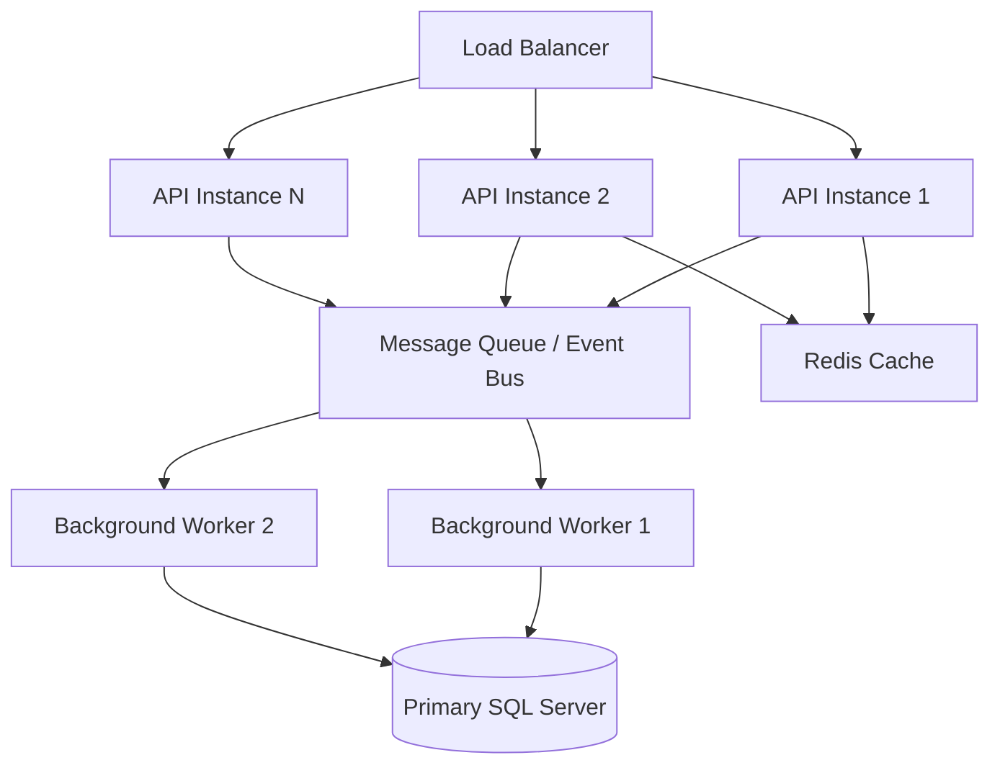
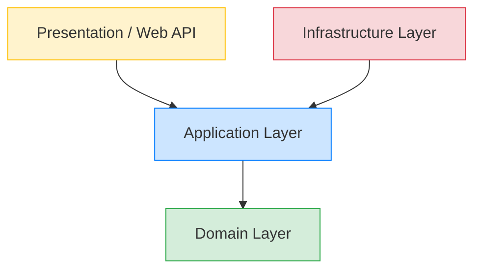

# Software Requirements Specification
## Non-Functional Requirements Specification
### Enterprise Attendance & Workforce Analytics Platform

---

## 1. Executive Summary

This document specifies the Non-Functional Requirements (NFRs) for the Enterprise Attendance & Workforce Analytics Platform. While functional requirements define what the system must do, these non-functional requirements define how the system must perform its functions. They are critical for ensuring the platform is robust, secure, scalable, and maintainable in an enterprise environment.

The system is an agentless, enterprise-grade Attendance Tracking System designed specifically for employees in Indian offices (Chennai, Noida, Hyderabad, Gurugram, and Bangalore). It relies heavily on background telemetry correlation from Microsoft 365 (Entra ID, Intune, Defender) and corporate network infrastructure. Given its silent tracking nature, strict non-functional constraints—particularly around performance, security, and data privacy—are paramount to ensure compliance, user trust, and operational efficiency.

The NFRs are organized into the following categories:
- Performance (NFR-100 series)
- Scalability (NFR-200 series)
- Availability & Reliability (NFR-300 series)
- Security (NFR-400 series)
- Usability (NFR-500 series)
- Maintainability (NFR-600 series)
- Portability & Compatibility (NFR-700 series)
- Data (NFR-800 series)
- Compliance (NFR-900 series)

---

## 2. Performance Requirements (NFR-100 Series)

Performance requirements dictate how quickly and efficiently the system must respond to user interactions and process background data. Given the heavy reliance on background telemetry processing, these requirements ensure that the system does not become a bottleneck.

| ID | Category | Requirement | Metric | Target Value | Priority | Verification Method |
|---|---|---|---|---|---|---|
| **NFR-101** | Performance | API response time must be swift to ensure responsive UI. | Response Time (95th percentile) | < 500ms | High | Load testing, Application Performance Monitoring (APM) logs |
| **NFR-102** | Performance | Dashboard page load time must be fast to provide a smooth user experience for managers and HR. | Page Load Time | < 2 seconds | High | Automated browser testing, APM |
| **NFR-103** | Performance | Telemetry ingestion processing must efficiently handle individual network events without queuing delays. | Processing time per event | < 1 second | Critical | Component stress testing, Metrics logging |
| **NFR-104** | Performance | Background synchronization of organizational hierarchy and user data from Entra ID must complete swiftly. | Cycle Completion Time | < 5 minutes for 10,000 employees | High | Batch processing metrics, Quartz.NET logs |
| **NFR-105** | Performance | Database queries, particularly for attendance reports and dashboard widgets, must be highly optimized. | Query Execution Time | < 200ms for indexed queries | High | SQL Profiler, Execution Plan analysis |
| **NFR-106** | Performance | The system must support a significant number of concurrent managerial and HR users without degradation. | Concurrent Users | 500 simultaneous users | Medium | Load testing (JMeter/K6) |
| **NFR-107** | Performance | Automated email generation for weekly summaries or non-compliance notifications must scale efficiently. | Email Generation Rate | 1,000 emails within 15 minutes | Medium | SMTP relay metrics, Background job logs |

### 2.1 Concrete Examples & Edge Cases
- **Edge Case (NFR-103)**: A network flap causes 5,000 devices to reconnect simultaneously, generating 5,000 telemetry events in 10 seconds. The ingestion queue must absorb the burst, and processing must scale horizontally or process batches to maintain the < 1 second average without timing out.
- **Example (NFR-104)**: During the weekend, Entra ID sync might process fewer changes, completing in 30 seconds. On Monday morning, mass role changes might take up to 4 minutes, remaining within the 5-minute threshold.

---

## 3. Scalability Requirements (NFR-200 Series)

The system must handle future growth in terms of user base, geographic locations, and data volume without requiring major architectural overhauls.

| ID | Category | Requirement | Metric | Target Value | Priority | Verification Method |
|---|---|---|---|---|---|---|
| **NFR-201** | Scalability | System must handle the current employee base and scale for substantial enterprise growth. | Supported Employees | 1,000 to 50,000 | Critical | Scalability modeling, database volume testing |
| **NFR-202** | Scalability | System must easily integrate new office locations beyond the initial Indian scope. | Office Locations | 5 initially, expandable to 50+ global | High | Configuration inspection, architectural review |
| **NFR-203** | Scalability | The telemetry ingestion pipeline must handle high daily volumes of network connectivity events. | Telemetry Events | 100,000+ per day | Critical | Soak testing, Volume testing |
| **NFR-204** | Scalability | Database must support long-term data retention without performance degradation. | Data Retention Capacity | 1 year minimum without archiving | High | Database stress testing with synthetic data |

### 3.1 Architectural Approach to Scalability

*Figure 1: Scalable Architecture utilizing Message Queues and horizontal scaling of API/Worker instances.*

---

## 4. Availability & Reliability (NFR-300 Series)

As an enterprise tool used for compliance and HR metrics, the system must be highly available and resilient to downstream failures.

| ID | Category | Requirement | Metric | Target Value | Priority | Verification Method |
|---|---|---|---|---|---|---|
| **NFR-301** | Availability | The platform must meet enterprise uptime standards during core business hours. | Uptime SLA | 99.5% | Critical | APM monitoring, synthetic transactions |
| **NFR-302** | Reliability | The system must continue functioning if downstream services (e.g., M365 Graph API) become temporarily unavailable. | Degradation State | Graceful degradation (queue syncs, read-only UI) | High | Chaos engineering, failure injection testing |
| **NFR-303** | Reliability | Data consistency must be maintained across all transactions, especially when merging daily attendance sessions. | Consistency Guarantee | ACID compliance / Eventual Consistency within 5 mins | Critical | Transaction log analysis, data integrity audits |
| **NFR-304** | Availability | The system must support automated monitoring to detect and recover from failures. | Health Checks | /health endpoint returns 200 OK | High | Integration with monitoring tools (e.g., Azure Monitor, Prometheus) |

### 4.1 Dependency Failure Scenarios
- **M365 Graph API Rate Limiting (NFR-302)**: If Graph API throttles the sync worker, the worker must implement exponential backoff and retry, while the frontend dashboard continues to serve cached hierarchy data.
- **Database Failover (NFR-301)**: If the primary SQL Server instance fails, the connection string must support seamless transition to a read-replica or secondary node, minimizing downtime to under 5 minutes.

---

## 5. Security Requirements (NFR-400 Series)

Given that the system tracks employee presence, the data is sensitive. Security measures must align with enterprise standards.

| ID | Category | Requirement | Metric | Target Value | Priority | Verification Method |
|---|---|---|---|---|---|---|
| **NFR-401** | Security | All data in transit must be encrypted using strong protocols. | Transport Encryption | HTTPS (TLS 1.2+) | Critical | SSL Server Test, Network scanning |
| **NFR-402** | Security | All sensitive data stored in the database must be encrypted. | Encryption at Rest | AES-256 for DB files/backups | Critical | Database configuration review |
| **NFR-403** | Security | Credentials, API keys, and connection strings must not be hardcoded or stored in plaintext. | Secrets Management | 100% of secrets in Azure Key Vault / secure store | Critical | Code analysis, Security audit |
| **NFR-404** | Security | The system must record all significant administrative actions and data access events. | Audit Logging | Complete immutable audit trail | High | Penetration testing, manual audit review |
| **NFR-405** | Security | The system must align with data protection principles to minimize PII exposure. | GDPR-lite Protection | Minimal PII retention, data masking for low-privilege users | High | Privacy impact assessment |
| **NFR-406** | Security | The system must comply with relevant Indian cybersecurity mandates. | Indian IT Act | Section 43A compliance (Reasonable Security Practices) | Critical | Legal/Compliance review |

---

## 6. Usability Requirements (NFR-500 Series)

The dashboard and reporting interfaces will be used by managers, HR personnel, and executives, necessitating a clean and accessible UI.

| ID | Category | Requirement | Metric | Target Value | Priority | Verification Method |
|---|---|---|---|---|---|---|
| **NFR-501** | Usability | The UI must adapt to various screen sizes (desktop, tablet, mobile). | Responsive Design | 100% UI components scale gracefully | Medium | Cross-device testing |
| **NFR-502** | Usability | The platform must be accessible to users with disabilities. | Accessibility | WCAG 2.1 AA compliance | Medium | Accessibility auditing tools (e.g., axe) |
| **NFR-503** | Usability | The web application must function correctly on modern, enterprise-approved browsers. | Browser Support | Edge, Chrome, Firefox, Safari (latest 2 versions) | High | Automated cross-browser testing |
| **NFR-504** | Usability | The application architecture must support future localization (multi-language support). | Localization Readiness | Externalized resource strings | Low | Code review |

---

## 7. Maintainability Requirements (NFR-600 Series)

To ensure the long-term viability of the project, the codebase must adhere to strict software engineering principles.

| ID | Category | Requirement | Metric | Target Value | Priority | Verification Method |
|---|---|---|---|---|---|---|
| **NFR-601** | Maintainability | The application must follow Clean Architecture principles to separate concerns. | Architecture | Strict layer separation (Domain, Application, Infrastructure, Presentation) | Critical | Architectural review, Dependency rule checking |
| **NFR-602** | Maintainability | The codebase must adhere to SOLID principles. | Code Quality | High cohesion, low coupling | High | Static code analysis (e.g., SonarQube) |
| **NFR-603** | Maintainability | The system must provide structured, searchable logs for debugging and auditing. | Logging | Serilog implementation with structured JSON output | High | Log aggregation review (e.g., ELK, Splunk) |
| **NFR-604** | Maintainability | The system must expose metrics for operational health. | Monitoring | Expose Prometheus/OpenTelemetry metrics | Medium | Monitoring dashboard review |
| **NFR-605** | Maintainability | Application settings must be environment-specific and easily modifiable without code changes. | Configuration | Configuration via appsettings.json / Environment Variables | High | Deployment pipeline review |

### 7.1 Clean Architecture Dependency Flow

*Figure 2: Dependency rule in Clean Architecture. Outer layers depend on inner layers.*

---

## 8. Portability & Compatibility (NFR-700 Series)

The deployment strategy requires the application to be flexible and hostable in various corporate environments.

| ID | Category | Requirement | Metric | Target Value | Priority | Verification Method |
|---|---|---|---|---|---|---|
| **NFR-701** | Portability | The application components must be containerized for consistent deployment. | Docker Support | Dockerfiles provided for Web API and Background Workers | High | Successful image build and execution |
| **NFR-702** | Portability | The application must be deployable to Microsoft Azure App Services or AKS. | Azure Deployment | ARM/Bicep templates or Helm charts provided | High | Automated deployment pipeline test |
| **NFR-703** | Portability | As an alternative to cloud hosting, the application must be deployable on-premises. | IIS Deployment | Publish profiles and web.config configuration support | Medium | Manual deployment validation on Windows Server |

---

## 9. Data Requirements (NFR-800 Series)

Data lifecycle management is crucial to prevent uncontrolled database growth and ensure data recovery capabilities.

| ID | Category | Requirement | Metric | Target Value | Priority | Verification Method |
|---|---|---|---|---|---|---|
| **NFR-801** | Data | The system database must be backed up regularly to prevent data loss. | Backup Policy | Daily full, hourly transaction logs | Critical | Backup restoration tests |
| **NFR-802** | Data | The system must retain attendance records for a specified period for compliance. | Retention Policy | 1 year active, 3 years archived | High | Automated data lifecycle policies |
| **NFR-803** | Data | Historical data older than the active retention period must be moved to cold storage. | Archival Policy | Automated archival of data > 1 year | Medium | Archival job verification |
| **NFR-804** | Data | Telemetry events older than 30 days (after being processed into daily summaries) must be deleted. | Purge Policy | Automated deletion of raw telemetry | High | Database size monitoring, Purge job verification |

---

## 10. Compliance Requirements (NFR-900 Series)

The system must comply with internal policies and regional laws governing employee tracking and data security.

| ID | Category | Requirement | Metric | Target Value | Priority | Verification Method |
|---|---|---|---|---|---|---|
| **NFR-901** | Compliance | The system must adhere to the Indian Information Technology Act, 2000 and rules. | Indian IT Act | Complete compliance with Section 43A | Critical | External legal audit |
| **NFR-902** | Compliance | The system must enforce the configurable "minimum days in office" corporate policy. | Company Policies | Accurately flags non-compliant employees | High | UAT against known test cases |
| **NFR-903** | Compliance | The system must generate reports suitable for internal HR and IT audits. | Audit Requirements | Exportable tamper-evident reports (CSV, PDF) | High | Feature demonstration to compliance team |

---

## 11. Assumptions and Dependencies

- **A1**: Microsoft Entra ID is the single source of truth for organizational hierarchy and employee metadata.
- **A2**: Intune/Defender endpoints are successfully pushing network connection events to the central repository.
- **D1**: The system depends on the stability and availability of Microsoft Graph API for directory synchronization.
- **D2**: The corporate network infrastructure (SSIDs, Subnets, VLANs) is accurately documented and provided to the application configuration.

## 12. Risks

- **R1**: Changes to Microsoft Graph API endpoints or permissions could break the synchronization process. *Mitigation: Monitor Microsoft deprecation notices and implement versioned API calls.*
- **R2**: Extremely high telemetry volumes during a network outage could overwhelm the ingestion queue. *Mitigation: Implement dynamic scaling of worker nodes and robust message queuing with dead-letter handling.*

---
*End of Document*
