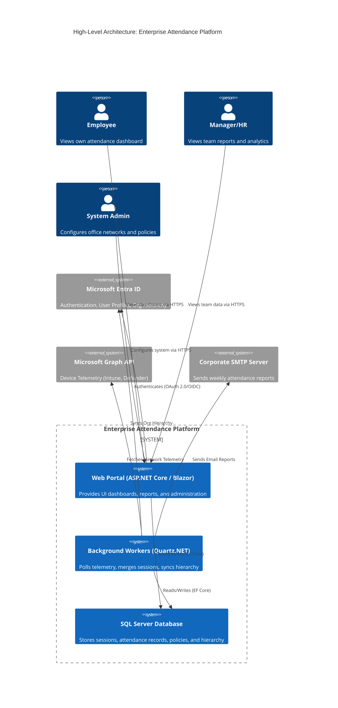
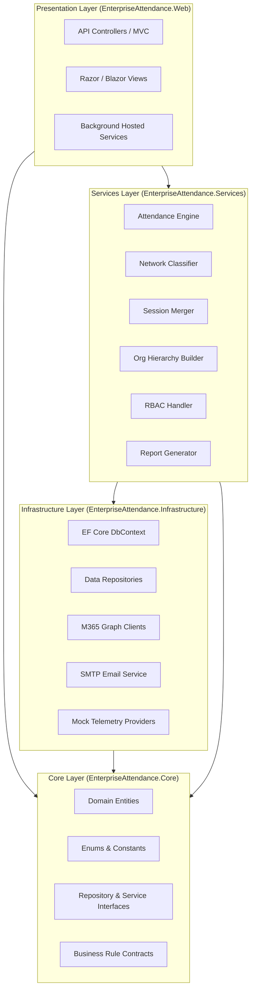
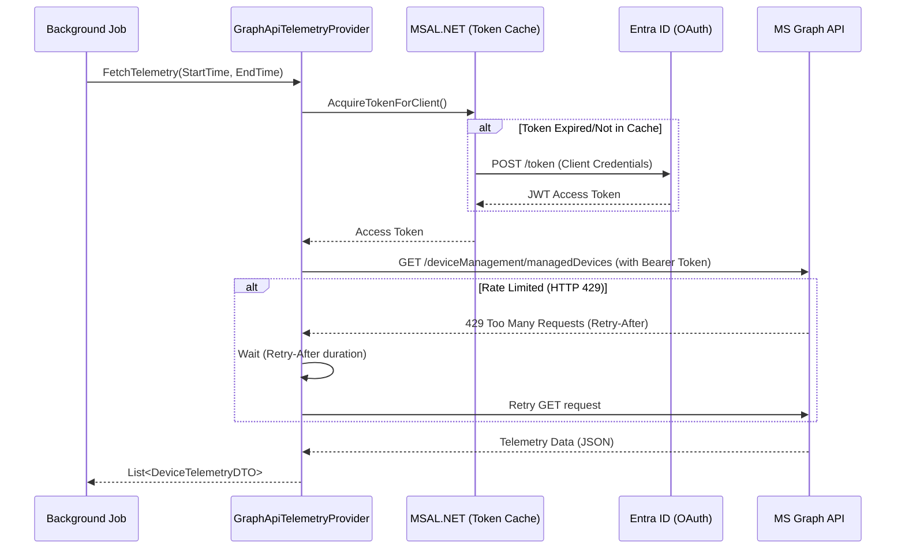
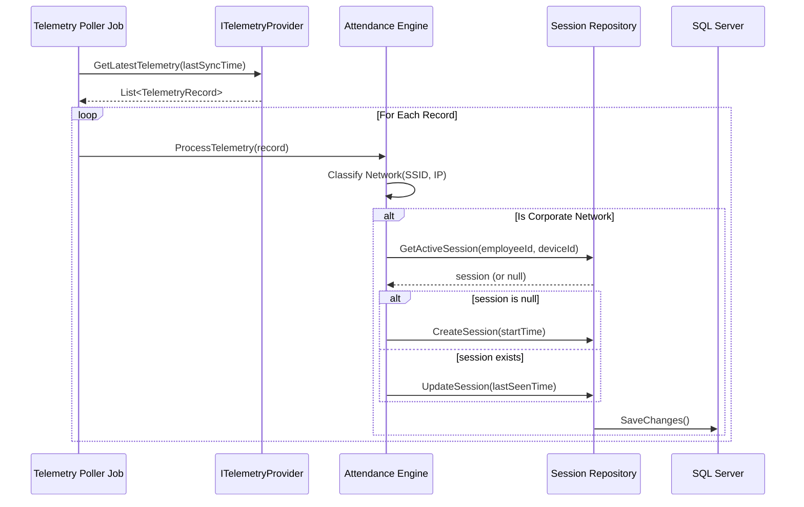
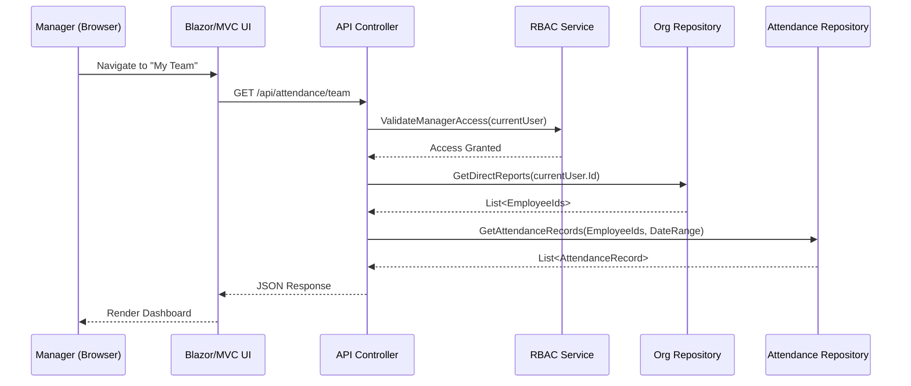

# Software Architecture Document (SAD)
## Enterprise Attendance & Workforce Analytics Platform

---

## 1. Executive Summary

The Enterprise Attendance & Workforce Analytics Platform is a highly scalable, agentless solution designed to determine physical office presence for employees in designated Indian corporate locations. This document outlines the architectural foundation, structural principles, and technical design of the system. 

Built on ASP.NET Core 8 using Clean Architecture principles, the platform integrates deeply with the Microsoft 365 ecosystem (Entra ID, Intune, Defender for Endpoint) to silently ingest network telemetry and calculate daily office attendance. The system is designed to support a "Dual-Mode" architecture, allowing seamless switching between mock telemetry (for POC/development) and live M365 telemetry (for production) without changing business logic.

---

## 2. Architecture Principles

The architecture adheres to several core software engineering principles to ensure maintainability, testability, and scalability:

- **Clean Architecture**: The solution is divided into concentric layers (Domain, Application/Service, Infrastructure, Presentation). Dependencies always point inward toward the Domain layer. The Core (Domain) has no dependencies on any external framework or infrastructure.
- **SOLID Principles**: Components are designed with Single Responsibility, Open/Closed, Liskov Substitution, Interface Segregation, and Dependency Inversion in mind.
- **Separation of Concerns**: UI, business logic, data access, and external integrations are strictly separated.
- **Dependency Injection (DI)**: Inversion of Control is utilized extensively via the native ASP.NET Core DI container to manage object lifetimes and dependencies.
- **Repository Pattern**: Data access is abstracted behind generic and specific repository interfaces, ensuring the domain and service layers are decoupled from Entity Framework Core.
- **CQRS (Command Query Responsibility Segregation)**: While not fully event-sourced, the system separates read and write operations logically, using specialized DTOs for queries and distinct service methods for commands.

---

## 3. High-Level Architecture Diagram



---

## 4. Clean Architecture Layers

The system is structured according to Clean Architecture, ensuring the business domain remains pure and agnostic of infrastructure concerns.



### 4.1. Core Layer (`EnterpriseAttendance.Core`)
- **Responsibility**: Contains enterprise-wide business rules and domain definitions.
- **Components**: Entities (`Employee`, `AttendanceSession`, `OfficeLocation`), Value Objects, Enums (`AttendanceStatus`), and Interfaces (`IAttendanceRepository`, `ITelemetryProvider`).
- **Dependencies**: None. Pure C#.

### 4.2. Infrastructure Layer (`EnterpriseAttendance.Infrastructure`)
- **Responsibility**: Implements interfaces defined in the Core layer. Handles database access, external API calls, and file I/O.
- **Components**: `ApplicationDbContext` (EF Core), Repository implementations, `GraphApiTelemetryProvider`, `MockTelemetryProvider`, `SmtpEmailService`.
- **Dependencies**: Core Layer, Entity Framework Core, Microsoft Graph SDK.

### 4.3. Services Layer (`EnterpriseAttendance.Services`)
- **Responsibility**: Application-specific business rules and orchestration.
- **Components**: `AttendanceCalculationService`, `OrgHierarchySyncService`, `ReportGenerationService`.
- **Dependencies**: Core Layer, Infrastructure Layer (via DI interfaces).

### 4.4. Presentation Layer (`EnterpriseAttendance.Web`)
- **Responsibility**: UI rendering, HTTP API endpoints, and background job scheduling.
- **Components**: MVC Controllers, Blazor Components, Quartz.NET jobs, JWT Authentication middleware.
- **Dependencies**: Services Layer, Core Layer.

---

## 5. Solution Structure

```text
EnterpriseAttendance.sln
├── src/
│   ├── EnterpriseAttendance.Core/              # Domain & Contracts
│   │   ├── Entities/                           # Domain Models (Employee, Session, Location)
│   │   ├── Enums/                              # Statuses, Roles
│   │   ├── Interfaces/                         # IRepository, ITelemetryProvider
│   │   └── Exceptions/                         # Domain Exceptions
│   │
│   ├── EnterpriseAttendance.Infrastructure/    # Data Access & External Services
│   │   ├── Data/                               # ApplicationDbContext, Migrations
│   │   ├── Repositories/                       # EF Core Repository Implementations
│   │   ├── GraphApi/                           # Microsoft Graph API Clients
│   │   ├── Mocking/                            # Mock Telemetry Generators
│   │   └── Services/                           # SmtpEmailService, HttpClients
│   │
│   ├── EnterpriseAttendance.Services/          # Business Logic Orchestration
│   │   ├── Attendance/                         # Engine, Session Merger, Network Classifier
│   │   ├── Identity/                           # Org Sync, RBAC Handlers
│   │   └── Reporting/                          # Excel/PDF Generators, Analytics
│   │
│   └── EnterpriseAttendance.Web/               # UI, APIs, and Background Hosts
│       ├── Controllers/                        # REST API Endpoints
│       ├── Views/                              # MVC / Blazor Pages
│       ├── BackgroundJobs/                     # Quartz.NET Job Definitions
│       ├── Middleware/                         # Error Handling, Logging, Auth
│       └── appsettings.json                    # Configuration
│
└── tests/
    ├── EnterpriseAttendance.Core.Tests/        # Unit Tests for Domain
    ├── EnterpriseAttendance.Services.Tests/    # Unit Tests for Business Logic
    ├── EnterpriseAttendance.Infra.Tests/       # Integration Tests for Repositories/Graph
    └── EnterpriseAttendance.Web.Tests/         # Controller/E2E Tests
```

---

## 6. Component Diagram

```mermaid
componentDiagram
    package "EnterpriseAttendance.Web" {
        [Dashboard UI]
        [API Controllers]
        [Quartz Scheduler]
    }

    package "EnterpriseAttendance.Services" {
        [Attendance Engine]
        [Session Merger]
        [Network Classifier]
        [Hierarchy Sync]
    }

    package "EnterpriseAttendance.Infrastructure" {
        [EF Core Repositories]
        [Graph API Provider]
        [SMTP Client]
    }

    package "EnterpriseAttendance.Core" {
        [Domain Entities]
        [IRepositories]
        [ITelemetryProvider]
    }

    [Dashboard UI] --> [API Controllers]
    [API Controllers] --> [Attendance Engine]
    [Quartz Scheduler] --> [Session Merger]
    [Quartz Scheduler] --> [Hierarchy Sync]
    
    [Attendance Engine] --> [Network Classifier]
    [Attendance Engine] --> [IRepositories]
    [Session Merger] --> [IRepositories]
    [Hierarchy Sync] --> [IRepositories]
    
    [EF Core Repositories] ..|> [IRepositories]
    [Graph API Provider] ..|> [ITelemetryProvider]
    
    [EF Core Repositories] --> [SQL Server]
    [Graph API Provider] --> [M365 Cloud]
```

---

## 7. Integration Architecture (Microsoft Graph API)

The system relies on MS Graph API for telemetry and user data. The integration includes robust OAuth token management, exponential backoff for retries, and rate limit handling.



---

## 8. Data Flow Architecture

The end-to-end flow from raw telemetry to aggregated dashboard view.

```mermaid
flowchart TD
    subgraph Ingestion
        A[M365 Intune / Defender] -->|REST API| B(Graph API Provider)
        B --> C{Normalize Data}
        C -->|Raw Telemetry| D[(Raw Telemetry Buffer)]
    end

    subgraph Processing [Attendance Engine]
        D --> E[Network Classifier]
        E -->|Match against Office DB| F{Is Corporate Network?}
        F -->|Yes| G[Create/Update Session]
        F -->|No| H[Ignore / Mark Remote]
        G --> I[(Session Store)]
    end

    subgraph Aggregation [Session Merger Job]
        I --> J[End of Day Consolidation]
        J --> K[Merge multiple device sessions]
        K --> L[Calculate Total Duration]
        L --> M{Duration >= Minimum?}
        M -->|Yes| N[Mark Status: Present (WFO)]
        M -->|No| O[Mark Status: Partial/Absent]
        N --> P[(Daily Attendance Table)]
        O --> P
    end

    subgraph Presentation
        P --> Q[API Endpoints]
        Q --> R[Manager Dashboard]
        Q --> S[Weekly Reports]
    end
```

---

## 9. Deployment Architecture

The system is designed for deployment on Microsoft Azure or on-premise Windows Server environments.


### Environment Progression:
1. **DEV**: Mock Telemetry Provider enabled. Local SQL Server.
2. **QA/UAT**: Connected to Test M365 tenant. Azure SQL Basic.
3. **PROD**: Connected to Live M365 tenant. Azure SQL Premium, Geo-replicated. 

---

## 10. Security Architecture

### Authentication & Authorization
- **Interactive Users (UI)**: Authenticated via OpenID Connect (OIDC) against Entra ID. Uses MSAL to obtain ID and Access tokens.
- **APIs**: Secured via JWT Bearer authentication. 
- **System-to-System (Background)**: Uses OAuth 2.0 Client Credentials flow with application permissions (not user-delegated) to access Graph API.

### Role-Based Access Control (RBAC)
Implemented using custom Claims stored in the database and injected into the ClaimsPrincipal upon login.

```mermaid
flowchart LR
    User -->|Login via SSO| Entra[Entra ID]
    Entra -->|JWT ID Token| App[Web Application]
    App -->|Lookup User Roles| DB[(SQL DB)]
    DB -->|Roles: Manager, Admin| App
    App -->|Generate App Auth Cookie with Claims| Browser
    
    Browser -->|Request with Cookie| Controller[API / Page]
    Controller -->|Check [Authorize(Roles="Manager")]| Access{Granted?}
    Access -->|Yes| Data[Return Data]
    Access -->|No| 403[403 Forbidden]
```

### Data Protection
- Sensitive configuration (Client Secrets, SQL Connection Strings) stored in Azure Key Vault.
- Network traffic encrypted via TLS 1.2+.
- SQL Data at Rest encrypted using TDE (Transparent Data Encryption).

---

## 11. Sequence Diagrams

### 11.1. Telemetry Ingestion & Session Creation



### 11.2. Manager Viewing Team Attendance



---

## 12. Technology Stack Details

| Component | Technology | Version | Purpose |
|-----------|------------|---------|---------|
| **Backend Framework** | ASP.NET Core | 8.0 (LTS) | API, MVC, background processing |
| **Language** | C# | 12.0 | Core programming language |
| **Database** | SQL Server / Azure SQL | 2022 / v12 | Relational data storage |
| **ORM** | Entity Framework Core | 8.0 | Data access, migrations |
| **Authentication** | Microsoft Identity Web | 2.x | Entra ID Integration, JWT validation |
| **Task Scheduling** | Quartz.NET | 3.x | Cron-based background jobs |
| **Logging** | Serilog | 3.x | Structured application logging |
| **API Integration** | Microsoft Graph SDK | 5.x | Fetching M365 telemetry |
| **Dependency Injection** | Microsoft.Extensions.DI | Native | IoC Container |
| **API Documentation** | Swashbuckle (Swagger) | 6.x | OpenAPI spec generation |
| **Frontend** | MVC / Blazor / Bootstrap | Latest | UI presentation |

---

## 13. Cross-Cutting Concerns

- **Logging**: Configured via `Serilog` to output to Console and SQL Server. All background jobs log start/stop times, processed record counts, and errors.
- **Exception Handling**: Global exception handling middleware in ASP.NET Core catches unhandled exceptions, logs them with stack traces, and returns standardized JSON problem details.
- **Caching**: `IMemoryCache` is used heavily for static configuration data like Office Network Rules (SSIDs/IPs) and the Organizational Hierarchy to reduce database load.
- **Configuration**: Uses `appsettings.json` merged with environment variables and (optionally) Azure Key Vault for secrets. Strongly typed configuration objects (Options Pattern).
- **Health Checks**: `/health` endpoint exposes DB connectivity and Graph API reachability status.

---

## 14. Dual-Mode Architecture

A core requirement is to support development/testing without real M365 data, and production with real data.

This is achieved using the Strategy Pattern and Dependency Injection.

**Interface:**
```csharp
public interface ITelemetryProvider 
{
    Task<List<DeviceTelemetry>> GetRecentTelemetryAsync(DateTime since);
}
```

**Implementations:**
1. `MockTelemetryProvider`: Generates fake telemetry based on a predefined scenario file or random distribution.
2. `GraphApiTelemetryProvider`: Makes actual HTTP calls to Microsoft Graph.

**Configuration (Startup.cs / Program.cs):**
```csharp
if (builder.Configuration.GetValue<bool>("UseMockTelemetry"))
{
    builder.Services.AddScoped<ITelemetryProvider, MockTelemetryProvider>();
}
else
{
    builder.Services.AddScoped<ITelemetryProvider, GraphApiTelemetryProvider>();
}
```

---

## 15. Design Decisions & Trade-offs

| Decision | Alternative Considered | Rationale & Trade-off |
|----------|------------------------|-----------------------|
| **SQL Server for Storage** | NoSQL (MongoDB, CosmosDB) | Attendance data is highly structured, relational (Org Hierarchy), and requires complex reporting joins. Trade-off: Schema rigidity. |
| **Quartz.NET for Jobs** | Hangfire / Native IHostedService | Quartz offers robust cron scheduling and clustering capabilities suitable for heavy polling. Hangfire UI was not required. |
| **Agentless Telemetry** | Deploying a custom endpoint agent | Agentless reduces IT rollout friction and security reviews. Trade-off: Reliant on M365 sync delays (data is not strictly real-time). |
| **EF Core (Code First)** | Dapper / ADO.NET | EF Core speeds up development and handles complex migrations. Performance critical queries (like massive reporting) can still use Dapper or Raw SQL. |

---

## 16. Assumptions, Risks, Dependencies, and Constraints

### 16.1. Assumptions
- Microsoft Intune and Defender are widely deployed across all Indian office devices.
- Network infrastructure (SSIDs, VLANs, Subnets) for the 5 Indian offices is documented and strictly managed without frequent undocumented changes.
- Employees authenticate to the corporate network with their primary assigned devices.

### 16.2. Dependencies
- **Microsoft Graph API limits**: The system depends heavily on Graph API availability and throughput.
- **Entra ID completeness**: Accurate Org Hierarchy relies completely on the "Manager" field being correctly populated in Entra ID by HR.

### 16.3. Risks & Mitigations
- **Risk**: Delay in telemetry data surfacing in Graph API (Intune sync can take hours).
  **Mitigation**: System design focuses on "End of Day" processing rather than real-time tracking. "Last Seen" times are eventually consistent.
- **Risk**: API Rate Limiting.
  **Mitigation**: Implementing Polly policies for exponential backoff and observing `Retry-After` headers.

### 16.4. Constraints
- System must process telemetry *only* for the specified Indian locations (Chennai, Noida, Hyderabad, Gurugram, Bangalore).
- Data retention policies must comply with local privacy regulations (GDPR/local laws).
- No VPN traffic should be classified as Office Presence.

---

## 17. Future Enhancements
- Integration with turnstile/badge data for cross-validation of physical presence.
- AI/ML based anomaly detection (e.g., impossible travel, proxy manipulation).
- Mobile application for managers to view dashboards on the go.
- Real-time Push Notifications (WebSockets/SignalR) when critical processing jobs fail.
