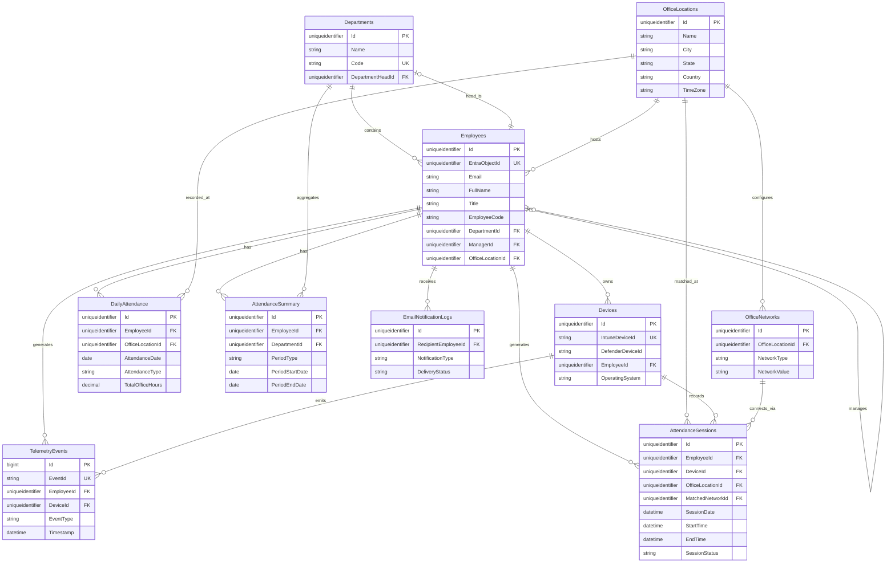

# Software Requirements Specification
## Enterprise Attendance & Workforce Analytics Platform
### Document 06: Database Design

---

## 1. Executive Summary

This document details the database design and schema architecture for the Enterprise Attendance & Workforce Analytics Platform. The system relies on a relational database architecture to store configuration, telemetry data, calculated attendance records, and reporting summaries. The database serves as the single source of truth for the platform, integrating multi-source inputs from Microsoft 365 (Entra ID, Intune, Defender) and corporate network details to accurately track and calculate physical office presence for employees in the defined Indian office locations. 

The design emphasizes performance, scalability, data integrity, and analytical efficiency, recognizing the substantial volume of network telemetry data generated by enterprise environments. Proper indexing, data retention policies, and architectural conventions (Clean Architecture via EF Core) ensure the platform is well-suited for long-term operational success without requiring database-level manual intervention.

---

## 2. Database Strategy

- **Database Engine**: Microsoft SQL Server (Azure SQL Database or on-premises SQL Server, based on deployment requirements).
- **ORM Framework**: Entity Framework Core 8 (EF Core 8) using the Code-First approach.
- **Paradigm**: Fully normalized schema (3NF) where practical, with strategic denormalization in reporting/summary tables (`DailyAttendance`, `AttendanceSummary`) to optimize read-heavy analytics queries.
- **Collation**: `SQL_Latin1_General_CP1_CI_AS` (Case-Insensitive, Accent-Sensitive) for standard textual storage.
- **Primary Keys**: Strongly typed surrogate primary keys (typically GUIDs `uniqueidentifier` or auto-incrementing `bigint`/`int`), ensuring uncoupled referential integrity and ease of global distribution.
- **Auditing**: Standardized `CreatedAt`, `UpdatedAt`, `CreatedBy`, `UpdatedBy` tracking on key entities, supported by a dedicated `AuditLogs` table for granular historical auditing of structural/configuration changes.
- **Reporting Optimization**: Columnstore indexes (or heavily optimized B-Tree indexes) for telemetry and historical attendance tables to support analytical queries.

---

## 3. Entity Relationship Diagram

---

## 4. Complete Table Definitions

### 4.1. Core Tables

#### 4.1.1. `Employees`
Stores foundational user identities synchronized from Microsoft Entra ID. Tracks org hierarchy and physical location mapping.

| Column Name | Data Type | Nullable | Default | Description | Constraints |
|---|---|---|---|---|---|
| `Id` | `uniqueidentifier` | No | `NEWID()` | Surrogate primary key. | PK |
| `EntraObjectId` | `uniqueidentifier` | No | | Entra ID GUID mapping. | Unique |
| `Email` | `nvarchar(255)` | No | | Corporate email address. | Unique |
| `FullName` | `nvarchar(255)` | No | | Employee's full display name. | |
| `Title` | `nvarchar(255)` | Yes | | Job title (e.g., "Senior Engineer"). | |
| `EmployeeCode` | `nvarchar(50)` | Yes | | Internal HR system identifier. | |
| `DepartmentId` | `uniqueidentifier` | Yes | | Reference to the employee's department. | FK (Departments.Id) |
| `ManagerId` | `uniqueidentifier` | Yes | | Manager reference (self-referencing). | FK (Employees.Id) |
| `OfficeLocationId` | `uniqueidentifier` | Yes | | Primary assigned office base. | FK (OfficeLocations.Id) |
| `IsActive` | `bit` | No | `1` | Denotes if the employee is active. | |
| `CreatedAt` | `datetime2(7)` | No | `GETUTCDATE()` | Creation timestamp. | |
| `UpdatedAt` | `datetime2(7)` | Yes | | Last modification timestamp. | |

*Note on Managers*: To retrieve manager hierarchies, recursive CTEs (Common Table Expressions) will be utilized at the data access layer, abstracting this complexity from the application layer.

#### 4.1.2. `Departments`
Categorizes employees for aggregation and reporting functions.

| Column Name | Data Type | Nullable | Default | Description | Constraints |
|---|---|---|---|---|---|
| `Id` | `uniqueidentifier` | No | `NEWID()` | Surrogate primary key. | PK |
| `Name` | `nvarchar(255)` | No | | Department display name. | |
| `Code` | `nvarchar(50)` | No | | Unique abbreviation or cost center. | Unique |
| `DepartmentHeadId` | `uniqueidentifier` | Yes | | Reference to Employee heading department. | FK (Employees.Id) |
| `IsActive` | `bit` | No | `1` | Active flag. | |
| `CreatedAt` | `datetime2(7)` | No | `GETUTCDATE()` | Creation timestamp. | |

#### 4.1.3. `OfficeLocations`
Defines the authorized Indian corporate offices.

| Column Name | Data Type | Nullable | Default | Description | Constraints |
|---|---|---|---|---|---|
| `Id` | `uniqueidentifier` | No | `NEWID()` | Surrogate primary key. | PK |
| `Name` | `nvarchar(255)` | No | | Friendly name (e.g. "Ramboll Chennai"). | |
| `City` | `nvarchar(100)` | No | | City (e.g., Chennai, Noida). | |
| `State` | `nvarchar(100)` | No | | State (e.g., Tamil Nadu). | |
| `Country` | `nvarchar(100)` | No | `'India'` | Country (Always India for scope). | |
| `TimeZone` | `nvarchar(100)` | No | `'IST'` | Timezone identifier (IST). | |
| `IsActive` | `bit` | No | `1` | Active flag. | |

### 4.2. Device Tables

#### 4.2.1. `Devices`
Hardware assets assigned to employees used to generate network telemetry.

| Column Name | Data Type | Nullable | Default | Description | Constraints |
|---|---|---|---|---|---|
| `Id` | `uniqueidentifier` | No | `NEWID()` | Surrogate primary key. | PK |
| `IntuneDeviceId` | `nvarchar(255)` | Yes | | Device ID in Intune. | Unique |
| `DefenderDeviceId` | `nvarchar(255)` | Yes | | Device ID in Defender for Endpoint. | |
| `DeviceName` | `nvarchar(255)` | Yes | | OS hostname. | |
| `SerialNumber` | `nvarchar(255)` | Yes | | Hardware serial. | |
| `EmployeeId` | `uniqueidentifier` | No | | Assigned employee. | FK (Employees.Id) |
| `OperatingSystem` | `nvarchar(100)` | Yes | | OS Name (Windows, macOS). | |
| `OSVersion` | `nvarchar(100)` | Yes | | OS Version build. | |
| `ComplianceStatus` | `nvarchar(50)` | Yes | | Compliant/Non-Compliant status. | |
| `IsManaged` | `bit` | No | `1` | Whether the device is MDM managed. | |
| `LastSyncTime` | `datetime2(7)` | Yes | | Last contact with MDM. | |
| `RetiredAt` | `datetime2(7)` | Yes | | Timestamp of device retirement. | |
| `CreatedAt` | `datetime2(7)` | No | `GETUTCDATE()`| Creation timestamp. | |

### 4.3. Network Configuration Tables

#### 4.3.1. `OfficeNetworks`
Maps SSIDs, subnets, and IP ranges to physical office locations to evaluate telemetry accurately.

| Column Name | Data Type | Nullable | Default | Description | Constraints |
|---|---|---|---|---|---|
| `Id` | `uniqueidentifier` | No | `NEWID()` | Surrogate primary key. | PK |
| `OfficeLocationId` | `uniqueidentifier` | No | | Associated office location. | FK (OfficeLocations.Id) |
| `NetworkType` | `nvarchar(50)` | No | | Enum: SSID, Subnet, IPRange, VLAN, VPN, NAC. | |
| `NetworkValue` | `nvarchar(255)` | No | | Value (e.g., 'Ramboll-CHN' or '10.0.0.0/24').| |
| `Description` | `nvarchar(500)` | Yes | | Notes or description of network context. | |
| `IsActive` | `bit` | No | `1` | Active flag. | |
| `CreatedAt` | `datetime2(7)` | No | `GETUTCDATE()`| Creation timestamp. | |

*Note*: If a network payload matches a `VPN` NetworkType, the system forcibly categorizes it as Remote/WFH, as VPN connections do not constitute physical office presence.

### 4.4. Attendance Tables

#### 4.4.1. `AttendanceSessions`
Tracks continuous network connection spans (sessions). Multiple sessions are merged into a single `DailyAttendance` record.

| Column Name | Data Type | Nullable | Default | Description | Constraints |
|---|---|---|---|---|---|
| `Id` | `uniqueidentifier` | No | `NEWID()` | Surrogate primary key. | PK |
| `EmployeeId` | `uniqueidentifier` | No | | Employee generating the session. | FK (Employees.Id) |
| `DeviceId` | `uniqueidentifier` | Yes | | Device used for the session. | FK (Devices.Id) |
| `SessionDate` | `date` | No | | Logical date of the session (IST). | |
| `StartTime` | `datetime2(7)` | No | | Session start timestamp (UTC). | |
| `EndTime` | `datetime2(7)` | Yes | | Session end timestamp (UTC). | |
| `DurationMinutes` | `int` | Yes | | Calculated duration in minutes. | |
| `NetworkLocationType`| `nvarchar(50)` | No | | Office/Remote/VPN/Unknown. | |
| `OfficeLocationId` | `uniqueidentifier` | Yes | | Resolved office if matched. | FK (OfficeLocations.Id) |
| `MatchedNetworkId` | `uniqueidentifier` | Yes | | Specific network config rule matched. | FK (OfficeNetworks.Id) |
| `IPAddress` | `nvarchar(50)` | Yes | | Snapshot of connection IP. | |
| `DetectedSSID` | `nvarchar(100)` | Yes | | Snapshot of connection SSID. | |
| `SessionStatus` | `nvarchar(50)` | No | `'Active'` | Active/Closed/Merged. | |
| `ClosedReason` | `nvarchar(100)` | Yes | | Sleep/Hibernate/Shutdown/Disconnect/etc.| |
| `ConfidenceScore` | `decimal(5,2)` | No | `100.0` | Algorithmic confidence level (0-100). | |
| `CreatedAt` | `datetime2(7)` | No | `GETUTCDATE()`| Creation timestamp. | |

#### 4.4.2. `DailyAttendance`
Daily roll-up of all `AttendanceSessions` for an employee.

| Column Name | Data Type | Nullable | Default | Description | Constraints |
|---|---|---|---|---|---|
| `Id` | `uniqueidentifier` | No | `NEWID()` | Surrogate primary key. | PK |
| `EmployeeId` | `uniqueidentifier` | No | | Employee reference. | FK (Employees.Id) |
| `AttendanceDate` | `date` | No | | Local operational date (IST). | |
| `OfficeLocationId` | `uniqueidentifier` | Yes | | Principal office location if office. | FK (OfficeLocations.Id) |
| `AttendanceType` | `nvarchar(50)` | No | | Office/WFH/Absent/Holiday/Weekend/Leave. | |
| `FirstSeenTime` | `datetime2(7)` | Yes | | Min(StartTime) of the day. | |
| `LastSeenTime` | `datetime2(7)` | Yes | | Max(EndTime) of the day. | |
| `TotalOfficeHours` | `decimal(5,2)` | No | `0.00` | Merged total duration of Office sessions.| |
| `TotalSessions` | `int` | No | `0` | Count of sessions forming this record. | |
| `NetworkLocationType`| `nvarchar(50)` | No | | Dominant location classification. | |
| `IsHybridCompliant`| `bit` | No | `0` | True if TotalOfficeHours > MinHours rule.| |
| `ConfidenceScore` | `decimal(5,2)` | No | `100.0` | Overall confidence. | |
| `CreatedAt` | `datetime2(7)` | No | `GETUTCDATE()`| Creation timestamp. | |
| `UpdatedAt` | `datetime2(7)` | Yes | | Modification timestamp. | |

#### 4.4.3. `AttendanceSummary`
Aggregated views computed via background jobs for manager and executive dashboards.

| Column Name | Data Type | Nullable | Default | Description | Constraints |
|---|---|---|---|---|---|
| `Id` | `uniqueidentifier` | No | `NEWID()` | Surrogate primary key. | PK |
| `EmployeeId` | `uniqueidentifier` | No | | Employee reference. | FK (Employees.Id) |
| `DepartmentId` | `uniqueidentifier` | Yes | | Snapshot department reference. | FK (Departments.Id) |
| `PeriodType` | `nvarchar(50)` | No | | Daily/Weekly/Monthly. | |
| `PeriodStartDate` | `date` | No | | Start of summary window. | |
| `PeriodEndDate` | `date` | No | | End of summary window. | |
| `TotalWorkingDays` | `int` | No | `0` | Excludes weekends/holidays. | |
| `OfficeDaysCount` | `int` | No | `0` | Total compliant office days. | |
| `WFHDaysCount` | `int` | No | `0` | Total remote working days. | |
| `AbsentDaysCount` | `int` | No | `0` | Days not detected and not on leave. | |
| `TotalOfficeHours` | `decimal(10,2)` | No | `0.00` | Sum of total office hours. | |
| `AverageOfficeHoursPerDay`| `decimal(5,2)` | No | `0.00` | TotalOfficeHours / OfficeDaysCount. | |
| `HybridCompliancePercentage`|`decimal(5,2)` | No | `0.00` | Percentage against policy target. | |
| `PolicyTarget` | `int` | No | `3` | Required days per week as of calculation. | |
| `PolicyComplianceStatus` | `nvarchar(50)` | No | | Met/PartiallyMet/NonCompliant. | |
| `CreatedAt` | `datetime2(7)` | No | `GETUTCDATE()`| Creation timestamp. | |

### 4.5. Telemetry Tables

#### 4.5.1. `TelemetryEvents`
Raw landing table for ingestion webhooks and Graph API polling. Extremely high volume.

| Column Name | Data Type | Nullable | Default | Description | Constraints |
|---|---|---|---|---|---|
| `Id` | `bigint` | No | Identity | Surrogate sequential ID. | PK |
| `EventId` | `nvarchar(255)` | No | | Vendor specific event ID. | Unique |
| `EmployeeId` | `uniqueidentifier` | Yes | | Resolved Employee ID. | FK (Employees.Id) |
| `DeviceId` | `uniqueidentifier` | Yes | | Resolved Device ID. | FK (Devices.Id) |
| `TelemetrySource` | `nvarchar(50)` | No | | Entra/Intune/Defender. | |
| `EventType` | `nvarchar(100)` | No | | Connect/Disconnect/Heartbeat. | |
| `Timestamp` | `datetime2(7)` | No | | Event occurrence time. | |
| `IPAddress` | `nvarchar(50)` | Yes | | Extracted IP. | |
| `NetworkSSID` | `nvarchar(100)` | Yes | | Extracted SSID. | |
| `SubnetInfo` | `nvarchar(100)` | Yes | | Extracted Subnet. | |
| `RawPayloadJson` | `nvarchar(max)` | No | | Complete unparsed payload. | |
| `IsDuplicate` | `bit` | No | `0` | Flag for deduplicated events. | |
| `ProcessedStatus` | `nvarchar(50)` | No | `'Pending'` | Pending/Processed/Failed. | |
| `ProcessedAt` | `datetime2(7)` | Yes | | Time when the event engine handled it. | |
| `CreatedAt` | `datetime2(7)` | No | `GETUTCDATE()`| Time of DB ingestion. | |

### 4.6. Notification Tables

#### 4.6.1. `EmailNotificationLogs`
Audit log of all outbound emails (e.g. non-compliance warnings).

| Column Name | Data Type | Nullable | Default | Description | Constraints |
|---|---|---|---|---|---|
| `Id` | `uniqueidentifier` | No | `NEWID()` | Surrogate primary key. | PK |
| `RecipientEmployeeId`| `uniqueidentifier`| No | | Internal employee reference. | FK (Employees.Id) |
| `RecipientEmail` | `nvarchar(255)` | No | | Destination address. | |
| `NotificationType` | `nvarchar(100)` | No | | Type (e.g. WeeklyDigest, Warning). | |
| `Subject` | `nvarchar(500)` | No | | Email subject line. | |
| `BodyHtml` | `nvarchar(max)` | No | | HTML rendered content. | |
| `AttachmentPath` | `nvarchar(max)` | Yes | | Links to generated reports. | |
| `SentAt` | `datetime2(7)` | Yes | | Transmission time. | |
| `DeliveryStatus` | `nvarchar(50)` | No | `'Pending'` | Pending/Sent/Failed. | |
| `ErrorMessage` | `nvarchar(max)` | Yes | | SMTP failure message. | |
| `CreatedAt` | `datetime2(7)` | No | `GETUTCDATE()`| Timestamp. | |

#### 4.6.2. `EmailTemplates`
Stores dynamically injectable Razor or String-replaced HTML templates.

| Column Name | Data Type | Nullable | Default | Description | Constraints |
|---|---|---|---|---|---|
| `Id` | `uniqueidentifier` | No | `NEWID()` | Surrogate primary key. | PK |
| `TemplateName` | `nvarchar(100)` | No | | Identifier (e.g., "WeeklyManagerDigest").| |
| `TemplateType` | `nvarchar(50)` | No | | Type category. | |
| `SubjectTemplate` | `nvarchar(500)` | No | | String-replaceable subject. | |
| `BodyTemplate` | `nvarchar(max)` | No | | String-replaceable HTML body. | |
| `IsActive` | `bit` | No | `1` | Active flag. | |
| `CreatedAt` | `datetime2(7)` | No | `GETUTCDATE()`| Creation timestamp. | |

### 4.7. System Tables

#### 4.7.1. `BusinessRules`
Configurable rules driving the attendance engine.

| Column Name | Data Type | Nullable | Default | Description | Constraints |
|---|---|---|---|---|---|
| `Id` | `uniqueidentifier` | No | `NEWID()` | Primary key. | PK |
| `RuleName` | `nvarchar(100)` | No | | Friendly name. | |
| `RuleKey` | `nvarchar(100)` | No | | Engine lookup key (e.g. `HybridDaysRequired`). | Unique |
| `RuleValue` | `nvarchar(255)` | No | | String representation of the value. | |
| `DataType` | `nvarchar(50)` | No | | INT, DECIMAL, BOOLEAN, STRING. | |
| `Description` | `nvarchar(500)` | Yes | | What the rule controls. | |
| `IsActive` | `bit` | No | `1` | Active flag. | |
| `CreatedAt` | `datetime2(7)` | No | `GETUTCDATE()`| Creation time. | |
| `UpdatedAt` | `datetime2(7)` | Yes | | Modification time. | |

#### 4.7.2. `AuditLogs`
Tracks changes specifically from the Administrative/HR portal (e.g., manually overriding attendance).

| Column Name | Data Type | Nullable | Default | Description | Constraints |
|---|---|---|---|---|---|
| `Id` | `uniqueidentifier` | No | `NEWID()` | Primary key. | PK |
| `Timestamp` | `datetime2(7)` | No | `GETUTCDATE()`| Time of action. | |
| `UserId` | `nvarchar(100)` | No | | Performing Entra user ID. | |
| `UserEmail` | `nvarchar(255)` | No | | Performing user email. | |
| `Action` | `nvarchar(100)` | No | | Update/Create/Delete/Override. | |
| `EntityType` | `nvarchar(100)` | No | | E.g. 'DailyAttendance'. | |
| `EntityId` | `nvarchar(100)` | No | | ID of the modified entity. | |
| `OldValue` | `nvarchar(max)` | Yes | | JSON representation of prior state. | |
| `NewValue` | `nvarchar(max)` | Yes | | JSON representation of new state. | |
| `IPAddress` | `nvarchar(50)` | Yes | | Modifying user IP. | |
| `Severity` | `nvarchar(50)` | No | `'Info'` | Info/Warning/Critical. | |
| `Details` | `nvarchar(max)` | Yes | | Context/reason. | |

#### 4.7.3. `ApiLogs` & `SystemConfiguration`
Standard infrastructure tables for API request tracking and secure application settings (e.g., third-party API limits, retry configurations).

---

## 5. Indexes Strategy

Due to the continuous influx of telemetry and reporting needs, indexing must balance write throughput with read efficiency.

| Table | Column(s) | Index Type | Purpose |
|---|---|---|---|
| `Employees` | `Email` | Non-Clustered | Fast SSO login resolution and graph lookups. |
| `Employees` | `DepartmentId` | Non-Clustered | Aggregating HR departmental views. |
| `Devices` | `IntuneDeviceId`, `DefenderDeviceId` | Non-Clustered | Rapid translation of incoming webhook device hints. |
| `OfficeNetworks` | `NetworkType`, `NetworkValue` | Non-Clustered (Covering) | Critical index for the Correlation Engine to match telemetry properties to office LANs instantly. |
| `AttendanceSessions` | `EmployeeId`, `SessionDate` | Non-Clustered | End-of-Day merge process optimization. |
| `AttendanceSessions` | `SessionStatus` | Filtered Index (`SessionStatus = 'Active'`) | Speeds up the engine finding open sessions to append new pings to. |
| `DailyAttendance` | `EmployeeId`, `AttendanceDate` | Non-Clustered | Dashboard reads and month-end roll-ups. |
| `DailyAttendance` | `AttendanceDate`, `OfficeLocationId` | Non-Clustered | HR spatial/location-based reporting across the company. |
| `TelemetryEvents` | `Id` | Clustered | Sequential insertion order optimized for massive write loads. |
| `TelemetryEvents` | `Timestamp`, `ProcessedStatus` | Non-Clustered | Read operations for background workers fetching `'Pending'` telemetry batches. |

---

## 6. Seed Data

On initial migration, the EF Core `OnModelCreating` will seed:

1. **Business Rules**:
   - `HybridDaysRequired`: '3' (INT)
   - `MinHoursForFullDay`: '4.5' (DECIMAL)
   - `SessionTimeoutThresholdMinutes`: '15' (INT)
2. **Indian Office Locations**:
   - 'Ramboll Chennai' (Chennai, Tamil Nadu)
   - 'Ramboll Noida' (Noida, Uttar Pradesh)
   - 'Ramboll Hyderabad' (Hyderabad, Telangana)
   - 'Ramboll Gurugram' (Gurugram, Haryana)
   - 'Ramboll Bangalore' (Bangalore, Karnataka)
3. **Roles** (In Entra ID, mapped virtually).
4. **Email Templates**:
   - `WeeklyComplianceReport_Manager`: Template rendering compliance percentages for direct reports.

---

## 7. Data Retention & Archival Policy

To prevent database bloat, the following Quartz.NET jobs will enforce retention policies:
- **TelemetryEvents**: Kept for **30 days**. Summarized into `AttendanceSessions`, making the raw JSON payloads obsolete.
- **AttendanceSessions**: Kept for **6 months**. Used for dispute resolution or troubleshooting algorithm flaws.
- **DailyAttendance** & **AttendanceSummary**: Kept for **7 years** (compliance and long-term HR analytics).
- **AuditLogs**: Kept for **3 years**.

Archived data is moved to cheaper Azure Blob Storage / AWS S3 via ETL pipelines before hard deletion from SQL.

---

## 8. EF Core Conventions

1. **Table Naming**: Pluralized (e.g., `Employees`, `Devices`).
2. **Column Naming**: PascalCase.
3. **Data Types**: `string` properties configure `HasMaxLength()` to prevent standardizing on `nvarchar(max)`.
4. **Cascade Deletes**: Disabled globally (`DeleteBehavior.Restrict`). The system utilizes soft-deletes (`IsActive = false`) for entities like `Employees` or `Departments`. 
5. **Value Converters**: EF Core Value Converters are used for `NetworkType` and `SessionStatus` to store C# Enums as underlying strings in the database, preserving readability.
6. **Query Filters**: Global Query Filters `.HasQueryFilter(e => e.IsActive)` are applied automatically for soft-delete support, with the ability to use `.IgnoreQueryFilters()` in administrative auditing screens.

---

## 9. Migration Strategy

- **Tooling**: Utilizes Entity Framework Core Migrations (`dotnet ef migrations add`).
- **Pipeline**: Automated migration scripts are generated during the CI phase. The CD pipeline executes idempotent SQL scripts (`Script-Migration -Idempotent`) against target environments (Dev/Test/UAT/Prod) rather than allowing the application process to invoke `context.Database.Migrate()` on startup, mitigating locking and permission risks.
- **Rollback**: Every deployment must have a corresponding tested `Down()` script strategy or backup snapshot execution immediately prior to run.

---

## 10. Edge Cases, Assumptions, Risks, Future Enhancements

### Assumptions
- **Entra ID Integrity**: The database schema relies heavily on Entra ID being the master for Organizational Hierarchy.
- **Time Zones**: Everything operates in standard India Standard Time (IST) culturally, but telemetry timelines (`StartTime`, `EndTime`, `Timestamp`) are explicitly stored in UTC to prevent daylight-savings or multi-region migration bugs.

### Edge Cases
- **Simultaneous Network Transitions**: A device hopping rapidly between VPN and Corporate Wi-Fi triggers interleaving `TelemetryEvents`. The DB is designed to close and open `AttendanceSessions` chronologically, but the End-of-Day logic must safely merge overlapping minutes by querying `AttendanceSessions` with a standard timeline overlap overlap algorithm.
- **Orphaned Sessions**: A user forcefully crashes their laptop, sending no "Disconnect" event. A background scheduled task will look for `SessionStatus = 'Active'` where `LastSeen` is > `SessionTimeoutThresholdMinutes` and flag them as `ClosedReason = 'Timeout'`.

### Risks
- **Telemetry Flooding**: If a networking misconfiguration spams Defender/Intune logs, the `TelemetryEvents` table could suffer catastrophic growth. The `IsDuplicate` flag and index on `EventId` help deduplicate at the persistence layer, though ideally filtered at the API boundary.
- **Lock Contention**: The Session engine constantly updating `LastSeenTime` on `AttendanceSessions` can lock rows. Optimistic concurrency control (RowVersion) will be deployed.

### Future Enhancements
- **Spatial Partitioning**: If scaling beyond India (e.g., APAC or EMEA), table partitioning on `OfficeLocationId` or `AttendanceDate` will be introduced.
- **Graph Database integration**: Moving manager hierarchy from a recursive CTE approach in SQL Server to Azure Cosmos DB Gremlin API if the organizational structure complexity causes performance degredation in summary reporting.
