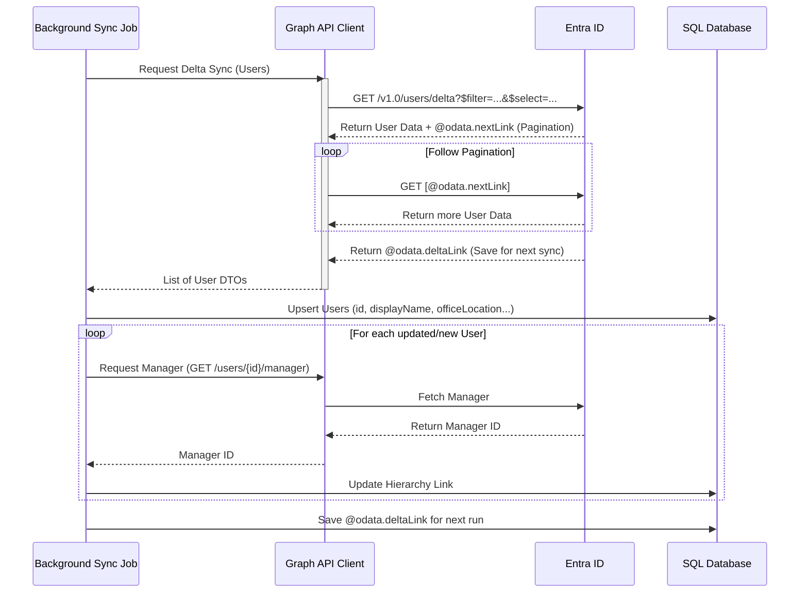
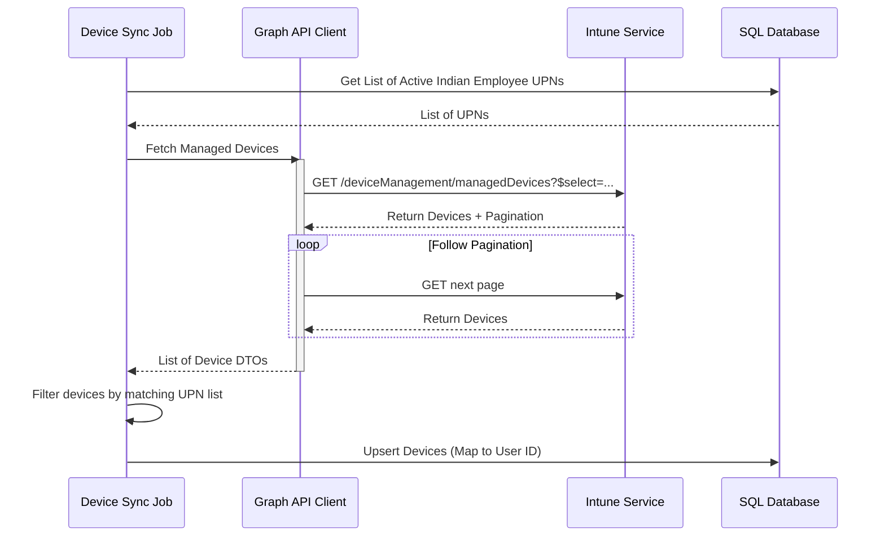
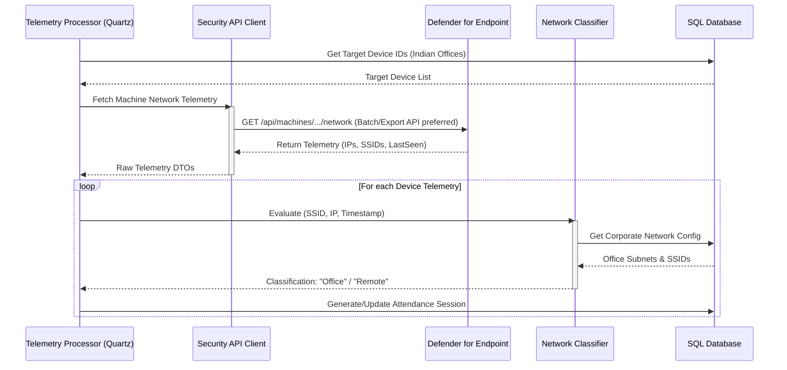
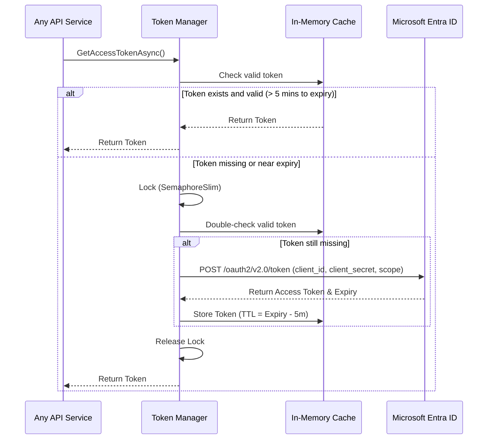

# 08 - Microsoft Integration Design Document

## 1. Executive Summary

The Enterprise Attendance & Workforce Analytics Platform leverages Microsoft 365 services as its foundational data source for organizational structure, device inventory, and network telemetry. This **Microsoft Integration Design Document** outlines the architectural patterns, API interactions, data flows, and resilience strategies required to seamlessly and securely integrate with Microsoft Entra ID, Microsoft Intune, and Microsoft Defender for Endpoint.

The platform operates silently, without requiring end-point agent installation or user interaction. By correlating data from these three Microsoft services, the system determines the physical presence of employees at corporate office locations in India (Chennai, Noida, Hyderabad, Gurugram, and Bangalore). This document details the technical implementation of these integrations, focusing on the OAuth 2.0 authentication flow, Graph API usage, data mapping, rate limit handling, and the dual-mode architecture that supports both live telemetry and simulated data for development and testing.

## 2. Integration Overview Diagram

The following diagram illustrates the high-level data flows between the Enterprise Attendance Platform and the Microsoft 365 ecosystem.

```mermaid
graph TD
    %% Define Styles
    classDef system fill:#0072C6,stroke:#fff,stroke-width:2px,color:#fff;
    classDef platform fill:#2E7D32,stroke:#fff,stroke-width:2px,color:#fff;
    classDef db fill:#F57F17,stroke:#fff,stroke-width:2px,color:#fff;
    
    %% Microsoft Ecosystem
    subgraph "Microsoft 365 Ecosystem"
        Entra[Microsoft Entra ID]:::system
        Intune[Microsoft Intune]:::system
        Defender[Microsoft Defender for Endpoint]:::system
        GraphAPI{Microsoft Graph API}:::system
    end
    
    %% Platform
    subgraph "Enterprise Attendance Platform"
        Auth[Auth & Token Manager]:::platform
        SyncEngine[Background Sync Engine]:::platform
        TelemetryEngine[Telemetry Processing Engine]:::platform
        DataDB[(SQL Server Database)]:::db
    end
    
    %% Connections
    Auth -->|Client Credentials Flow| Entra
    Entra -.->|Access Token| Auth
    
    Auth -->|Inject Token| SyncEngine
    Auth -->|Inject Token| TelemetryEngine
    
    SyncEngine -->|GET /users, /users/{id}/manager| GraphAPI
    GraphAPI -.->|Org Hierarchy & Users| Entra
    
    SyncEngine -->|GET /deviceManagement/managedDevices| GraphAPI
    GraphAPI -.->|Device Inventory| Intune
    
    TelemetryEngine -->|GET /security/alerts, Machine Info| GraphAPI
    GraphAPI -.->|Network & Telemetry Data| Defender
    
    SyncEngine -->|Save Org & Device Data| DataDB
    TelemetryEngine -->|Save Telemetry Data| DataDB
```

## 3. Microsoft Entra ID Integration

### 3.1 Purpose
Microsoft Entra ID (formerly Azure Active Directory) serves as the definitive source of truth for identity management, organizational hierarchy, and user authentication. The platform integrates with Entra ID to automatically synchronize employee accounts, their reporting structures, and basic profile information.

### 3.2 Graph API Endpoints Used
- `GET /v1.0/users`: Retrieves the list of users.
- `GET /v1.0/users/{id}/manager`: Retrieves the manager of a specific user.
- `GET /v1.0/users/{id}/directReports`: Retrieves the direct reports of a specific user.

### 3.3 Data Fields Synced
- `displayName`: Full name of the employee.
- `mail`: Primary corporate email address.
- `jobTitle`: Current job title.
- `department`: Department name.
- `officeLocation`: Physical office location (used for filtering).
- `id`: Entra ID Object ID (Unique Identifier).
- `accountEnabled`: Status of the user account.
- `manager`: Reference to the user's manager object.

### 3.4 Filtering Rules
To comply with business requirements, the synchronization process is restricted to employees based in Indian offices.
- **Filter Criteria**: `$filter=officeLocation in ('Chennai', 'Noida', 'Hyderabad', 'Gurugram', 'Bangalore') and accountEnabled eq true`
- **Note**: The exact matching strings must align with the values populated in the company's Entra ID environment.

### 3.5 Synchronization Strategy
- **Frequency**: A background worker (Quartz.NET job) runs every 6 hours. This is configurable via `appsettings.json`.
- **Methodology**: 
  - A full sync is performed on the initial run.
  - Subsequent runs utilize **Delta Queries** (`/v1.0/users/delta`) to fetch only changes (additions, updates, deletions) since the last sync, minimizing API calls and processing time.

### 3.6 Sequence Diagram: Entra ID Sync



## 4. Microsoft Intune Integration

### 4.1 Purpose
Microsoft Intune provides the mobile device management (MDM) capabilities. The platform queries Intune to build an inventory of corporate-owned devices assigned to the synchronized Indian employees. This mapping is crucial to associate network telemetry generated by a device with the specific employee who owns it.

### 4.2 Graph API Endpoints Used
- `GET /v1.0/deviceManagement/managedDevices`: Retrieves the list of managed devices.

### 4.3 Data Fields Synced
- `deviceName`: The hostname of the device.
- `operatingSystem`: OS type (e.g., Windows, macOS).
- `complianceState`: Device compliance status.
- `lastSyncDateTime`: Last time the device checked in with Intune.
- `userPrincipalName`: UPN of the primary user, used to map the device to the Entra ID user.
- `managedDeviceOwnerType`: Indicates if it's a corporate or personal device.
- `serialNumber`: Hardware serial number.

### 4.4 Filtering Rules
- Only synchronize devices where `managedDeviceOwnerType` is 'company'.
- Only process devices assigned to users (`userPrincipalName`) that have already been synchronized in the Entra ID step (Indian employees).

### 4.5 Sequence Diagram: Intune Device Sync



## 5. Microsoft Defender for Endpoint Integration

### 5.1 Purpose
This is the **most critical** integration for the platform. Defender for Endpoint provides rich telemetry about device network connectivity without needing an additional agent. By analyzing the network adapters, connected SSIDs, and IP addresses reported by Defender, the platform can definitively determine if a device is physically on the corporate office network versus a remote network.

### 5.2 Graph API / Defender API Endpoints Used
Microsoft is consolidating Defender APIs into Graph, but some advanced machine information endpoints may still utilize the dedicated Defender APIs (`https://api.securitycenter.microsoft.com`).
- `GET /v1.0/security/alerts` (via Graph API) or `GET /api/machines` (Defender API)
- Specific endpoint to extract: Machine Network Information, Logon Information.

### 5.3 Data Fields Extracted
- `lastSeen`: Timestamp of the last telemetry report.
- `healthStatus`: Agent health.
- `riskScore`: Device risk level (optional, for logging).
- `ipAddress`: Current active IPv4/IPv6 addresses.
- `networkAdapters`: Details of active network interfaces.
  - `SSID`: The Wi-Fi network name (if wireless).
  - `subnetInfo`: IP Subnet details.
  - `defaultGateway`: Gateway IP.

### 5.4 Network Detection Logic
The platform compares the reported `SSID` and `ipAddress/subnet` against the known Corporate Network Identifiers configured for each Indian office.
- **Office Presence**: If SSID == "Ramboll-Corp" AND IP is within `10.10.x.x/16` (example).
- **Remote via VPN**: If SSID == "Home-WiFi" AND IP shows a VPN virtual adapter subnet. **This is classified as Work From Home**.
- **Remote**: Any unmanaged network.

### 5.5 Sequence Diagram: Telemetry Processing



## 6. Authentication & Token Management

### 6.1 Authentication Flow
Because the platform operates autonomously in the background, it uses the **OAuth 2.0 Client Credentials Flow**. The application authenticates as itself (App-Only) using a Client ID and Client Secret (or Certificate) configured in Azure AD.

### 6.2 Token Caching Strategy
To minimize latency and avoid hitting authentication rate limits, tokens are cached in memory using `IMemoryCache`.
- **Proactive Refresh**: A background service checks token validity. If a token has less than 5 minutes remaining before expiry, a new token is requested preemptively.
- **Thread Safety**: Token retrieval uses `SemaphoreSlim` to ensure that only one thread requests a new token during expiry, preventing stampeding herds.

### 6.3 Sequence Diagram: Token Lifecycle



## 7. Resilience & Fault Tolerance

To ensure reliable data processing despite transient network issues or Microsoft service degradation, the platform implements robust resilience patterns.

### 7.1 Polly Retry Policy
All outbound HTTP requests to Microsoft APIs are wrapped in a Polly `AsyncRetryPolicy`.
- **Trigger**: HTTP 429 (Too Many Requests) and HTTP 5xx (Server Errors).
- **Strategy**: Exponential backoff with jitter.
  - Attempt 1: 2 seconds
  - Attempt 2: 4 seconds
  - Attempt 3: 8 seconds
- If a `Retry-After` header is present (especially on 429s), the policy respects the header duration instead of the exponential backoff calculation.

### 7.2 Circuit Breaker Pattern
To protect the system and prevent cascading failures during sustained Microsoft API outages:
- **Trigger**: 5 consecutive failures within a 60-second rolling window.
- **Action**: Break the circuit for 5 minutes. All subsequent requests immediately throw a `BrokenCircuitException` without hitting the network.
- **Recovery**: After 5 minutes, transition to 'Half-Open'. Allow one request through. If it succeeds, reset the circuit. If it fails, open it again.

### 7.3 Graceful Degradation
If telemetry services (Defender) are completely down:
- The system logs a critical warning to Serilog.
- The telemetry processing cycle is skipped gracefully without crashing the host.
- A "Data Source Unavailability" event is recorded in the platform's audit log to explain potential gaps in attendance data for that day.

## 8. Rate Limiting & Throttling

Microsoft Graph API enforces strict rate limits per application.

### 8.1 Batching Requests
Where possible, individual API calls are grouped using the Graph API `$batch` endpoint, which allows up to 20 requests in a single HTTP payload.

### 8.2 Delta Queries
As mentioned in section 3.5, Delta Queries are utilized for Entra ID synchronization to dramatically reduce the payload size and the number of API calls, retrieving only modified entities.

### 8.3 Throttling Implementation
The platform employs a centralized `RateLimitHandler` delegating handler in the `HttpClient` pipeline.
- It intercepts HTTP 429 responses.
- It parses the `Retry-After` header.
- It pauses the specific thread using `Task.Delay` before allowing the Polly retry policy to attempt the request again.

## 9. Graph API Permission Requirements

The following application permissions must be granted and admin-consented in the Microsoft Entra ID portal.

| Service | Permission Name | Type | Description | Admin Consent Req. |
|---------|-----------------|------|-------------|--------------------|
| Entra ID | `User.Read.All` | Application | Read all user profiles and organizational hierarchy. | Yes |
| Entra ID | `Directory.Read.All` | Application | Read directory data. | Yes |
| Intune | `DeviceManagementManagedDevices.Read.All` | Application | Read properties of all managed devices. | Yes |
| Defender | `Machine.Read.All` (Defender API) | Application | Read machine metadata and network configuration. | Yes |
| Defender | `SecurityEvents.Read.All` (Graph) | Application | Read security events and telemetry. | Yes |

## 10. Dual-Mode Architecture

To facilitate local development, testing, and CI/CD pipelines without requiring access to real production Microsoft 365 tenants, the platform implements a Dual-Mode Architecture using the Dependency Injection container.

### 10.1 Interface Abstraction
All Microsoft integrations are abstracted behind specific interfaces:
- `IEntraIdProvider`
- `IIntuneProvider`
- `IDefenderProvider`

### 10.2 Implementations
- **Live Implementation**: E.g., `GraphEntraIdProvider`, uses standard HttpClient and actual OAuth tokens.
- **Mock Implementation**: E.g., `MockEntraIdProvider`, generates deterministic, fake data (Bogus library) that simulates realistic organizational structures and telemetry events.

### 10.3 Configuration Switch
In `appsettings.json`, a configuration flag controls the binding:
```json
"TelemetrySettings": {
  "UseMockTelemetry": true
}
```

### 10.4 DI Registration Pattern
In `Program.cs` or the service registration extension:
```csharp
if (configuration.GetValue<bool>("TelemetrySettings:UseMockTelemetry"))
{
    services.AddSingleton<IEntraIdProvider, MockEntraIdProvider>();
    services.AddSingleton<IIntuneProvider, MockIntuneProvider>();
    services.AddSingleton<IDefenderProvider, MockDefenderProvider>();
}
else
{
    // Register Graph clients, HttpClientFactory, Polly policies...
    services.AddHttpClient<IEntraIdProvider, GraphEntraIdProvider>()
            .AddPolicyHandler(GetRetryPolicy())
            .AddPolicyHandler(GetCircuitBreakerPolicy());
}
```

## 11. Data Mapping Tables

### 11.1 Entra ID User -> Employee Entity
| Microsoft Graph Field | Application Employee Entity | Notes |
|-----------------------|-----------------------------|-------|
| `id` | `EntraId` | Unique GUID identifier |
| `displayName` | `FullName` | |
| `mail` | `Email` | |
| `jobTitle` | `Designation` | |
| `department` | `DepartmentName` | Maps to Department entity |
| `officeLocation` | `LocationName` | Maps to OfficeLocation entity |
| `manager.id` | `ManagerId` | Self-referencing foreign key via EntraId |

### 11.2 Intune Device -> Device Entity
| Microsoft Graph Field | Application Device Entity | Notes |
|-----------------------|---------------------------|-------|
| `id` | `IntuneId` | Unique GUID identifier |
| `deviceName` | `Hostname` | |
| `operatingSystem` | `Platform` | |
| `userPrincipalName` | `OwnerEmail` | Used to link Device to Employee |

## 12. Edge Cases

- **Token Expiry Mid-Sync**: If a token expires during a paginated request loop, the `HttpClient` middleware will intercept the 401 Unauthorized, trigger the token refresh mechanism, and retry the request transparently using Polly.
- **Partial User Data**: If a user is missing a critical field (e.g., `officeLocation`), they are skipped and a warning is logged. They will not have attendance tracked.
- **Deleted Users**: If an employee is terminated and removed from Entra ID, the Delta Query will return a deleted flag. The platform will mark the `Employee` entity as `IsActive = false`, retaining historical attendance data.
- **Disabled Accounts**: Filtered out on initial sync. If an account is disabled post-sync, they are treated similarly to deleted users.
- **Device Ownership Changes**: If a device is re-imaged and assigned to a new user, the next Intune sync will update the `OwnerEmail` mapping, attributing subsequent telemetry to the new employee.

## 13. Assumptions, Risks, Dependencies, Future Enhancements

### Assumptions
- All employees in Indian offices are issued corporate devices managed by Intune.
- Defender for Endpoint is active and reporting network telemetry reliably for all corporate devices.
- Network configurations (SSIDs, Subnets) for Indian offices are static or updated via platform administration interfaces when changed by the network team.

### Risks
- **Microsoft API Changes**: Microsoft frequently updates Graph API and Defender APIs. A breaking change could interrupt data flow.
  - *Mitigation*: Pin to specific API versions (v1.0). Monitor Microsoft 365 Message Center.
- **Telemetry Latency**: Defender telemetry might not be real-time. There could be delays in reporting "connected" status.
  - *Mitigation*: The session logic handles historical timestamps correctly and rebuilds sessions retroactively based on the `lastSeen` timestamps rather than the processing time.

### Dependencies
- Microsoft Graph API availability.
- Azure AD Application Registration and Admin Consent.
- Proper network configuration data from the IT infrastructure team.

### Future Enhancements
- **Webhooks/Event Grid**: Migrate from polling (Quartz jobs) to event-driven architectures utilizing Microsoft Graph Change Notifications (Webhooks) for near real-time updates of user and device changes.
- **Confidence Scoring Integration**: Implement advanced telemetry weighting. E.g., High Confidence if both Defender IP and a physical access badge swipe are correlated.
- **Cross-Tenant Integration**: Support for multiple Entra ID tenants in the case of mergers and acquisitions.
