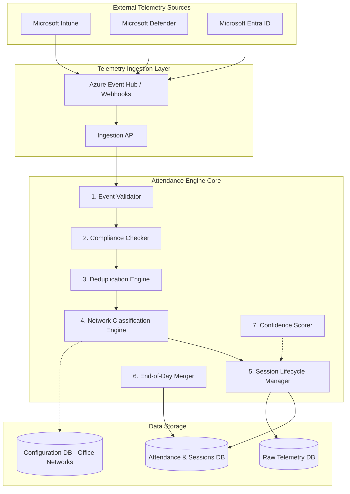
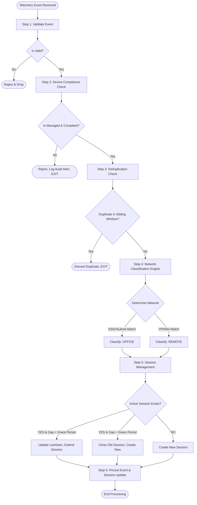
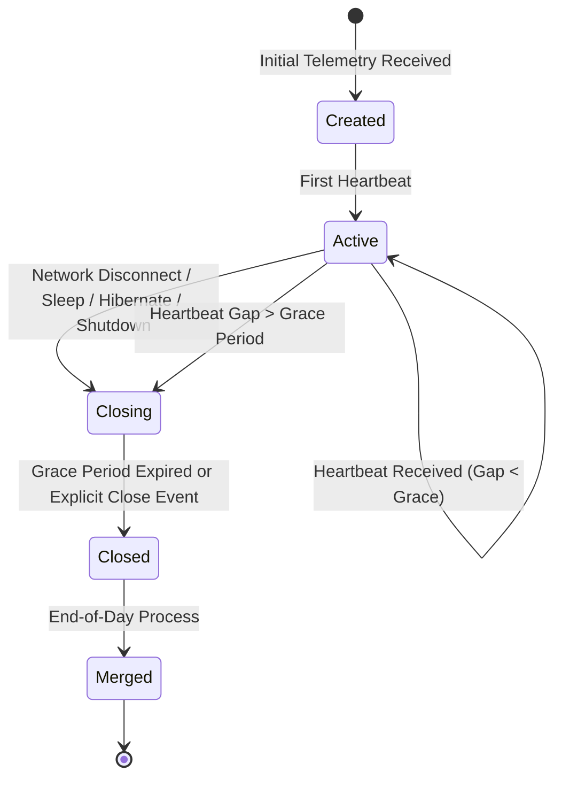

# 09. Attendance Engine Design Document

## 1. Executive Summary
The Attendance Engine is the absolute core business logic component of the Enterprise Attendance & Workforce Analytics Platform. It is responsible for ingesting, correlating, and analyzing raw network and device telemetry from multiple Microsoft 365 sources (Microsoft Entra ID, Microsoft Intune, Microsoft Defender for Endpoint) to accurately calculate employee office attendance. 

Unlike traditional attendance systems that rely on swipe cards or explicit check-ins, this engine operates silently in the background, utilizing a sophisticated set of algorithms to determine whether an employee is working from a corporate office or remotely. The engine's accuracy is paramount, as its outputs directly influence workforce analytics, HR policies, and real estate planning. This document outlines the architecture, processing pipelines, classification algorithms, and edge-case handling mechanisms of the Attendance Engine.

## 2. Engine Architecture
The Attendance Engine is designed using Clean Architecture principles, ensuring separation of concerns and high testability. It operates primarily as a background service within the backend infrastructure, processing telemetry events asynchronously.



## 3. Engine Processing Pipeline
The processing pipeline defines the sequence of operations applied to every incoming telemetry event.



## 4. Network Classification Engine
The Network Classification Engine is the most critical sub-component. It determines the location context of the device based on network telemetry.

### 4.1 Decision Tree

```mermaid
flowchart TD
    Start([Evaluate Network Context]) --> SSID_Check
    
    SSID_Check{Does SSID match an Office Network?}
    SSID_Check -- Yes --> OfficeMatch1[Classify: OFFICE (Map to Location)]
    SSID_Check -- No/Empty --> Subnet_Check
    
    Subnet_Check{Does IP/Subnet match an Office LAN?}
    Subnet_Check -- Yes --> VPN_Check1
    Subnet_Check -- No --> Remote1[Classify: REMOTE]
    
    VPN_Check1{Is VPN Active?}
    VPN_Check1 -- Yes --> ConfigCheck{Does Config Allow VPN over LAN?}
    ConfigCheck -- Yes --> OfficeMatch2[Classify: OFFICE]
    ConfigCheck -- No --> Remote2[Classify: REMOTE]
    VPN_Check1 -- No --> OfficeMatch2
```

### 4.2 Priority Order & Critical Rules
1. **SSID Match**: Highest priority. If the device is connected to a known corporate Wi-Fi SSID (e.g., 'Ramboll-CHN'), it is in the office.
2. **Subnet/IP Range Match**: If on wired LAN, the subnet is evaluated.
3. **CRITICAL RULE**: A VPN connection where the device's assigned local IP resolves to a non-office subnet MUST be classified as REMOTE. Even if the VPN tunnel routes traffic through the office gateway, the physical location is remote. VPN IP ranges (e.g., 10.200.x.x for VPN clients) are explicitly excluded from office classifications.

### 4.3 Per-Office Matching Examples
- **Chennai**: SSID = `Ramboll-CHN`, Subnets = `10.100.0.0/16`
- **Noida**: SSID = `Ramboll-NOI`, Subnets = `10.101.0.0/16`
- **Hyderabad**: SSID = `Ramboll-HYD`, Subnets = `10.102.0.0/16`
- **Gurugram**: SSID = `Ramboll-GUR`, Subnets = `10.103.0.0/16`
- **Bangalore**: SSID = `Ramboll-BLR`, Subnets = `10.104.0.0/16`

## 5. Session Lifecycle Management
A "Session" represents a continuous block of time an employee spends on a specific network type (Office or Remote).



### Close Reasons Enum
- `NetworkDisconnect`: Device left the network.
- `PowerStateChange`: Sleep, Hibernate, or Shutdown detected.
- `Timeout`: Grace period expired without telemetry.
- `EndOfDay`: Forced closure at 11:59 PM.
- `LocationChange`: Transitioned from Office to Remote or vice versa.

## 6. Grace Period Algorithm
Network instability or moving between access points can cause temporary telemetry gaps.

- **Configurable Threshold**: Default is 30 minutes.
- **Gap < Grace Period**: If the time between the `LastSeen` of the active session and the timestamp of the new event is less than the grace period, the gap is ignored. `LastSeen` is updated, and the session continues. The gap time is counted as active office time.
- **Gap > Grace Period**: If the gap exceeds the grace period (e.g., employee goes out for a 2-hour lunch), the active session is closed using its existing `LastSeen` timestamp. The new event triggers the creation of a new session. The gap time is NOT counted.

## 7. End-of-Day Session Merge Algorithm
At a configured time (e.g., 11:59 PM IST), the engine aggregates all closed sessions for the day into a single `DailyAttendance` record per employee.

- **Process**:
  1. Fetch all sessions for Employee E on Date D.
  2. Filter sessions by `NetworkType == OFFICE`.
  3. **Total Office Hours**: Sum of durations of all OFFICE sessions.
  4. **First Seen**: Earliest `StartTime` among OFFICE sessions.
  5. **Last Seen**: Latest `EndTime` among OFFICE sessions.
  6. **Remote Sessions**: Handled separately for analytics, but do not contribute to Total Office Hours.

## 8. Multi-Device Merge Algorithm
Employees often use multiple devices. The engine merges overlapping sessions to prevent double-counting.

**Scenario**: 
- Laptop A (Office): 09:00 - 12:00
- Laptop B (Office): 11:30 - 18:00

**Algorithm**:
1. Sort all OFFICE sessions by `StartTime`.
2. Initialize `MergedSessions` list.
3. For each session:
   - If `MergedSessions` is empty, add session.
   - Compare current session with the last session in `MergedSessions`.
   - If they overlap (Current.StartTime <= Last.EndTime), extend Last.EndTime to `MAX(Last.EndTime, Current.EndTime)`.
   - If they do not overlap, add current session to `MergedSessions`.
4. Calculate Total Office Hours from the `MergedSessions` list.

```mermaid
timeline
    title Multi-Device Overlap De-duplication
    section Laptop A
        09:00 - 12:00 : Session A Active
    section Laptop B
        11:30 - 18:00 : Session B Active
    section Merged Result
        09:00 - 18:00 : Merged Session (9 Hours Total)
```

## 9. Office vs Remote Classification Decision Table

| Scenario | SSID Match | Subnet Match | VPN Active | Classification |
|----------|-----------|-------------|------------|----------------|
| Office Wi-Fi | Yes | Yes | No | **OFFICE** |
| Office LAN | N/A | Yes | No | **OFFICE** |
| Home Wi-Fi | No | No | No | **REMOTE** |
| VPN from Home | No | No (tunnel IP) | Yes | **REMOTE** |
| VPN from Office | Yes | Yes | Yes | **OFFICE** |
| Unknown Network | No | No | No | **UNKNOWN** |

## 10. Confidence Scoring Algorithm
Each session is assigned a confidence score based on the diversity of telemetry sources validating it.
- **High**: Telemetry confirmed by Intune, Defender, and Entra ID network logs.
- **Medium**: Confirmed by 2 sources (e.g., Intune and Defender).
- **Low**: Confirmed by only 1 source.
- **Very Low**: Network data is ambiguous, incomplete, or conflicts between sources.

## 11. Edge Cases (Exhaustive)

1. **First login of day**: Creates new session, sets First Seen.
2. **Multiple logins/logouts**: Generates multiple short sessions; merged at EOD if gap > grace period.
3. **Sleep/Hibernate/Restart**: Triggers immediate session close; new session on wake.
4. **VPN from home**: Classified as REMOTE; zero office hours accrued.
5. **Wi-Fi switch within office (e.g., Floor 1 to Floor 2)**: Same office SSID/Subnet; gap is < grace period; session continues.
6. **LAN to Wi-Fi transition**: Different IP/Subnet but both belong to office; gap < grace period; session continues.
7. **Network interruption < grace period**: Ignored; session extended.
8. **Network interruption > grace period**: Session closed; gap excluded from office hours; new session created.
9. **Multi-device switch**: Sessions overlap; merged via Multi-Device algorithm.
10. **Device replacement**: Old device session ends; new device starts; merged via Multi-Device algorithm.
11. **Non-compliant device (BYOD)**: Rejected at Step 2; no session created.
12. **Duplicate telemetry**: Discarded at Step 3; no impact.
13. **Missing telemetry source (e.g., Defender offline)**: Rely on Intune/Entra; Confidence score downgraded to Medium/Low.
14. **Weekend login**: Processed normally but flagged as 'Weekend/Overtime' in analytics.
15. **Holiday login**: Processed normally but flagged as 'Holiday' in analytics.
16. **After-hours login**: Processed normally; extends Total Office Hours.
17. **Two offices same day (travel)**: E.g., Chennai morning, Bangalore afternoon. Two distinct OFFICE sessions created with different location tags. Merged at EOD into Total Office Hours, but location reflects "Multiple Offices".
18. **Employee transfer between offices**: Office networks configuration maps to the new office seamlessly based on SSID/Subnet.
19. **Clock skew on device**: Engine relies on server receipt time or trusted network timestamps, rejecting client-generated times that skew beyond a 5-minute threshold.
20. **Sudden power loss (No shutdown event)**: Session remains active until Heartbeat Gap > Grace Period, then closes retroactively at LastSeen.

## 12. Performance Considerations
- **Batch Processing**: Telemetry events are batched from the Event Hub to reduce database write operations.
- **Async I/O**: All database and external API calls utilize async/await to maximize throughput.
- **Efficient SQL**: The Deduplication Check and Active Session Lookups utilize indexed, highly optimized SQL queries (or a Redis cache layer for extreme scale).
- **In-Memory Caching**: The `OfficeNetworks` configuration table is cached in memory and refreshed periodically to eliminate DB hits during Step 4.

## 13. Assumptions, Risks, Dependencies
### Assumptions
- Corporate SSIDs and Subnets are unique to the physical offices and are not broadcast elsewhere.
- Devices heartbeat at a frequency less than the defined Grace Period.

### Risks
- **VPN Misconfiguration**: If VPN IP pools overlap with Office LAN subnets, home workers might be misclassified as OFFICE. Mitigation: Strict network design enforcement.
- **Telemetry Latency**: Delayed events might arrive out of order. Engine must buffer and sort events by timestamp before processing.

### Dependencies
- Microsoft Graph API (for Entra ID sync).
- Azure Event Hubs (for scalable telemetry ingestion).
- Network Team (for maintaining accurate `OfficeNetworks` definitions).

### Future Enhancements
- Machine Learning models to detect anomalous attendance patterns (e.g., "impossible travel" between offices).
- Real-time dashboarding for facility managers (occupancy heatmaps).

### Acceptance Criteria
- Engine successfully processes 10,000 events/minute with < 1s latency.
- Accuracy of OFFICE vs REMOTE classification > 99.9% based on test datasets.
- Multi-device overlapping sessions are perfectly de-duplicated.
- VPN from home yields 0 Office Hours.
