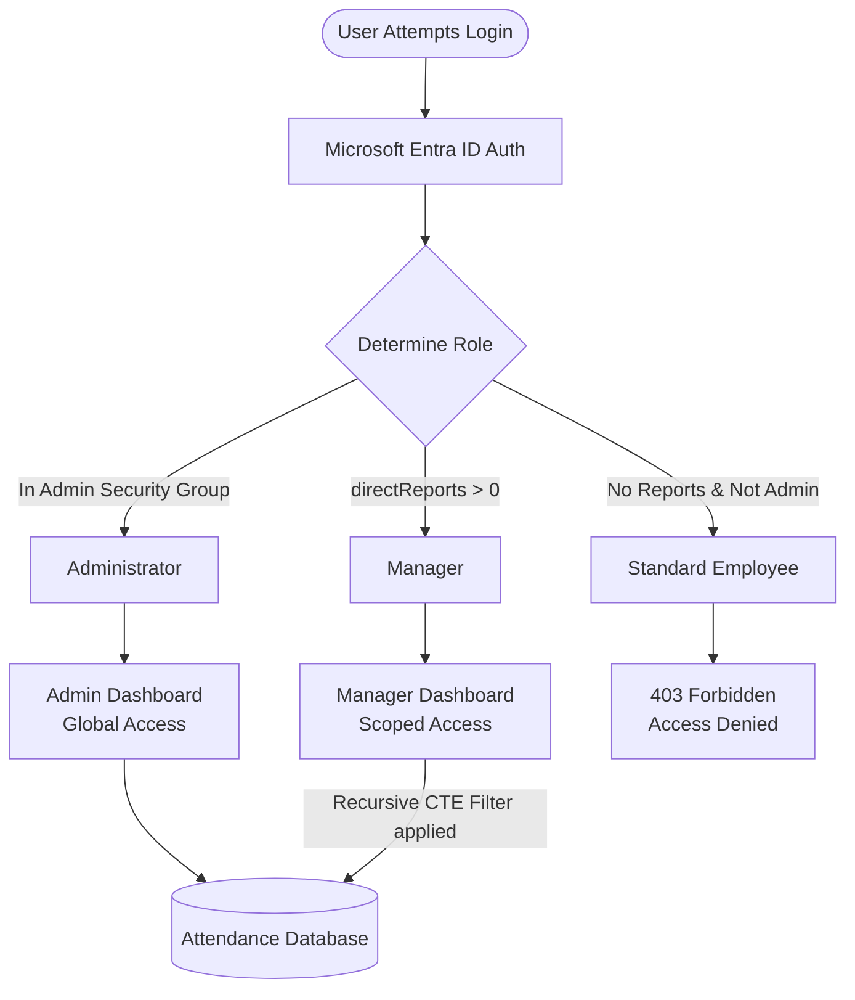
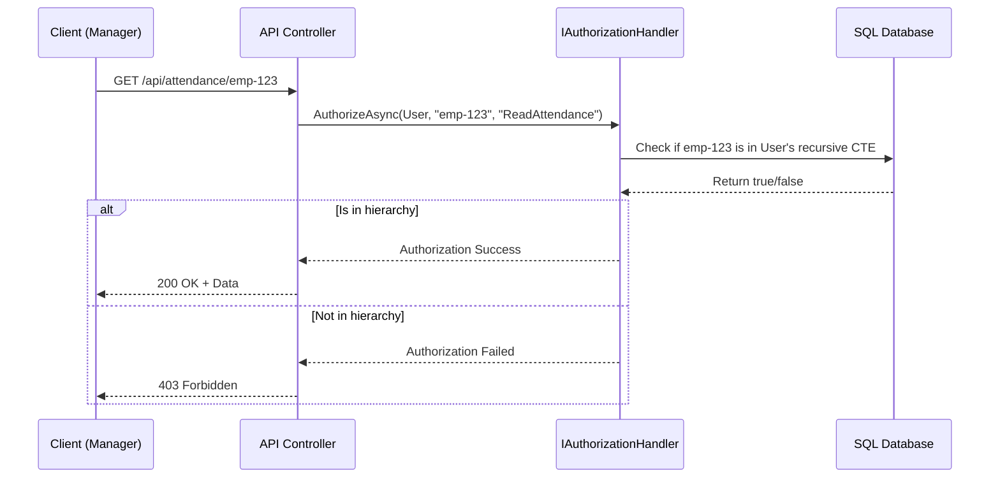
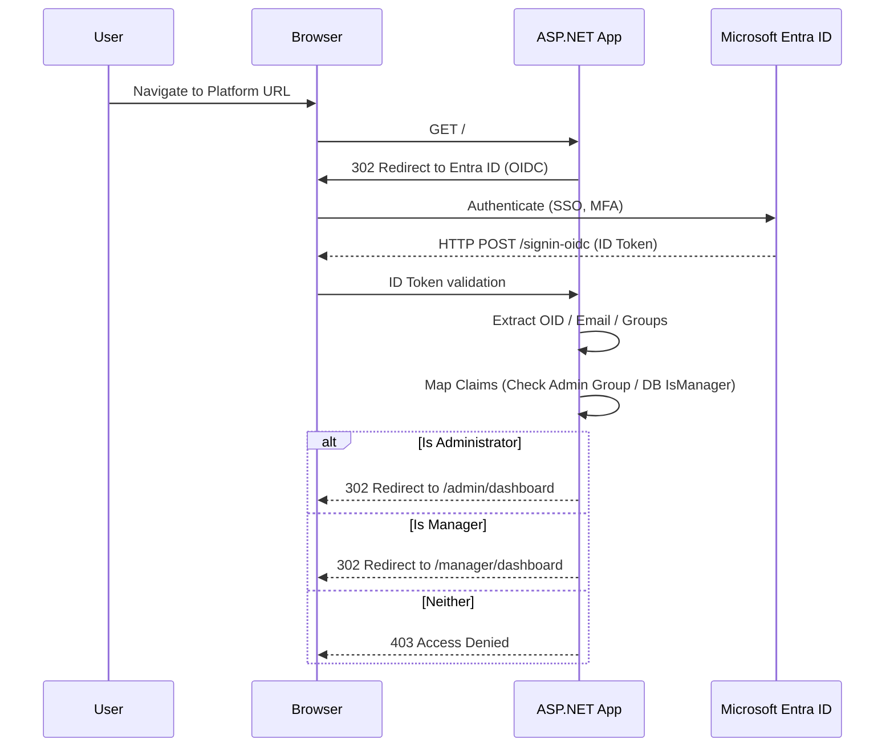
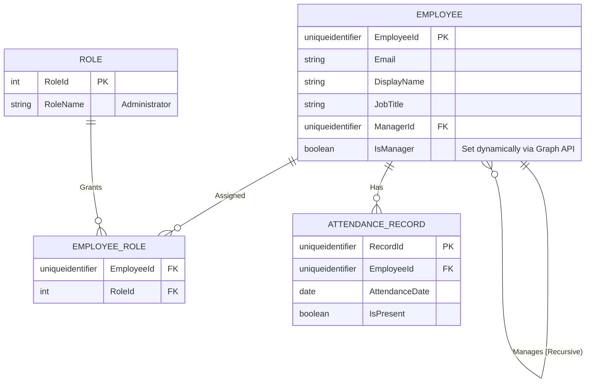

# Enterprise Attendance & Workforce Analytics Platform
## Software Requirements Specification: Role-Based Access Control (RBAC)

---

## 1. Executive Summary
This document outlines the Role-Based Access Control (RBAC) architecture for the Enterprise Attendance & Workforce Analytics Platform. The system utilizes a simplified, high-security authorization model strictly limited to two distinct roles: **Administrator** and **Manager**. By design, the application is a silent, background tracking system operating autonomously via network telemetry. Consequently, standard employees have zero access to the platform UI. This strict two-role model ensures operational simplicity, reduces the attack surface, and complies with data privacy requirements by limiting attendance data visibility solely to an employee's direct management chain or system administrators.

## 2. Purpose
The primary purpose of this specification is to define the exact access boundaries, authorization workflows, role definitions, and hierarchical data scoping mechanisms governing user interactions with the Enterprise Attendance dashboards. It serves as the definitive blueprint for the engineering and security teams implementing the ASP.NET Core authorization policies, Microsoft Entra ID integration, and database row-level security.

## 3. Scope
This document covers:
*   Authentication via Microsoft Entra ID (OAuth 2.0 / OpenID Connect).
*   Role definitions and the exhaustive permission matrix.
*   Data scoping rules based on dynamic multi-level organizational hierarchies.
*   The explicitly prohibited access boundaries (e.g., standard employees).
*   Role assignment mechanisms and Entra ID attribute dependencies.
*   Audit logging requirements for system access.

**Out of Scope:**
*   Detailed technical configuration of Entra ID app registrations (covered in Security Architecture).
*   Network telemetry processing logic (covered in Data Processing Specifications).
*   Frontend UI design specifications.

## 4. Actors / Stakeholders

| Actor | Description | System Interaction Level |
| :--- | :--- | :--- |
| **Administrator** | IT Operations, System Administrators, or super-users responsible for system configuration and global monitoring. | **Full / Global.** Has unrestricted access to all data, settings, and dashboards. |
| **Manager** | Any user identified in Microsoft Entra ID as having direct reports (`directReports > 0`). | **Scoped / Hierarchical.** Can only view data and reports for employees within their recursive reporting subtree. |
| **Employee** | Standard workforce members generating attendance telemetry. | **None.** Employees do not have portal access. Any login attempt yields a 403 Forbidden. |

## 5. RBAC Architecture and Flow

The following diagram illustrates the simplified two-role hierarchy and how Microsoft Entra ID integrates with the ASP.NET Core backend to enforce access control.


### 5.1 Architecture Diagram: Logical Access



## 6. Role Definitions

| Role | Description | Scope | Dashboard Access |
|------|-------------|-------|------------------|
| **Administrator** | IT/System admin | Full system access — all employees, all offices, all configuration | Admin Dashboard |
| **Manager** | People manager | Direct + indirect reports (recursive subtree only) | Manager Dashboard |

## 7. Permission Matrix

The following comprehensive table defines exact feature toggles and data visibility boundaries for the active roles.

| Feature / Capability | Administrator | Manager | Notes |
| :--- | :---: | :---: | :--- |
| **View All Employee Attendance** | ✅ | ❌ | Managers only see their subtree. |
| **View Team Attendance** | ✅ | ✅ | Managers bounded to their hierarchy. |
| **View Org Chart** | ✅ | ✅ | Managers see org chart starting from themselves downward. |
| **Manage Office Networks (SSID/VLAN/IP)** | ✅ | ❌ | Configuration restricted to Admin. |
| **Manage Business Rules (Min Days, etc.)** | ✅ | ❌ | Policy configuration restricted to Admin. |
| **Manage Email Templates** | ✅ | ❌ | System notification templates. |
| **Trigger Manual Sync** | ✅ | ❌ | Manually syncing Entra ID users/telemetry. |
| **View Audit Logs** | ✅ | ❌ | Platform security and access logs. |
| **View API Logs** | ✅ | ❌ | Backend service integration logs. |
| **Export Team Data** | ✅ | ✅ | Managers can export CSV/PDF for their subtree. |
| **Preview Weekly Report** | ✅ | ✅ | Managers preview reports for their own team. |
| **Trigger Edge Case Simulator** | ✅ | ❌ | Development/QA tool. |
| **Employee Self-Service** | ❌ | ❌ | Does not exist in the system. |

## 8. Multi-Level Manager Hierarchy Access Rules

The application utilizes a strict, dynamic data scoping model for Managers. A Manager's visibility is bounded by their organizational reporting chain as synchronized from Microsoft Entra ID.

### 8.1 Business Rules for Hierarchy
1.  **Recursive Access**: A manager has access to data for their direct reports AND all indirect reports down to the lowest leaf node of their organizational tree.
    *   *Example*: Manager A manages Manager B. Manager B manages Employee C. Manager A can view attendance data for both Manager B and Employee C.
2.  **No Peer Access**: Manager A cannot view data for Manager D (a peer) or Manager D's subordinates.
3.  **No Upward Access**: Manager B cannot view attendance data for Manager A.
4.  **Self-Viewing**: A Manager CAN view their own attendance data within the Manager Dashboard.

### 8.2 Technical Implementation (Recursive CTE)
To resolve the organizational hierarchy efficiently at query time without causing N+1 query issues or loading the entire company org chart into memory, the system uses SQL Server Recursive Common Table Expressions (CTEs).

```sql
-- Example SQL Strategy for Data Scoping
WITH OrgCTE AS (
    -- Anchor member: The logged-in manager
    SELECT EmployeeId, ManagerId, DisplayName, 0 AS Level
    FROM Employees
    WHERE EmployeeId = @LoggedInUserId

    UNION ALL

    -- Recursive member: Direct and indirect reports
    SELECT e.EmployeeId, e.ManagerId, e.DisplayName, o.Level + 1
    FROM Employees e
    INNER JOIN OrgCTE o ON e.ManagerId = o.EmployeeId
)
SELECT * FROM OrgCTE;
```

### 8.3 ASP.NET Core IAuthorizationHandler
In the backend, this is enforced using custom Resource-Based Authorization.



## 9. No Employee Access (Silent Tracking Model)

A core tenet of this system is that it operates as a silent, background telemetry processor. 

**Business Rule**: Employees MUST NOT interact with this system.
1.  **No Login**: If a user attempts to log in and is not an Administrator and does not have `directReports > 0`, the ASP.NET Core Authentication middleware will automatically redirect them to an Access Denied (403) page.
2.  **No Correction Workflows**: Employees cannot log in to "correct" or "dispute" their attendance. All tracking is definitive based on network presence.

## 10. Role Assignment Mechanisms

Role assignment is highly automated to reduce administrative overhead and prevent drift.

### 10.1 Administrator Assignment
*   **Mechanism**: Static Entra ID Security Group membership.
*   **Process**: IT provisions users into a specific Entra ID Security Group (e.g., `SG-App-EnterpriseAttendance-Admins`). The application inspects the user's claims upon login to check for this Group ID (or App Role assignment).

### 10.2 Manager Assignment
*   **Mechanism**: Dynamic detection based on standard Entra ID user attributes.
*   **Process**: During the nightly Org Sync background job, the system queries the Microsoft Graph API. If an employee has `directReports` count greater than 0, their `IsManager` flag is set to `true` in the local SQL database. 
*   **Login Resolution**: When a user logs in, the system checks the local `IsManager` flag to determine if they receive the Manager claim.

## 11. Authentication Flow and Routing

The system relies exclusively on Microsoft Entra ID for authentication.



## 12. Entity Relationship Diagram (RBAC Focus)


*Note: The Manager "role" is implicitly derived from the self-referential `ManagerId` relationship and the `IsManager` boolean, rather than a row in the `ROLE` table.*

## 13. Audit Logging

To maintain strict security and compliance, all access and data viewing actions are logged.
1.  **Authentication Logs**: Every login attempt (Success, Failure, Denied due to Role) is logged with Timestamp, User OID, IP Address.
2.  **Authorization Logs**: Any time a Manager views a team member's attendance, a log entry is created: `Manager {OID} viewed Attendance for Employee {OID} on {Date}`.
3.  **Administrative Actions**: Any changes to network configuration, business rules, or roles by an Administrator are heavily audited with Before/After state payloads.

## 14. Concrete Examples

*   **Scenario 1: Standard Employee Access**
    *   *Actor*: John Doe (Software Engineer, no direct reports).
    *   *Action*: John tries to navigate to `attendance.ramboll.com`.
    *   *Result*: Entra ID authenticates him. App checks DB. John is not in the Admin group, nor does he have reports. HTTP 403 Forbidden.
*   **Scenario 2: Middle Manager View**
    *   *Actor*: Sarah Connor (Engineering Manager, manages 5 developers).
    *   *Action*: Sarah logs in.
    *   *Result*: Directed to Manager Dashboard. Can see list of her 5 developers and their weekly office presence metrics.
*   **Scenario 3: Director Level View**
    *   *Actor*: Miles Dyson (Director, manages Sarah and 3 other managers).
    *   *Action*: Miles logs in.
    *   *Result*: Directed to Manager Dashboard. Can see Sarah, the 3 other managers, AND all the developers reporting to those managers.
*   **Scenario 4: Administrator Maintenance**
    *   *Actor*: Alice (IT Network Admin, no direct reports, in Admin Group).
    *   *Action*: Logs in.
    *   *Result*: Directed to Admin Dashboard. Can update the Noida office subnet ranges. Can view attendance across the entire Indian org to troubleshoot telemetry mapping issues.

## 15. Edge Cases

| Edge Case | Expected System Behavior |
| :--- | :--- |
| **Manager with no current reports (transition)** | If a manager loses all direct reports (e.g., re-org), the nightly sync will set `IsManager = false`. On their next login, they will be denied access (403) like a standard employee. |
| **Admin who is also a Manager** | If a user is both, the Administrator role takes precedence. They are routed to the Admin Dashboard and have global access. |
| **Circular Reporting Hierarchy** | Entra ID typically prevents this, but if a data glitch causes a circular loop in `ManagerId`, the SQL CTE will throw an error. A `MAXRECURSION` limit of 20 will be applied to the SQL query to prevent infinite loops, failing gracefully with an error log. |
| **Executive without direct reports** | If an executive (e.g., Country Head) has their EA managing the org chart in Entra ID and technically has no direct reports in the system, they will be denied access. They must either be granted Admin rights manually or the Entra ID org chart must be corrected. |

## 16. Assumptions
1.  Microsoft Entra ID is the single source of truth for the organizational reporting hierarchy (the `manager` attribute).
2.  The organizational hierarchy in Entra ID is well-maintained and accurately reflects real-world reporting lines.
3.  Administrators are highly trusted individuals governed by standard corporate IT policies.

## 17. Future Enhancements
*   **Delegated Manager Access**: Allowing a manager to temporarily delegate their dashboard access to another manager (e.g., during PTO).
*   **HR Role / Anonymized Data Views**: Re-introducing an HR role that can see aggregated, anonymized trends for an office without seeing individual employee data, ensuring privacy while providing strategic analytics.

## 18. Acceptance Criteria
*   [ ] User in Admin security group can access the Admin Dashboard.
*   [ ] User in Admin security group can view attendance data for any employee in the system.
*   [ ] User with `directReports > 0` can access the Manager Dashboard.
*   [ ] User with `directReports > 0` can view attendance data for direct reports.
*   [ ] User with `directReports > 0` can view attendance data for indirect reports (multi-level).
*   [ ] User with `directReports > 0` is DENIED access to attendance data of peers or managers.
*   [ ] User with NO direct reports and NO Admin group membership is presented with a 403 Forbidden page.
*   [ ] Audit logs capture every dashboard login event and data access event.

## 19. Risks
*   **Entra ID Data Quality**: If the Entra ID org chart is outdated, managers may see data for employees who no longer report to them, representing a privacy violation.
*   **Performance overhead of deep hierarchies**: Extremely deep organizational trees (e.g., 15+ levels) may cause performance degradation in CTE queries. Mitigation via caching or materialized paths will be monitored.

## 20. Dependencies
*   Microsoft Entra ID / Microsoft Graph API (for Auth and hierarchy sync).
*   Entity Framework Core (for database access).
*   SQL Server 2022 (for CTE and robust relational querying).

## 21. References
*   `01_Architecture_Overview.md`
*   `05_Data_Processing_Telemetry.md`
*   Microsoft Entra ID Documentation: Object properties and Manager attributes.
