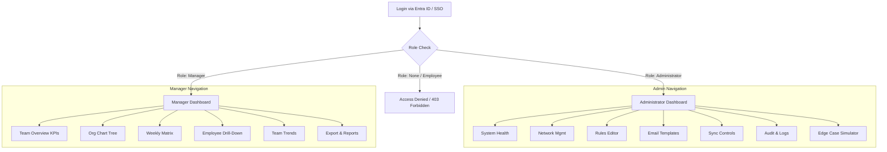

# Software Requirements Specification: Dashboard Requirements

## 1. Executive Summary

This document outlines the detailed functional and non-functional requirements for the dashboards of the Enterprise Attendance & Workforce Analytics Platform. The system utilizes a silent background tracking architecture to calculate office presence, relying entirely on network telemetry and Microsoft 365 integrations (Entra ID, Intune, Defender for Endpoint, Graph API). The dashboards are the sole visual interface for the platform, enabling system administration and workforce analytics. 

**Important Architectural Shift**: The system features **ONLY TWO** dashboard interfaces:
1. **Administrator Dashboard** — For IT administrators and system operators.
2. **Manager Dashboard** — For people managers to view and analyze their team's office attendance.

**Employees do NOT have access to the system**. The system operates as a silent tracking mechanism. Employees are never notified via the platform, and they do not have any dashboard or login access. This document details the exact layout, capabilities, and data representations required for the remaining authorized roles, ensuring comprehensive system management and robust attendance reporting.

## 2. Purpose

The purpose of this document is to define the exact specifications, layout, visual components, data points, and interactive features of the Administrator and Manager dashboards. It serves as a definitive blueprint for the frontend and backend engineering teams, UI/UX designers, and quality assurance testers. By meticulously defining the dashboard requirements, this document ensures that the final product aligns perfectly with the strategic goals of silent tracking, robust administration, and effective managerial oversight.

## 3. Scope

The scope of this specification covers:
- The architectural foundation and technology stack for the dashboard interfaces.
- Navigation flows and sitemaps.
- Detailed wireframe descriptions and component breakdowns for the Administrator Dashboard.
- Detailed wireframe descriptions and component breakdowns for the Manager Dashboard.
- Access control mechanisms and authorization flows.
- User Experience (UX) design principles and responsive design requirements.
- Concrete examples, edge cases, assumptions, and acceptance criteria.

The scope strictly EXCLUDES any employee-facing interfaces, HR-specific macro-dashboards, or Executive-level roll-up dashboards, as these have been removed from the product roadmap.

## 4. Actors/Stakeholders

| Actor | Description | Access Level |
|-------|-------------|--------------|
| **Administrator (IT/System Ops)** | Technical users responsible for maintaining system health, configuring network parameters, managing API integrations, and troubleshooting tracking issues. | Full administrative access to system settings, health metrics, and audit logs. |
| **Manager (People Leader)** | Employees with direct or indirect reports in Microsoft Entra ID. They need to monitor team compliance with the hybrid work policy (e.g., 3 days/week in the office). | Read-only access to attendance data and trends specifically for their organizational subtree (direct and indirect reports). |
| **Employee (Target)** | The workforce whose attendance is being tracked via background telemetry. | **NO ACCESS**. Employees cannot log into the system and receive no notifications from it. |

## 5. Dashboard Architecture

The dashboards are built on a modern, robust, and high-performance web architecture:
- **Framework**: ASP.NET Core MVC or Blazor (Server/WebAssembly based on final team preference, standardizing on Blazor Server for real-time SignalR capabilities).
- **Styling & Theming**: Tailwind CSS or custom SCSS leveraging CSS Variables for dynamic theming (Dark Mode default, Light Mode optional).
- **Data Visualization**: Chart.js or ApexCharts for rendering high-performance, interactive charts (line graphs, bar charts, timelines).
- **Responsiveness**: Desktop-first design. The system is primarily accessed via corporate laptops/desktops. Tablet view is supported as secondary. No mobile-specific responsive design is required or scoped.
- **State Management**: Flux pattern (via Fluxor if Blazor is chosen) to manage application state, caching, and filter contexts.

## 6. Dashboard Navigation Structure

The system enforces strict role-based routing upon authentication. Since employees have no access, any standard employee attempting to authenticate will be denied access entirely.

## 7. Administrator Dashboard

The Administrator Dashboard is the central command center for the technical operations of the Attendance Platform. It is designed for density, utility, and immediate visibility into system health.

### 7.1. System Health Panel
Provides a real-time overview of backend operations and integrations.
- **M365 Sync Status**: Indicators (Green/Yellow/Red) for connection health to Entra ID, Intune, and Defender for Endpoint.
- **Last Sync Timestamps**: Exact date and time of the last successful data pull from each API.
- **Event Processing Queue**: Real-time counter of pending telemetry events waiting to be processed into sessions.
- **API Health Indicators**: Latency and uptime metrics for Microsoft Graph API.
- **Error Count**: Rolling 24-hour count of critical errors or unhandled exceptions.

### 7.2. Office Network Management
A comprehensive CRUD interface for defining the geographical and network boundaries of the "Office".
- **Locations**: Restricted to Indian offices (Chennai, Noida, Hyderabad, Gurugram, Bangalore).
- **Network Identifiers**: For each location, administrators can Add/Edit/Delete:
  - **SSIDs**: Authorized corporate Wi-Fi network names (e.g., `Ramboll_Corp_5G`).
  - **Subnets/IP Ranges**: Authorized IP ranges (e.g., `10.0.45.0/24`).
  - **VLANs**: Authorized VLAN tags.
- **View**: A high-density data table with inline editing, validation, and status toggles (Active/Inactive).

### 7.3. Business Rules Editor
Form-based interface to define the parameters of the attendance policy.
- **Target Office Days/Week**: Configurable integer (default: 3).
- **Working Hours**: Standard office hours (e.g., 09:00 - 18:00) for baseline calculations.
- **Grace Period**: Minutes allowed off-network before a session is officially split or closed (e.g., 15 minutes for coffee runs).
- **Compliant Device Requirement**: Toggle to enforce that only devices marked "Compliant" in Intune count towards attendance.

### 7.4. Email Template Manager
Interface to manage automated outbound communications to Managers.
- **Templates**: Edit the "Weekly Team Attendance Report" and "Monthly Summary" templates.
- **Editor**: Rich text editor with macro support (e.g., `{{ManagerName}}`, `{{TeamCompliancePercentage}}`).
- **Live Preview**: Split-screen view showing the rendered HTML email based on sample data.

### 7.5. Sync Controls
Manual override controls for background services.
- **Buttons**: `Trigger User Sync`, `Trigger Device Sync`, `Trigger Telemetry Sync`.
- **Feedback**: Indeterminate progress bars that transition to success/failure toasts upon completion.

### 7.6. Organization Overview
Macro-level statistics of the synced directory.
- **Total Synced Employees**: Count of Indian office employees successfully mirrored from Entra ID.
- **Total Devices**: Count of registered devices tied to these employees.
- **Total Offices**: Configured office locations.

### 7.7. Audit Log Viewer
A searchable and filterable table logging all administrative actions.
- **Columns**: Timestamp, User (Admin), Action (e.g., "Updated Subnet"), Severity, Details.
- **Filters**: Date range, User, Action Type.

### 7.8. API & Email Logs
- **API Log Viewer**: Table showing recent calls to Microsoft Graph. Columns: Endpoint, Method, Status Code, Duration (ms), Error Message (if any).
- **Email Delivery Log**: History of automated reports sent to managers. Columns: Recipient, Template, Sent Timestamp, Delivery Status (Delivered/Bounced).

### 7.9. Edge Case Simulator Panel
A critical QA and troubleshooting tool built directly into the admin dashboard.
- **Interactive Panel**: Allows admins to simulate specific telemetry sequences to verify logic.
- **Scenarios**:
  - Simulate a VPN drop (verifying it doesn't count as office presence).
  - Simulate an employee switching from Laptop A to Laptop B midday.
  - Simulate a network disconnect lasting exactly 14 minutes (within grace period).
  - Simulate a non-compliant device connection.

## 8. Manager Dashboard

The Manager Dashboard is designed to provide actionable insights into team attendance without overwhelming the user with technical telemetry data. It focuses on people, hierarchy, and compliance.

### 8.1. Team Overview KPIs
Top-level metrics summarizing the manager's entire hierarchy.
- **Team Size**: Total number of direct and indirect reports.
- **Average Office Days/Week**: The aggregate average over the current week.
- **Team Hybrid Compliance %**: Percentage of the team meeting the Target Office Days.
- **Employees Below Target**: Absolute count of employees failing to meet the policy.

### 8.2. Interactive Org Chart Tree
A visual representation of the reporting structure.
- **Structure**: Expandable/collapsible node tree based on Entra ID `manager` attribute.
- **Multi-level visibility**: If Manager A has direct report Manager B, who has direct report Employee C, Manager A can expand B's node to see C.
- **Node Data**: Employee Avatar, Name, Title.
- **Compliance Badge**: 
  - 🟢 Met (≥ Target days)
  - 🟡 Partial (> 0 but < Target days)
  - 🔴 Non-Compliant (0 days in office)

### 8.3. Team Attendance Weekly Matrix
The core operational view. A data grid showing the current week at a glance.
- **Rows**: Each direct and indirect report.
- **Columns**:
  - Employee Name & Title
  - Monday, Tuesday, Wednesday, Thursday, Friday
  - Week Total Office Days
  - Compliance Status
- **Cell States**:
  - ✅ Office (Green background, standard icon)
  - 🏠 WFH (Grey background, standard icon)
  - ❌ Absent / Unknown / Leave (Red background, standard icon)
- **Sorting/Filtering**: Sort by name, total days, or compliance status.

### 8.4. Employee Drill-Down Modal
Detailed view triggered by clicking an employee in the matrix or tree.
- **Daily Attendance Timeline**: A horizontal Gantt-style chart showing a specific day.
  - X-Axis: 00:00 to 23:59.
  - Blocks: Solid colored blocks indicating periods connected to the corporate network.
  - Tooltips: Hover over blocks to see exact start/end times and network identifier.
- **Key Metrics**: First Seen time, Last Seen time, Total Office Hours.
- **Context**: Office Location detected (e.g., Ramboll Hyderabad), Device(s) used (e.g., DESKTOP-X923).
- **History Table**: A paginated list of historical daily records, filterable by date range.

### 8.5. Analytics & Visualization
- **Team Trends Chart**: A line chart mapping the average office attendance of the team over the last 12 weeks. Helps identify macro trends in return-to-office adherence.
- **Office Occupancy by Location**: A bar chart (visible only if the manager has reports across multiple offices) showing how many team members are present in Chennai vs. Noida vs. Bangalore on a given day.

### 8.6. Utility Features
- **Filters**: Global context filters affecting all widgets: Week selector (defaults to current week), Date range picker (for historical views), Compliance Status, Office Location.
- **Weekly Report Preview**: A modal allowing the manager to see exactly what the automated Monday morning email will look like based on current data.
- **Export**: A button to download the current matrix or historical data as a structured CSV or Excel file for offline analysis.

## 9. Access Control

Security and authorization are paramount.
- **Authentication**: Exclusively via Microsoft Entra ID (OAuth 2.0 / OpenID Connect).
- **Role Assignment**:
  - **Administrator**: Defined by membership in a specific Entra ID Security Group (e.g., `SG-App-Attendance-Admins`).
  - **Manager**: Dynamically determined. Any user who is listed as the `manager` for at least one active employee in the Indian offices is automatically granted the Manager role.
- **Enforcement**: 
  - Employees without direct reports and lacking the Admin group membership are immediately redirected to a `403 Forbidden` page with a polite message indicating they do not have access to this system.
  - All unauthorized access attempts (API or UI) are logged with severity WARNING.

## 10. Responsive Design

- **Primary Target**: Desktop monitors (1920x1080 and 1366x768). The UI must optimize screen real estate to show dense data tables and complex org charts without excessive scrolling.
- **Secondary Target**: Tablets (landscape orientation).
- **Out of Scope**: Mobile interfaces (smartphones). Complex matrices and timelines do not degrade well to narrow screens, and the primary use case involves managers reviewing data at their desks. 

## 11. UX Design Principles

- **Aesthetic**: Premium "glassmorphic" UI. Semi-transparent panels with subtle background blurs to create depth and hierarchy.
- **Theme**: Dark Mode by default to reduce eye strain for analytical tasks, with a high-contrast Light Mode toggle.
- **Brand Alignment**: Strict adherence to Ramboll corporate color palettes (specific shades of cyan, blue, and neutral grays).
- **Micro-animations**: Smooth transitions when expanding org chart nodes, opening modals, or hovering over timeline elements to make the interface feel responsive and modern.
- **Empty States**: Beautifully designed empty states (e.g., "No data available for this week") rather than blank screens or raw data grids.

## 12. Edge Cases

| Scenario | System Behavior |
|----------|-----------------|
| **Manager with no direct reports** | (e.g., Org restructuring). The user loses the Manager role on next sync. If they log in before sync, the dashboard displays a designated Empty State: "You currently have no direct reports assigned in the system." |
| **Manager Promoted/Demoted** | Manager A gets a new department. Their dashboard instantly updates on the next session login to reflect the new hierarchy, pulling fresh data from the backend materialized views. |
| **Admin Revoking Manager** | If an admin needs to manually override, they adjust the Entra ID hierarchy. The system relies entirely on Entra ID as the source of truth; no local override exists. |
| **Data Delay/Lag** | If telemetry processing is delayed, the dashboard displays a subtle warning banner: "Data is currently delayed by [X] minutes. Attendance records may not be fully up to date." |
| **Employee switches managers mid-week** | The historical data for Monday/Tuesday remains visible to the old manager in historical reports, but the employee appears on the new manager's current weekly matrix from Wednesday onward. |

## 13. Assumptions

- The Microsoft Graph API will reliably return the `manager` attribute and direct reports for all users.
- Entra ID is perfectly maintained and reflects the true reporting structure of the organization.
- Managers primarily use standard corporate laptops/desktops to access this information.
- The definition of "Compliance" (e.g., 3 days) is uniform across the organization and does not require per-employee customization.

## 14. Future Enhancements (Out of Scope for V1)

- **Predictive Analytics**: AI-driven forecasts on which days the office will be most crowded based on historical manager team trends.
- **Manager Delegation**: Allowing Manager A to temporarily delegate dashboard access to Manager B while on vacation.
- **Custom Reporting Builder**: Allowing managers to drag-and-drop columns and save custom report views.

## 15. Acceptance Criteria

- [ ] **AC1**: Administrator can successfully log in and view the System Health panel with real-time API status.
- [ ] **AC2**: Administrator can add, edit, and delete office network identifiers (SSIDs, Subnets).
- [ ] **AC3**: Administrator can trigger manual syncs and view the results in the Audit Log.
- [ ] **AC4**: Manager can successfully log in and view the Weekly Matrix populated strictly with their direct and indirect reports.
- [ ] **AC5**: Manager can click an employee and view a detailed timeline of their network presence for a specific day.
- [ ] **AC6**: An employee without direct reports and lacking admin privileges receives a 403 Forbidden error upon attempting to log in.
- [ ] **AC7**: Dashboard successfully renders in both Dark and Light modes.
- [ ] **AC8**: The Interactive Org Chart accurately reflects multi-level hierarchies retrieved from Entra ID.

## 16. Risks

- **Performance with Large Hierarchies**: A senior manager or director might have 500+ indirect reports. Rendering a deep tree or a massive weekly matrix could cause browser UI lag if not properly paginated or virtualized.
  - *Mitigation*: Implement UI virtualization for large lists and lazy-loading for org chart nodes.
- **Stale Data Confusion**: Managers might assume the dashboard is real-time down to the second, whereas background processing might have a 5-15 minute latency.
  - *Mitigation*: Clearly display "Last Updated: [Time]" on the Manager Dashboard.

## 17. Dependencies

- **Microsoft Entra ID**: For Authentication, Authorization, and Organizational Hierarchy data.
- **Backend API Layer**: The dashboard relies entirely on the custom REST/GraphQL APIs provided by the backend ASP.NET Core services.
- **Telemetry Processing Engine**: Data visualization depends on the successful background calculation of sessions.

## 18. References

- *02_Architecture_Design.md* - Overall system architecture.
- *05_Security_Privacy.md* - Data access and privacy constraints.
- *Microsoft Graph API Documentation* - For understanding the structure of hierarchical queries.
