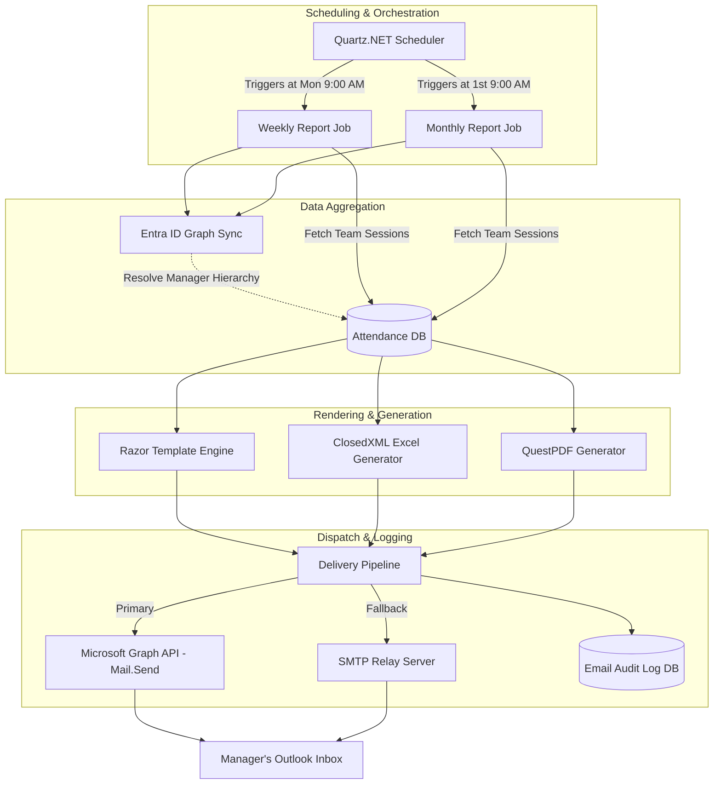
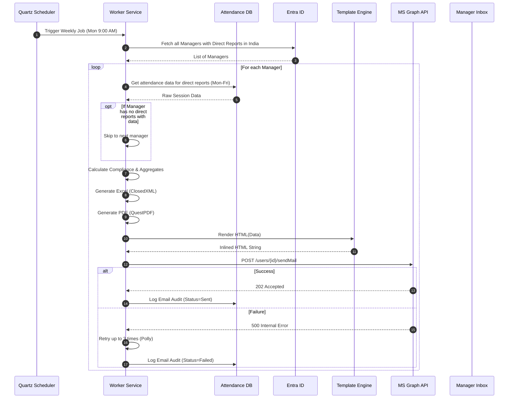

# Software Requirements Specification: Email Notification System

## 1. Executive Summary

The **Enterprise Attendance & Workforce Analytics Platform** employs a strictly targeted, automated email notification mechanism designed exclusively for managerial oversight. Consistent with the system's core philosophy of silent, background telemetry tracking, **no attendance-related emails are ever sent to employees, HR personnel, or executive management**. 

The email system is singularly focused on providing direct managers with actionable, aggregated data regarding their immediate team's physical office presence. It accomplishes this through exactly two scheduled business reports: a Weekly Manager Attendance Report and a Monthly Manager Attendance Summary. By restricting communications to these two specific touchpoints, the platform avoids alert fatigue while ensuring managers have the exact compliance data needed to enforce hybrid work policies (e.g., 3 days per week in the office) without needing to manually log into the system on a daily basis. 

An optional, internal-only System Health Alert is maintained solely for IT administrators to monitor the health of the background tracking and email delivery infrastructure itself.

## 2. Purpose

The purpose of this document is to define the architectural, functional, and technical requirements for the Email Notification module within the Enterprise Attendance platform. It specifies the exact structure of the allowed managerial emails, the template rendering engine, the delivery mechanisms (Microsoft Graph API / SMTP), the scheduling infrastructure (Quartz.NET), and the attachment generation pipelines (Excel and PDF).

## 3. Scope

### 3.1. In Scope
*   Generation and delivery of **EN-001: Weekly Manager Attendance Report**.
*   Generation and delivery of **EN-002: Monthly Manager Attendance Summary**.
*   Generation and delivery of **EN-003: System Health Alert** (Admin only).
*   Dynamic HTML rendering using Razor templates.
*   Automated generation of `.xlsx` and `.pdf` attachments.
*   Integration with Microsoft Graph API for email dispatch.
*   Fallback to SMTP delivery if Graph API is unavailable.
*   Comprehensive audit logging of all dispatched emails.
*   Background job scheduling and retry mechanisms for failed deliveries.

### 3.2. Out of Scope
*   **Employee Notifications:** Employees are never notified of their attendance status, missing days, or system tracking.
*   **HR/Executive Broadcasts:** The system does not send department-wide or company-wide roll-up emails. HR and Executives must use the web dashboard for aggregate reporting.
*   **Real-time Alerts:** The system does not send real-time alerts when someone enters or leaves an office.
*   **Reply Processing:** The system sends emails from a "no-reply" address. Incoming emails are discarded.

## 4. Actors and Stakeholders

| Actor | Role | Interaction with Email System |
|-------|------|-------------------------------|
| **Manager** | Direct supervisor of one or more employees (derived from Entra ID hierarchy). | Receives automated weekly and monthly reports containing attendance data solely for their direct reports. |
| **System Administrator** | IT personnel managing the platform. | Receives system health alerts; manages email templates; views email audit logs; configures Graph API credentials. |
| **Background Service** | Automated worker process (Quartz.NET). | Compiles data, generates attachments, renders templates, and dispatches emails via Graph API. |

## 5. Email Architecture Overview

The email architecture is designed for reliability, scalability, and strict access control. The background worker queries the database for managerial hierarchies, aggregates the attendance sessions for the specified period, renders the email body using Razor templates, generates attachments, and dispatches the email via Microsoft Graph API.

## 6. Email Notification Types

The system supports only the following tightly controlled notification types:

| Notification ID | Name | Recipient | Frequency | Schedule |
|----------------|------|-----------|-----------|----------|
| **EN-001** | Weekly Manager Attendance Report | Manager | Weekly | Monday 9:00 AM IST |
| **EN-002** | Monthly Manager Attendance Summary | Manager | Monthly | 1st of month 9:00 AM IST |
| **EN-003** | System Health Alert | Administrator | On failure | Event-based |

*Note: There are absolutely no notifications sent to employees under any circumstances.*

---

## 7. EN-001: Weekly Manager Attendance Report (Deep Dive)

The Weekly Manager Attendance Report is the primary enforcement tool for the hybrid work policy. It provides a highly detailed, scannable matrix of the team's physical office presence over the previous week (Monday to Friday).

### 7.1. Email Metadata
*   **To:** Manager's primary email address (from Entra ID).
*   **From:** `no-reply-attendance@ramboll.com` (configurable).
*   **Subject:** `Weekly Office Attendance Report — Your Team — [Week Start Date] to [Week End Date]`
    *   *Example:* `Weekly Office Attendance Report — Your Team — 20-Nov-2023 to 24-Nov-2023`

### 7.2. Email Body Structure

The email body is rendered via a Razor HTML template (`WeeklyManagerReport.cshtml`) and contains the following sections:

#### 7.2.1. Greeting
> "Hi {{ManagerName}},"
> "Here is the office presence summary for your direct reports for the week of {{WeekStartDate}} to {{WeekEndDate}}."

#### 7.2.2. Team Summary
A high-level overview of the team's compliance.
*   **Team Size:** [X] Employees
*   **Average Office Days (Team):** [Y.Y] days/employee
*   **Team Compliance %:** [Z]% (Percentage of team members who met the 3-day mandate)

#### 7.2.3. Per-Employee Weekly Matrix Table
A visual grid showing daily presence. This allows the manager to immediately spot patterns (e.g., everyone working from home on Fridays).

| Employee | Mon | Tue | Wed | Thu | Fri | Office Days | Compliance |
|----------|-----|-----|-----|-----|-----|-------------|------------|
| Priya Sharma | ✅ Office | 🏠 WFH | ✅ Office | ✅ Office | 🏠 WFH | 3/3 | ✅ Met |
| Ravi Kumar | ✅ Office | ✅ Office | 🏠 WFH | 🏠 WFH | 🏠 WFH | 2/3 | ⚠️ Partial |
| Amit Singh | 🏠 WFH | 🏠 WFH | 🏠 WFH | 🏠 WFH | 🏠 WFH | 0/3 | ❌ Failed |

*Legend/Rules for rendering:*
*   `✅ Office`: Device telemetry confirmed physical presence on a corporate network (Chennai, Noida, Hyderabad, Gurugram, or Bangalore) for > 4 hours (configurable threshold).
*   `🏠 WFH`: No corporate network presence detected.
*   `Compliance`: Target is inherently assumed as 3 days (configurable per policy).

#### 7.2.4. Per-Employee Detail Table
Provides timing analytics. Note that "First Seen" and "Last Seen" are based purely on network connection telemetry, not badge swipes.

| Employee | Office Days | First Seen (Avg) | Last Seen (Avg) | Avg Office Hours/Day |
|----------|-------------|-------------------|-----------------|---------------------|
| Priya Sharma | 3 | 09:15 AM | 06:30 PM | 9.2 hrs |
| Ravi Kumar | 2 | 10:00 AM | 04:45 PM | 6.7 hrs |

#### 7.2.5. Non-Compliant Highlight
An explicit call-out for policy violations to draw the manager's immediate attention.
> **Attention Required:** The following team members did not meet the 3-day office presence requirement this week:
> *   Ravi Kumar (2 days)
> *   Amit Singh (0 days)

#### 7.2.6. Action Link & Footer
> "[View detailed attendance and historical trends on your Manager Dashboard →](https://attendance.ramboll.internal/manager)"
>
> "This is an automated report from the Ramboll Attendance System. Please do not reply to this email. Data is based on background network telemetry across Indian office locations."

### 7.3. Attachments

To support managers who wish to perform their own pivot table analysis or maintain offline records, the system generates two attachments.

#### 7.3.1. Excel Attachment (`Team_Attendance_[WeekStart].xlsx`)
Generated using **ClosedXML**.
*   **Sheet 1 (Summary):** Replicates the email body matrix and summary metrics.
*   **Sheet 2 (Raw Data):** Contains raw daily session data for every employee.
    *   Columns: Date, Employee ID, Employee Name, First Seen, Last Seen, Duration (Hrs), Location/City, Subnet/VLAN, Status (Office/WFH).

#### 7.3.2. PDF Attachment (`Team_Attendance_Report_[WeekStart].pdf`)
Generated using **QuestPDF**.
A beautifully formatted, printable A4 PDF containing the team summary, compliance charts (rendered via a server-side charting library and embedded as base64 images), and the employee matrix.

---

## 8. EN-002: Monthly Manager Attendance Summary (Deep Dive)

The Monthly Manager Attendance Summary provides a macro-view of the team's behavior over the calendar month, helping managers identify long-term trends and habitual non-compliance.

### 8.1. Email Metadata
*   **To:** Manager's primary email address (from Entra ID).
*   **From:** `no-reply-attendance@ramboll.com`
*   **Subject:** `Monthly Office Attendance Summary — Your Team — [Month Year]`
    *   *Example:* `Monthly Office Attendance Summary — Your Team — October 2023`

### 8.2. Email Body Structure

#### 8.2.1. Monthly Aggregate Table
Instead of a daily matrix, this table aggregates the entire month.

| Employee | Office Days | WFH Days | Total Office Hours | Monthly Compliance % | Trend (vs Last Month) |
|----------|-------------|----------|--------------------|----------------------|-----------------------|
| Priya Sharma | 14 | 8 | 125 hrs | 100% | ⬆️ (+2 days) |
| Ravi Kumar | 9 | 13 | 75 hrs | 64% | ⬇️ (-1 day) |

*Notes:*
*   **Monthly Compliance %:** Calculated as (Actual Office Days / Expected Office Days in the month). E.g., if there are 4 weeks, expected is 12 days.
*   **Trend:** Compares the actual office days of the current month against the previous month.

#### 8.2.2. Rest of Email
Follows a similar structure to the weekly report, including non-compliant highlights, action links, and system footers. Includes monthly variations of the Excel and PDF attachments.

---

## 9. Email Template Engine

To ensure the emails are visually appealing, corporate-branded, and easily maintainable, the system uses Razor views compiled outside of the standard MVC pipeline.

### 9.1. Technology Stack
*   **RazorLight** or **Razor.Templating.Core**: To compile `.cshtml` files into HTML strings within a background worker context (where HTTP Context is absent).
*   **PreMailer.Net**: To inline all CSS styles. Most email clients (Outlook, Gmail) require inline CSS rather than `<style>` blocks in the `<head>`.

### 9.2. Admin Customization
*   Templates are stored in the database (or as files monitored by the system).
*   The **Admin Dashboard** features an "Email Preview" panel. Administrators can select an email type, input a dummy manager ID, and see exactly how the email will render using live or mocked data.

---

## 10. Email Delivery Architecture

### 10.1. Primary Delivery: Microsoft Graph API
Because the platform is deeply integrated with the Microsoft 365 ecosystem, the primary mechanism for sending emails is the **Microsoft Graph API (`Mail.Send`)**.

*   **Authentication:** Application permissions (Client ID, Client Secret, Tenant ID) using OAuth 2.0 client credentials flow.
*   **Permissions Required:** `Mail.Send` (Application permission).
*   **Endpoint:** `POST https://graph.microsoft.com/v1.0/users/{sender-object-id}/sendMail`
*   **Advantages:** Bypasses legacy SMTP protocols, ensures emails appear internally authenticated (reducing spam/phishing flags by Defender), and allows sending from a shared mailbox or service account without a dedicated license (if configured properly).

### 10.2. Fallback Delivery: SMTP
If the Graph API experiences an outage, the system will seamlessly failover to a standard SMTP relay (e.g., corporate Exchange server or SendGrid).

### 10.3. Demo/Silent Mode
For development, UAT, or when the system is in "monitoring only" mode during initial rollout, the delivery pipeline can be switched to `Demo Mode`.
*   In Demo Mode, emails are generated, rendered, and saved to the database (Email Audit Log) but are **NOT** transmitted to the network.
*   Administrators can view these generated emails in the web dashboard to verify data accuracy before turning on live dispatch.

---

## 11. Background Job Integration

The generation of hundreds or thousands of complex PDF/Excel reports and emails cannot be done synchronously.

### 11.1. Quartz.NET Scheduling
*   **Weekly Job:** Cron Expression `0 0 9 ? * MON` (Fires at 9:00 AM every Monday).
*   **Monthly Job:** Cron Expression `0 0 9 1 * ?` (Fires at 9:00 AM on the 1st of every month).

### 11.2. Orchestration & Resilience
1.  **Queueing:** When the Quartz trigger fires, it pushes a `GenerateManagerReportCommand` onto a message bus (e.g., RabbitMQ or Azure Service Bus) or an in-memory queue for *each* manager.
2.  **Concurrency:** Multiple background workers process these queues in parallel to ensure all reports are delivered promptly.
3.  **Retry Policy:** If a report fails to generate or Graph API returns a 5xx error, the consumer uses Polly to retry up to 3 times with exponential backoff (e.g., 1 min, 5 min, 15 min).
4.  **Dead Letter:** If delivery fails permanently, an alert (EN-003) is logged and sent to the administrator.

---

## 12. Sequence Diagram: Weekly Report Generation

---

## 13. Email Audit Logging

Every outbound email attempt is permanently recorded in the database to resolve disputes (e.g., a manager claiming they never received the report).

### 13.1. `EmailAuditLog` Table Schema

| Column Name | Data Type | Description |
|-------------|-----------|-------------|
| `Id` | UNIQUEIDENTIFIER | Primary Key |
| `NotificationType` | VARCHAR(50) | e.g., 'EN-001', 'EN-002' |
| `RecipientEmail` | VARCHAR(255) | The manager's email address |
| `Subject` | VARCHAR(500) | The exact subject line sent |
| `SentAt` | DATETIME | Timestamp of dispatch |
| `Status` | VARCHAR(50) | 'Sent', 'Failed', 'Pending' |
| `ErrorMessage` | NVARCHAR(MAX) | Exception details if failed |
| `PayloadReference` | VARCHAR(255) | Link to Blob storage where the exact HTML/PDF sent is archived (optional, for compliance) |

---

## 14. Business Rules & Edge Cases

| Scenario | System Behavior |
|----------|-----------------|
| **Manager has no direct reports** | The system skips the manager. No empty email is sent. |
| **All direct reports are on leave / 0 office days** | The system sends the email showing 0 office days. It is up to the manager to cross-reference with the HR leave system (out of scope for this app). |
| **Manager is on extended leave** | The system still sends the email to the manager's inbox. If Entra ID defines a "Delegate", future enhancements may allow routing to the delegate. Currently, it goes to the primary manager. |
| **Employee changes managers mid-week** | Entra ID sync occurs daily. The employee's data for the *entire week* will be included in the report of the manager who is assigned to them at the time the report runs (Monday 9 AM). |
| **API Rate Limiting** | Microsoft Graph API limits requests (e.g., 10,000 requests per 10 minutes). The background worker must implement batching and respect `Retry-After` headers to avoid throttling. |

---

## 15. Assumptions

1.  **Entra ID Accuracy:** The organizational hierarchy defined in Microsoft Entra ID is accurate and up-to-date. If the "Manager" attribute is empty or incorrect, the wrong person (or no person) will receive the report.
2.  **Mailbox Capacity:** Managers have sufficient mailbox quota to receive weekly reports with PDF/Excel attachments (approx. 200-500 KB per email).
3.  **Network Policies:** Corporate IT allows the application's service principal to use the `Mail.Send` permission globally or restricts it to a specific service account.

## 16. Dependencies

*   **Microsoft 365 / Entra ID:** For Graph API access and manager hierarchy.
*   **QuestPDF:** Requires a valid license (Community/MIT is available, but enterprise usage must be verified against their licensing model).
*   **ClosedXML:** Open-source library for Excel generation.
*   **Quartz.NET:** Required for robust, persistent cron scheduling.

## 17. Risks and Mitigations

| Risk | Impact | Mitigation |
|------|--------|------------|
| **Spam Filtering** | High | Internal emails sent via Graph API are typically trusted, but strict Defender policies might flag automated emails with attachments. IT Security must whitelist the sender address. |
| **Data Leakage** | Critical | A bug in the query could send Team A's data to Manager B. Strict Unit Testing and integration testing on the repository layer ensuring `Employee.ManagerId == Recipient.Id`. |
| **Thread Starvation** | Medium | Generating complex PDFs for 500+ managers simultaneously could exhaust thread pools. Limit concurrency in Quartz/RabbitMQ consumers. |

## 18. Future Enhancements

*   **Delegation:** Read out-of-office status from Exchange and automatically forward the report to the manager's designated delegate.
*   **Interactive Emails:** Use Adaptive Cards instead of HTML emails, allowing managers to acknowledge or add notes directly from Outlook.
*   **Exception Integration:** Integrate with the HR Leave Management System so the report explicitly labels "Approved Leave" instead of just "WFH/0 Days".

## 19. Acceptance Criteria

1.  **AC-1:** The system successfully triggers the Weekly Report job every Monday at 9:00 AM IST.
2.  **AC-2:** Emails are ONLY generated for users who are designated as a Manager in Entra ID and have at least one active direct report.
3.  **AC-3:** Employees and non-managers DO NOT receive any attendance emails.
4.  **AC-4:** The email contains a correctly formatted HTML matrix showing Monday-Friday presence for the specific manager's team.
5.  **AC-5:** The email contains an Excel (`.xlsx`) and PDF (`.pdf`) attachment matching the team's data.
6.  **AC-6:** If Microsoft Graph API returns an error, the system retries 3 times before logging a failure in the `EmailAuditLog`.
7.  **AC-7:** An admin can view the status of all sent emails in the Admin Dashboard based on the `EmailAuditLog` table.
8.  **AC-8:** The Monthly report triggers on the 1st of every month at 9:00 AM IST and aggregates data accurately for the previous calendar month.

## 20. References
*   [Microsoft Graph API - Send Mail](https://learn.microsoft.com/en-us/graph/api/user-sendmail)
*   [Quartz.NET Documentation](https://www.quartz-scheduler.net/)
*   [QuestPDF Documentation](https://www.questpdf.com/)
*   [ClosedXML Documentation](https://github.com/ClosedXML/ClosedXML)
