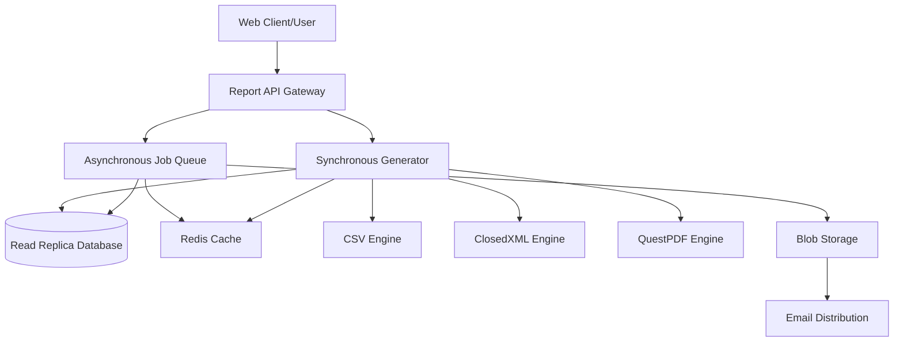

# Software Requirements Specification
## Enterprise Attendance & Workforce Analytics Platform
### Document 14: Reporting Requirements

---

## 1. Executive Summary

This Reporting Requirements Document defines the comprehensive suite of reports, analytics, and data extraction capabilities for the Enterprise Attendance & Workforce Analytics Platform. The reporting module is designed to provide stakeholders—from individual managers to C-suite executives—with actionable insights regarding workforce presence across the Indian office locations (Chennai, Noida, Hyderabad, Gurugram, and Bangalore).

By leveraging data collected passively from corporate network telemetry (Wi-Fi SSIDs, IP Subnets, VLANs) and synthesized into daily attendance records, the reporting subsystem will offer both real-time operational views and historical trend analyses. The primary focus of these reports is tracking Office Presence and compliance with the organizational Hybrid Work Policy (defaulting to a 3-day office presence requirement), explicitly ignoring remote VPN sessions.

This document outlines the complete report catalog, detailed specifications for each report, the underlying technical architecture for report generation, scheduling, distribution mechanisms, and the associated role-based access controls (RBAC) ensuring data privacy.

---

## 2. Report Catalog

The following table provides a comprehensive overview of all standard reports available within the platform.

| Report ID | Report Name | Frequency | Target Audience | Scope | Export Formats | Filters |
|-----------|-------------|-----------|-----------------|-------|---------------|--------|
| RPT-001 | Daily Attendance Report | Daily | HR, Manager | Team/Dept/Org | CSV, Excel, PDF | Date, Dept, Office, Status |
| RPT-002 | Weekly Attendance Summary | Weekly | Manager, HR | Team/Dept | CSV, Excel, PDF | Week, Dept, Office |
| RPT-003 | Monthly Attendance Report | Monthly | HR, Exec | Dept/Org | CSV, Excel, PDF | Month, Dept, Office |
| RPT-004 | Employee Attendance History | On-demand | Manager, HR | Individual | CSV, Excel, PDF | Employee, Date Range |
| RPT-005 | Department Compliance Report | Weekly/Monthly | Dept Head, HR | Department | CSV, Excel, PDF | Dept, Period |
| RPT-006 | Organization Dashboard Report | Monthly | Executive | Organization | PDF | Month |
| RPT-007 | Office Occupancy Report | Weekly/Monthly | Executive, HR | Per Office | CSV, Excel, PDF | Office, Period |
| RPT-008 | Non-Compliance Report | Daily/Weekly | HR, Manager | Team/Dept/Org | CSV, Excel | Period, Threshold |
| RPT-009 | Attendance Trend Report | Monthly/Quarterly | Executive | Organization | PDF | Period |
| RPT-010 | Device Compliance Report | Weekly | IT Admin | Organization | CSV, Excel | Period, Compliance Status |

---

## 3. Report Specifications

This section details the requirements for each report in the catalog.

### 3.1. RPT-001: Daily Attendance Report
- **Description:** A daily summary of who was present in the office, their first seen time, last seen time, and total duration.
- **Data Source:** `DailyAttendance`, `Employee`, `OfficeLocation`
- **Columns/Fields:** Employee Name, Employee ID, Department, Office Location, First Seen Time, Last Seen Time, Total Hours in Office, Status (Present/Absent).
- **Filters & Parameters:** Date (Default: Today), Department (Dropdown), Office (Dropdown), Status.
- **Sorting & Grouping:** Grouped by Department, sorted by Employee Name alphabetically.
- **Calculations & Formulas:** Total Hours = Last Seen Time - First Seen Time (minus any identified gap threshold).
- **Export formats:** CSV, Excel, PDF.
- **Access Control:** HR (All), Manager (Direct Reports Only).

### 3.2. RPT-002: Weekly Attendance Summary (Detailed Specification)
- **Description:** A comprehensive weekly view showing employee presence across the work week.
- **Data Source:** `DailyAttendance` (aggregated over 7 days), `Employee`.
- **Columns/Fields:** 
  - Employee Name
  - Employee Code
  - Department
  - Office
  - Mon Status (Present/Absent)
  - Tue Status (Present/Absent)
  - Wed Status (Present/Absent)
  - Thu Status (Present/Absent)
  - Fri Status (Present/Absent)
  - Office Days (Count)
  - WFH Days (Count)
  - Compliance Status (Met/Not Met)
  - First Seen (Avg)
  - Last Seen (Avg)
  - Avg Office Hours/Day
- **Filters & Parameters:** Week (Start Date), Department, Office.
- **Sorting & Grouping:** Grouped by Department, then by Manager. Sorted by Compliance Status (Not Met first), then Employee Name.
- **Calculations & Formulas:** 
  - Office Days = Count of days where Status = 'Present'
  - Compliance Status = `Office Days >= [Configured Policy Days]`
  - Avg Office Hours = Sum(Total Hours) / Office Days
- **Totals:** Department averages (Avg Office Days, Compliance %), Organization averages.
- **Export formats:** CSV, Excel, PDF.
- **Access Control:** Manager (Direct/Indirect Reports), HR (All).
- **Sample Output:**

| Employee Name | ID | Dept | Mon | Tue | Wed | Thu | Fri | Office Days | Compliance | Avg Hours |
|---------------|----|------|-----|-----|-----|-----|-----|-------------|------------|-----------|
| Jane Doe | 101 | Eng | P | A | P | P | A | 3 | Met | 8.5 |
| John Smith | 102 | HR | A | A | P | A | A | 1 | Not Met | 7.2 |

### 3.3. RPT-003: Monthly Attendance Report
- **Description:** Monthly aggregation of attendance data for payroll or formal compliance tracking.
- **Data Source:** `DailyAttendance` (aggregated over month).
- **Columns/Fields:** Employee ID, Name, Total Office Days, Total Working Days, Compliance Percentage.
- **Filters & Parameters:** Month/Year, Department.
- **Export formats:** CSV, Excel, PDF.
- **Access Control:** HR, Executives.

### 3.4. RPT-004: Employee Attendance History
- **Description:** Detailed, day-by-day historical view for a specific employee.
- **Data Source:** `DailyAttendance`, `SessionLog`.
- **Columns/Fields:** Date, Office, First Seen, Last Seen, Total Hours, Identified Subnet/VLAN.
- **Filters & Parameters:** Employee ID, Date Range.
- **Export formats:** CSV, Excel, PDF.
- **Access Control:** Manager (For reports), HR.

### 3.5. RPT-005: Department Compliance Report
- **Description:** High-level summary of policy compliance by department.
- **Data Source:** Aggregated `DailyAttendance`.
- **Columns/Fields:** Department Name, Total Employees, Compliant Employees, Non-Compliant Employees, Compliance Rate (%).
- **Filters & Parameters:** Period (Weekly/Monthly).
- **Export formats:** CSV, Excel, PDF.
- **Access Control:** Department Heads, HR.

### 3.6. RPT-006: Organization Dashboard Report
- **Description:** Executive-level visual summary of company-wide attendance.
- **Data Source:** Pre-calculated analytics views.
- **Columns/Fields:** Trend graphs, top compliant departments, bottom compliant departments, overall attendance rate.
- **Filters & Parameters:** Month.
- **Export formats:** PDF only.
- **Access Control:** Executives.

### 3.7. RPT-007: Office Occupancy Report
- **Description:** Analysis of physical office utilization based on network telemetry.
- **Data Source:** `DailyAttendance`, `OfficeLocation`.
- **Columns/Fields:** Office Name, Date, Max Concurrent Users, Total Unique Users, Capacity Utilization %.
- **Filters & Parameters:** Office, Date Range.
- **Export formats:** CSV, Excel, PDF.
- **Access Control:** Executives, Facilities, HR.

### 3.8. RPT-008: Non-Compliance Report
- **Description:** Actionable list of employees consistently failing to meet the hybrid work policy.
- **Data Source:** Aggregated `DailyAttendance`.
- **Columns/Fields:** Employee Name, Manager Name, Office Days, Required Days, Variance.
- **Filters & Parameters:** Period (Rolling 4 weeks, etc.), Threshold (e.g., < 2 days/week).
- **Export formats:** CSV, Excel.
- **Access Control:** HR, Managers.

### 3.9. RPT-009: Attendance Trend Report
- **Description:** Long-term analytics showing the evolution of return-to-office metrics over time.
- **Data Source:** Data Warehouse / Analytics Views.
- **Columns/Fields:** Month/Quarter, Avg Days in Office, YoY or MoM variance.
- **Filters & Parameters:** Date Range (Quarterly/Yearly).
- **Export formats:** PDF.
- **Access Control:** Executives.

### 3.10. RPT-010: Device Compliance Report
- **Description:** IT-focused report tracking devices that are connecting but not properly associating with an employee.
- **Data Source:** `RawTelemetry`, `DeviceRegistry`.
- **Columns/Fields:** MAC Address, Subnet, Last Seen, Associated Employee (if any), Authentication Type.
- **Filters & Parameters:** Date Range, Compliance Status.
- **Export formats:** CSV, Excel.
- **Access Control:** IT Admin.

---

## 4. Report Generation Architecture

The reporting subsystem will follow a robust, scalable architecture separated from the primary transaction processing to ensure performance.

### 4.1. Core Components
- **API-Driven Generation:** All reports are requested via RESTful APIs. Clients request a report and receive either the document stream directly (for small datasets) or a Job ID (for large datasets).
- **Background Jobs:** Long-running reports are processed by Quartz.NET background workers. Users are notified via SignalR or email upon completion.
- **Read-Replica DB:** Reporting queries will be routed to a read-only database replica (CQRS pattern) to prevent blocking transaction processing during large aggregations.
- **Export Engines:**
  - **CSV:** Native .NET `CsvHelper` for high-speed, low-memory raw data extraction.
  - **Excel:** `ClosedXML` for formatted `.xlsx` files with styling, frozen headers, and multiple sheets.
  - **PDF:** `QuestPDF` for rich, layout-driven PDF generation (ideal for RPT-006 and RPT-009).
- **Caching Strategy:** Frequently accessed organizational aggregates will be cached in Redis. Daily aggregates are pre-calculated at midnight to speed up historical reporting.

---

## 5. Report Scheduling

The system includes a fully featured scheduling engine based on Quartz.NET, allowing authorized users (HR, Administrators) to automate report delivery.

- **Cron-Based Scheduling:** Reports can be configured using standard CRON expressions (e.g., `0 8 * * 1` for every Monday at 8 AM).
- **Configurable Context:** A schedule contains predefined filters (e.g., Target Department, Specific Office).
- **Execution Logging:** Every scheduled run is logged. If generation fails (e.g., DB timeout), the system attempts up to 3 retries with exponential backoff before alerting administrators.

---

## 6. Report Distribution

Generated reports can be distributed via multiple channels:

1. **Dashboard Download:** Synchronous or asynchronous download via the web portal.
2. **Email Attachment:** Scheduled reports are sent via the corporate SMTP server (Exchange Online).
   - *Constraint:* Email attachments are limited to 15MB. If a report exceeds this, a secure download link (valid for 7 days) is sent instead.
3. **API Endpoint:** Third-party BI tools (e.g., Power BI) can query specific OData endpoints for raw report data integration.

---

## 7. Report Access Control (RBAC)

Report data is strictly filtered based on the user's role and position in the Entra ID hierarchy.

- **Employee:** Can only generate `RPT-004` (Employee Attendance History) for themselves.
- **Manager:** Can generate team reports (`RPT-001`, `RPT-002`, `RPT-004`, `RPT-008`). The SQL queries automatically inject a `WHERE ManagerPath LIKE '%[ManagerID]%'` clause to restrict data strictly to their reporting line.
- **Department Head:** Same as Manager, but scoped to the entire department code.
- **HR:** Has global access to all reports across the entire organization.
- **Executive Management:** Access to high-level aggregated dashboards (`RPT-006`, `RPT-007`, `RPT-009`).
- **IT Admin:** Access restricted strictly to infrastructure reports (`RPT-010`), with PII (employee names) masked where appropriate.

---

## 8. Edge Cases

- **Timezone Differences:** All Indian offices operate on IST (UTC +5:30). Reports will enforce IST for all Date boundaries to prevent multi-day spanning issues for late-night workers.
- **Missing Entra ID Metadata:** If an employee is missing department or manager data, they will be grouped under an "Unassigned" bucket in reports to ensure totals still match.
- **Large Hierarchies:** A single manager may have hundreds of indirect reports. Recursive CTEs will be optimized or materialized views will be used for hierarchical rollups to maintain report generation speed.
- **Zero-Day Connects:** If an office has no data for a given day (e.g., public holiday or network outage), trend reports must handle `NULL` cleanly, ensuring averages are not artificially deflated.

---

## 9. Assumptions

1. The underlying database contains pre-aggregated daily summaries (`DailyAttendance`); reports will primarily query this table rather than calculating from millions of raw `SessionLog` rows.
2. Reporting databases are sync-replicated with no more than 5 minutes of latency.
3. Users requesting reports have valid Entra ID tokens with appropriate AppRoles mapped.
4. QuestPDF licensing (Community/Enterprise) requirements are met by the organization.

---

## 10. Risks & Mitigation

| Risk | Impact | Mitigation |
|------|--------|------------|
| Memory Exhaustion during large Excel exports | High | Use streaming (e.g., OpenXML SAX writer) for exports > 10,000 rows. Limit standard downloads to 30 days of data. |
| Slow query performance on hierarchical data | Medium | Flatten the hierarchy into a `ManagerPath` string or use periodic materialized views for the Org Chart. |
| Data Privacy Breach via reports | Critical | Row-level security (RLS) enforced at the database/repository level based on the current user's Claims. |

---

## 11. Dependencies

- **Microsoft Entra ID:** For resolving the organizational hierarchy and manager relationships.
- **Exchange Online / SMTP:** For report distribution via email.
- **Quartz.NET:** For background job scheduling.
- **Redis:** For caching pre-computed aggregates.
- **PDF Generation Library:** QuestPDF or equivalent.
- **Excel Generation Library:** ClosedXML or equivalent.

---

## 12. Future Enhancements

- **Self-Service Custom Reports:** An interface allowing HR to drag-and-drop columns to build ad-hoc reports without developer intervention.
- **Predictive Analytics:** Forecasting office occupancy for the upcoming week based on historical trends (machine learning integration).
- **Power BI Integration:** Direct connectors allowing Power BI Pro users to build their own dashboards from semantic models hosted by the application.
- **Alerting Mechanisms:** Proactive Teams/Email notifications to managers when a direct report misses compliance for two consecutive weeks.

---

## 13. Acceptance Criteria

1. **Completeness:** All 10 standard reports defined in the catalog can be generated through the application interface.
2. **Accuracy:** `RPT-002` (Weekly Attendance Summary) correctly calculates the "Office Days" metric based strictly on defined physical corporate network presence, excluding VPNs.
3. **Performance:** Any synchronous report generation for a single department over a 30-day period must complete and begin downloading within 5 seconds.
4. **Security:** A Manager attempting to run a report for a department they do not oversee must return a dataset containing only their permitted direct/indirect reports, or an empty set if none apply.
5. **Formatting:** Exported Excel documents must have properly typed columns (e.g., dates as Excel Dates, numbers as numerics) and a frozen header row. PDF exports must be paginated correctly with a header and footer on each page.
6. **Scheduling:** A scheduled report correctly fires at the cron-specified time and delivers the email attachment successfully.
