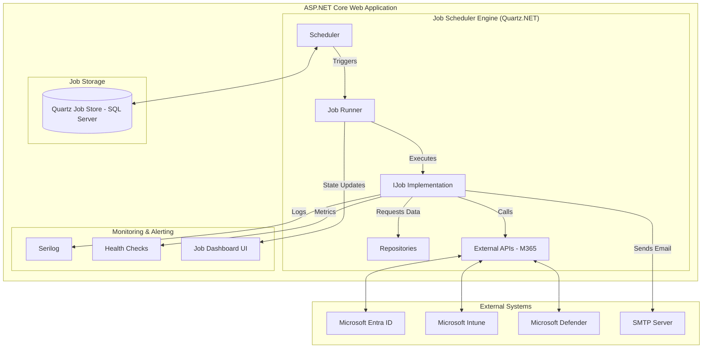
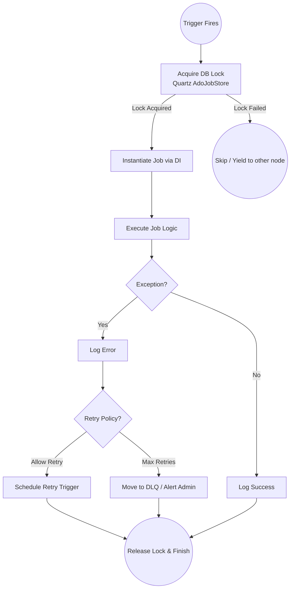
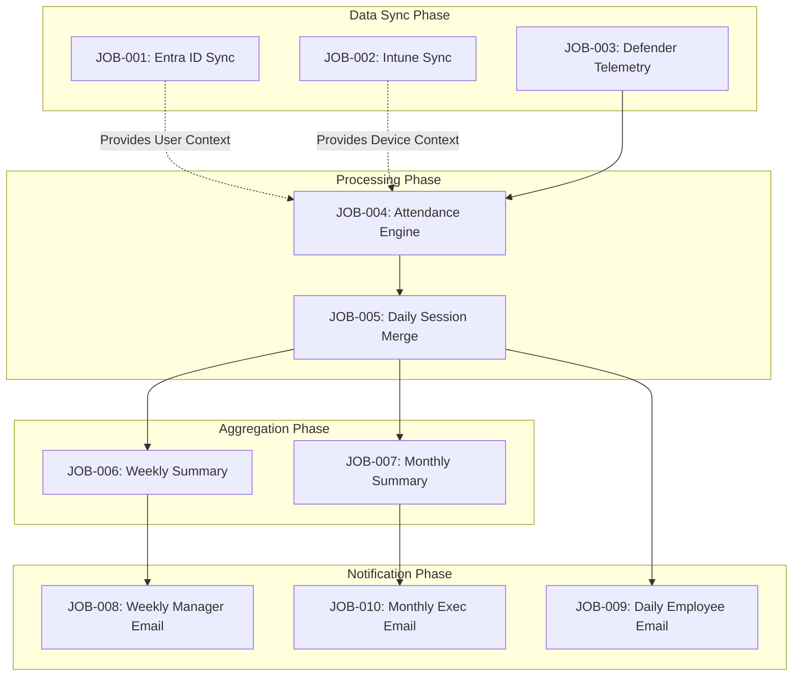

# Background Jobs & Scheduled Tasks Design Document

## 1. Executive Summary

The Enterprise Attendance & Workforce Analytics Platform relies heavily on background processing to function efficiently as a silent, agentless tracking system. This document details the design, scheduling, execution, and monitoring of all background jobs and scheduled tasks required by the platform. These jobs handle critical operations including Microsoft 365 data synchronization (Entra ID, Intune, Defender), raw telemetry processing, attendance session generation, summary aggregations, report generation, and system maintenance. Built on ASP.NET Core and Quartz.NET, the background job architecture is designed for high availability, fault tolerance, and scalability, ensuring accurate and timely calculation of employee office presence across all Indian locations.

## 2. Background Job Architecture

The background job architecture is centralized around Quartz.NET for robust scheduling, clustering, and persistence, combined with ASP.NET Core `IHostedService` for lifecycle management.

## 3. Job Catalog

| Job ID | Job Name | Type | Schedule | Description | Priority | Dependencies |
|--------|----------|------|----------|-------------|----------|-------------|
| JOB-001 | Entra ID User Sync | Scheduled | Every 6 hours | Sync employees, departments, managers from Entra ID (India filter) | High | Graph API |
| JOB-002 | Intune Device Sync | Scheduled | Every 4 hours | Sync device inventory, compliance from Intune | High | Graph API |
| JOB-003 | Defender Telemetry Ingestion | Scheduled | Every 15 minutes | Ingest device heartbeats, network telemetry from Defender | Critical | Graph API |
| JOB-004 | Attendance Engine Processing | Scheduled | Every 15 minutes | Process raw telemetry into attendance sessions | Critical | JOB-003 |
| JOB-005 | End-of-Day Session Merge | Scheduled | Daily 11:59 PM IST | Merge all daily sessions, compute DailyAttendance | Critical | JOB-004 |
| JOB-006 | Weekly Summary Generation | Scheduled | Monday 7:00 AM IST | Generate weekly attendance summaries | High | JOB-005 |
| JOB-007 | Monthly Summary Generation | Scheduled | 1st of month 7:00 AM IST | Generate monthly summaries | High | JOB-005 |
| JOB-008 | Weekly Manager Email | Scheduled | Monday 9:00 AM IST | Generate and send weekly manager reports | High | JOB-006 |
| JOB-009 | Daily Employee Email | Scheduled | Daily 6:30 PM IST | Generate and send daily employee summaries | Medium | JOB-005 |
| JOB-010 | Monthly Executive Email | Scheduled | 1st of month 10:00 AM IST | Generate and send monthly executive reports | High | JOB-007 |
| JOB-011 | Data Archival | Scheduled | Monthly | Archive old telemetry events (> retention period) | Low | None |
| JOB-012 | Health Check | Scheduled | Every 5 minutes | Check system health, M365 API connectivity | Medium | None |
| JOB-013 | Audit Log Cleanup | Scheduled | Weekly | Purge audit logs older than retention period | Low | None |

## 4. Job Specifications

### JOB-001: Entra ID User Sync
- **Description:** Synchronizes user identities, profiles, organizational hierarchy (manager mapping), and department details from Entra ID for Indian offices.
- **Trigger Type:** Cron
- **Cron Expression:** `0 0 0/6 ? * * *` (Every 6 hours)
- **Input Data:** Microsoft Graph API user delta queries.
- **Processing Steps:**
  1. Retrieve delta token from the database.
  2. Query Graph API for users matching Indian office locations.
  3. Upsert user records into the local SQL Server database.
  4. Update organizational hierarchy (manager relationships).
  5. Save new delta token.
- **Output/Side Effects:** Updated `Users`, `Departments`, and `Managers` tables.
- **Error Handling & Retry:** Retry up to 3 times with exponential backoff (1m, 5m, 15m) on API transient errors. Alert admin on failure.
- **Timeout:** 30 minutes.
- **Concurrency Rules:** Disallow concurrent execution.
- **Monitoring & Alerting:** Alert on 3 consecutive failures or execution time > 20 mins.

### JOB-002: Intune Device Sync
- **Description:** Synchronizes device inventory, assignments, and compliance state from Intune. Maps devices to employees.
- **Trigger Type:** Cron
- **Cron Expression:** `0 0 0/4 ? * * *` (Every 4 hours)
- **Input Data:** Microsoft Graph API device queries.
- **Processing Steps:**
  1. Fetch Intune managed devices for Indian office users.
  2. Upsert device records in the `Devices` table.
  3. Update mappings between users and devices.
- **Output/Side Effects:** Updated `Devices` table.
- **Error Handling & Retry:** 3 retries (2m, 10m, 30m).
- **Timeout:** 45 minutes.
- **Concurrency Rules:** Disallow concurrent execution.
- **Monitoring & Alerting:** Alert on missing/unmapped devices exceeding a 5% threshold.

### JOB-003: Defender Telemetry Ingestion
- **Description:** Pulls network connection events and device heartbeats from Microsoft Defender for Endpoint.
- **Trigger Type:** Cron
- **Cron Expression:** `0 0/15 * * * ?` (Every 15 minutes)
- **Input Data:** Microsoft 365 Defender Advanced Hunting API / Security Graph.
- **Processing Steps:**
  1. Formulate Advanced Hunting KQL query for the last 15 minutes.
  2. Execute query against Defender API.
  3. Map raw JSON events to strongly-typed `NetworkTelemetryEvent` entities.
  4. Bulk insert into the `RawTelemetry` table.
- **Output/Side Effects:** New rows in `RawTelemetry`.
- **Error Handling & Retry:** 5 retries with 1-minute intervals. Fallback to larger time window on next run if completely failed.
- **Timeout:** 5 minutes.
- **Concurrency Rules:** Disallow concurrent execution. Ensure strict sequential processing to avoid data duplication.
- **Monitoring & Alerting:** Alert if 0 events ingested for 2 consecutive runs during business hours.

### JOB-004: Attendance Engine Processing
- **Description:** Correlates raw telemetry events with defined office networks to create, update, or close attendance sessions.
- **Trigger Type:** Cron
- **Cron Expression:** `0 5/15 * * * ?` (Every 15 minutes, offset by 5 mins from JOB-003)
- **Input Data:** Unprocessed `RawTelemetry` rows, `OfficeNetworks` rules.
- **Processing Steps:**
  1. Fetch unprocessed telemetry data.
  2. For each event, evaluate if IP/SSID matches an office network.
  3. If match and no open session: Create new `AttendanceSession`.
  4. If match and open session exists: Update `LastSeen` timestamp.
  5. If no match (left network) or disconnect event: Close session.
  6. Mark telemetry events as processed.
- **Output/Side Effects:** Created/Updated rows in `AttendanceSessions`.
- **Error Handling & Retry:** Stop processing on DB error, retry on next cycle.
- **Timeout:** 10 minutes.
- **Concurrency Rules:** Disallow concurrent execution.
- **Monitoring & Alerting:** Alert on high unhandled exception rate during rule evaluation.

### JOB-005: End-of-Day Session Merge
- **Description:** Merges all daily sessions for an employee, handles multiple devices, and calculates total daily office presence duration.
- **Trigger Type:** Cron
- **Cron Expression:** `0 59 23 * * ?` (Daily at 11:59 PM IST)
- **Input Data:** All closed `AttendanceSessions` for the day.
- **Processing Steps:**
  1. Retrieve all sessions for the current date.
  2. Group sessions by EmployeeID.
  3. Merge overlapping sessions (from multiple devices).
  4. Calculate total `DurationMinutes`.
  5. Apply business logic: If duration >= Minimum Required Hours (e.g., 4 hrs), mark day as `Present`, else `Partial` or `Absent`.
  6. Insert/Update `DailyAttendance` records.
- **Output/Side Effects:** Computed `DailyAttendance` records.
- **Error Handling & Retry:** 3 retries (5m, 15m, 30m).
- **Timeout:** 60 minutes.
- **Concurrency Rules:** Disallow concurrent execution.
- **Monitoring & Alerting:** Critical alert if job fails to complete by 2:00 AM IST.

### JOB-006: Weekly Summary Generation
- **Description:** Aggregates daily attendance into weekly summaries to check hybrid policy compliance (e.g., 3 days/week).
- **Trigger Type:** Cron
- **Cron Expression:** `0 0 7 ? * MON` (Monday at 7:00 AM IST)
- **Input Data:** `DailyAttendance` records for the previous Monday-Sunday.
- **Processing Steps:**
  1. Aggregate days present per employee.
  2. Compare against `TargetDaysPerWeek`.
  3. Generate `WeeklyAttendanceSummary` records.
- **Output/Side Effects:** Created `WeeklyAttendanceSummary` records.
- **Error Handling & Retry:** Retry every 30 minutes up to 3 times.
- **Timeout:** 30 minutes.
- **Concurrency Rules:** Disallow concurrent execution.
- **Monitoring & Alerting:** Alert if not finished by 8:30 AM IST.

### JOB-007: Monthly Summary Generation
- **Description:** Aggregates daily attendance into monthly reports for payroll/HR compliance.
- **Trigger Type:** Cron
- **Cron Expression:** `0 0 7 1 * ?` (1st of the month at 7:00 AM IST)
- **Input Data:** `DailyAttendance` records for the previous month.
- **Processing Steps:**
  1. Calculate total present days, average hours per day per employee.
  2. Generate `MonthlyAttendanceSummary` records.
- **Output/Side Effects:** Created `MonthlyAttendanceSummary`.
- **Error Handling & Retry:** Retry every 1 hour up to 3 times.
- **Timeout:** 45 minutes.

### JOB-008: Weekly Manager Email
- **Description:** Sends an automated email to managers with the attendance summary of their direct reports.
- **Trigger Type:** Cron
- **Cron Expression:** `0 0 9 ? * MON` (Monday at 9:00 AM IST)
- **Input Data:** `WeeklyAttendanceSummary`, Manager hierarchy.
- **Processing Steps:**
  1. Fetch weekly summaries grouped by Manager.
  2. Generate HTML email templates.
  3. Dispatch via SMTP/Microsoft Graph Mail API.
- **Output/Side Effects:** Emails sent.
- **Error Handling & Retry:** Retry failed emails 3 times.
- **Timeout:** 60 minutes.

### JOB-009: Daily Employee Email
- **Description:** Sends daily tracking summary to employees (configurable opt-in/out).
- **Trigger Type:** Cron
- **Cron Expression:** `0 30 18 * * ?` (Daily at 6:30 PM IST)
- **Input Data:** `DailyAttendance` records.
- **Processing Steps:**
  1. Fetch attendance records.
  2. Format and send emails to employees.
- **Output/Side Effects:** Emails sent.
- **Timeout:** 60 minutes.

### JOB-010: Monthly Executive Email
- **Description:** Sends department-wide aggregated metrics to executives.
- **Trigger Type:** Cron
- **Cron Expression:** `0 0 10 1 * ?` (1st of month at 10:00 AM IST)
- **Input Data:** `MonthlyAttendanceSummary`.
- **Output/Side Effects:** Emails sent.

### JOB-011: Data Archival
- **Description:** Moves raw telemetry data older than 90 days to cold storage or deletes it.
- **Trigger Type:** Cron
- **Cron Expression:** `0 0 2 1 * ?` (1st of month at 2:00 AM IST)
- **Input Data:** `RawTelemetry` records older than configured threshold.
- **Output/Side Effects:** Rows deleted/archived.

### JOB-012: Health Check
- **Description:** Actively checks M365 API connections, DB connectivity, and system state.
- **Trigger Type:** Interval
- **Cron Expression:** `0 0/5 * * * ?` (Every 5 minutes)
- **Output/Side Effects:** Updates system status dashboard.

### JOB-013: Audit Log Cleanup
- **Description:** Deletes old application audit logs.
- **Trigger Type:** Cron
- **Cron Expression:** `0 0 1 ? * SUN` (Sunday at 1:00 AM IST)
- **Output/Side Effects:** Reduced `AuditLogs` table size.

## 5. Implementation Technology

The platform uses **Quartz.NET** integrated into the **ASP.NET Core 8** application.
- **IHostedService**: Used to bootstrap Quartz Scheduler on application startup.
- **Job Persistence**: AdoJobStore uses SQL Server to store job scheduling data, triggers, and execution history. This allows job persistence across application restarts and supports clustering if scaled out.
- **Dependency Injection**: Jobs inherit from `IJob` and are instantiated via ASP.NET Core DI container (using `UseMicrosoftDependencyInjectionJobFactory()`), allowing them to inject Repositories, DbContext, and HttpClients.
- **Clustering**: Configured for Quartz clustering to ensure a job runs only on one node at a time in a multi-instance deployment.

## 6. Job Execution Flowchart

## 7. Error Handling & Retry

Robust error handling is critical for background jobs, especially when communicating with external APIs (Graph, Defender) which are subject to rate limiting and transient failures.

- **Transient Fault Handling**: Integrated with **Polly** inside the Job's HttpClient factory for automatic retries on HTTP 5xx or 429 (Too Many Requests) with exponential backoff.
- **Job-Level Retries**: If Polly retries are exhausted and the Job itself fails (throws Exception), Quartz is configured to reschedule the job based on specific Job logic (using `JobExecutionException` with `RefireImmediately` set to true, or scheduling a custom retry trigger).
- **Dead Letter Queue (DLQ)**: Jobs that fail permanently after maximum retries are logged into a `JobFailures` SQL table for manual administrator review.
- **Alerting**: Serilog writes critical failures to an alerting sink (e.g., Azure Application Insights or an SMTP sink) to notify the support team immediately.

## 8. Job Monitoring Dashboard

Administrators will have access to a Job Monitoring Dashboard built into the ASP.NET Core UI.

**Features:**
- **Status Overview:** Displays all jobs (Running, Scheduled, Paused, Failed).
- **Execution History:** Shows the last 50 executions per job (Start Time, End Time, Duration, Status).
- **Manual Actions:** "Run Now", "Pause", "Resume" actions for administrators to manage jobs manually.
- **Error Traces:** Direct view of stack traces for failed job executions.
- **Upcoming Executions:** Table displaying the next calculated firing times (Next Fire Time) based on cron expressions.

## 9. Job Dependencies Diagram

## 10. Edge Cases

- **Job Overlap**: If a job execution takes longer than its interval (e.g., JOB-003 takes 16 mins but interval is 15 mins), Quartz is configured with `[DisallowConcurrentExecution]` to prevent multiple instances from running simultaneously, avoiding race conditions.
- **Server Restart During Job**: Jobs running during an unexpected shutdown will be marked as orphaned by Quartz. The `AdoJobStore` clustering feature will recover the job on restart (or on another node) based on the job's `RequestsRecovery` property.
- **M365 Outage**: Extended outages of Microsoft Graph API or Defender will halt telemetry ingestion. Once restored, JOB-003 is designed to fetch events for the missed time window (up to a 24-hour lookback) to ensure no data is lost.
- **Timezone Handling**: All cron expressions are evaluated in `Asia/Kolkata` (IST) timezone. Dates stored in SQL Server are UTC, and conversions happen purely at the presentation layer or during report generation.
- **Data Arriving Late**: Defender telemetry may occasionally be delayed. The Attendance Engine (JOB-004) processes data by event timestamp, not ingestion timestamp, safely reconstructing past sessions.

## 11. Assumptions, Risks, Dependencies, Future Enhancements, Acceptance Criteria

### Assumptions
- Background job processing nodes have stable outgoing internet access to Microsoft endpoints.
- Database throughput is sufficient to handle large bulk inserts (telemetry ingestion) without blocking other queries.
- Quartz.NET tables are provisioned during application deployment.

### Risks
- **Rate Limiting:** Microsoft Graph APIs enforce throttling. Bulk operations must respect HTTP 429 headers.
- **Database Bloat:** Telemetry ingestion (every 15 mins) will generate massive data volumes, potentially degrading DB performance if archival jobs fail.
- **SMTP Limitations:** Sending bulk emails (JOB-009) might hit SMTP quotas or get flagged as spam if not routed through an enterprise mass-mailing gateway.

### Dependencies
- Microsoft Graph API (Users, Devices).
- Microsoft 365 Defender Advanced Hunting API.
- Enterprise SMTP server for notifications.
- SQL Server for Quartz Job Store.

### Future Enhancements
- Transition from Polling (Cron) for Defender Telemetry to a webhook/Event Hub streaming architecture for real-time processing.
- Offload heavy report generation to a dedicated reporting server or Azure Functions.
- Implement RabbitMQ/Azure Service Bus for decoupled event-driven processing instead of batched jobs.

### Acceptance Criteria
- All jobs trigger strictly according to their scheduled Cron expressions.
- The system correctly recovers missed executions after a server restart.
- No duplicate data is created due to overlapping job executions.
- The Admin Dashboard accurately reflects real-time job states.
- If M365 APIs are unreachable, jobs retry gracefully and log appropriately without crashing the application.
