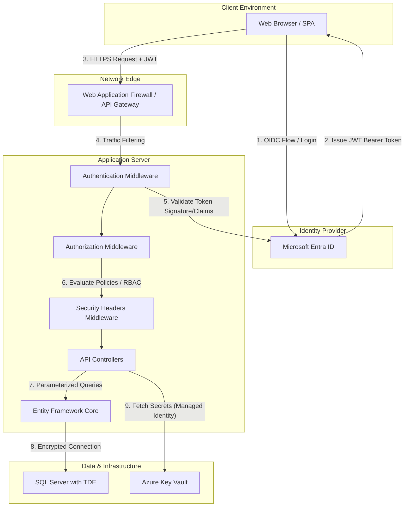
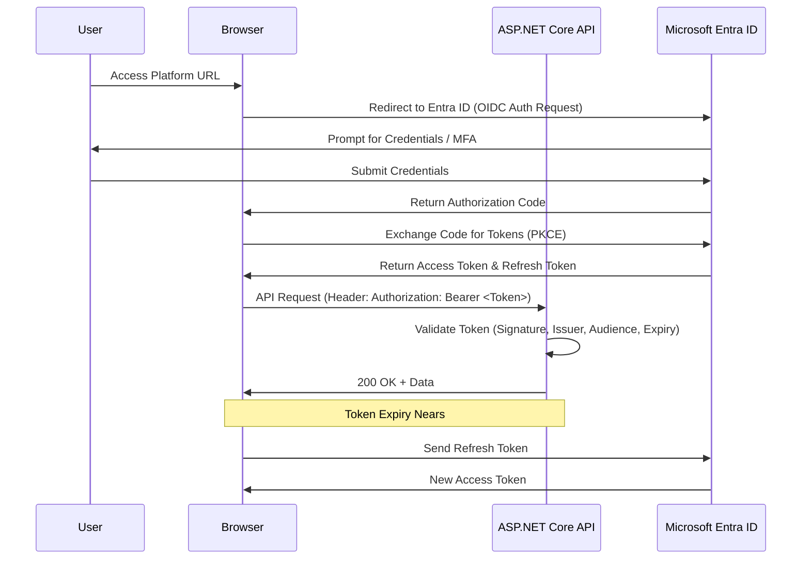

# Enterprise Attendance & Workforce Analytics Platform
## Software Requirements Specification: Security Requirements & Architecture

---

## 1. Executive Summary

The Enterprise Attendance & Workforce Analytics Platform tracks employee attendance passively across Indian offices (Chennai, Noida, Hyderabad, Gurugram, and Bangalore) by correlating network telemetry data. Given the silent nature of the tracking and the sensitivity of employee location data, ensuring robust security, privacy, and data protection is paramount. 

This Security Requirements & Architecture document outlines the complete security posture of the platform. It defines the methodologies, architectures, and implementation specifics to secure the platform across multiple layers: Authentication (via Microsoft Entra ID), Authorization (via Policy-based ASP.NET Core mechanisms), API Security, Data Security (at rest and in transit), Application Security (injection prevention, secure headers), Audit Logging, and Secrets Management. Furthermore, it details the platform's compliance with Indian IT Act 2000 regulations and internal data protection policies to ensure legal and ethical operation.

## 2. Purpose

The purpose of this document is to explicitly define the security controls, mechanisms, and architectural designs required to protect the Enterprise Attendance Platform. It provides the engineering, DevSecOps, and QA teams with clear security requirements to build, test, and maintain a secure application that meets both enterprise standards and legal regulations.

## 3. Scope

This document covers all security aspects of the Enterprise Attendance Platform, including:
- Identity and Access Management (Authentication & Authorization).
- Application-level security (API protection, injection prevention).
- Data protection (encryption, PII handling).
- Infrastructure security requirements as they pertain to the application (secrets management, TLS).
- Auditing and logging capabilities for forensic and compliance purposes.
- Security testing requirements and compliance mandates.

## 4. Actors/Stakeholders

- **Employees**: Users whose presence is tracked silently; they have access to view their own attendance records.
- **Managers**: Personnel who view attendance records for their direct and indirect reports.
- **Department Heads**: Leaders who view aggregated and detailed attendance data for their departments.
- **HR Personnel**: Users with broad access to organizational attendance data for compliance and reporting.
- **Administrators**: IT staff managing system configurations, network mapping, and RBAC assignments.
- **Executive Management**: High-level stakeholders accessing anonymized/aggregated analytics.
- **DevSecOps/Security Teams**: Personnel responsible for validating the security posture, conducting penetration tests, and monitoring audit logs.

## 5. Security Architecture Diagram

The following diagram illustrates the multi-layered security architecture of the platform, showing interactions from the client browser down to the database.


*(Note: In a pure Mermaid flow diagram if architecture-beta is not supported by all viewers, the following fallback flowchart is provided.)*



## 6. Authentication Architecture

The platform relies strictly on the Microsoft 365 ecosystem for identity management. There are no local user accounts or local password storage mechanisms.

### Authentication Mechanisms
- **Primary Identity Provider**: Microsoft Entra ID (Azure AD).
- **User Authentication**: OpenID Connect (OIDC) is used for authenticating users interacting with the web frontend. The platform uses the Authorization Code Flow with PKCE for single-page applications (SPAs) or standard Authorization Code flow for server-rendered apps.
- **API Authentication**: The frontend applications pass a JWT Bearer Token in the `Authorization` header to the backend APIs.
- **Backend-to-Backend Authentication**: The ASP.NET Core backend uses OAuth 2.0 Client Credentials flow to authenticate itself to the Microsoft Graph API for background tasks (e.g., syncing organizational hierarchy).

### Token Lifecycle
1. **Acquisition**: Client redirects to Entra ID, authenticates, and receives an Access Token and Refresh Token.
2. **Validation**: The ASP.NET Core API validates the Access Token on every request (Signature, Issuer, Audience, Expiry).
3. **Refresh**: The client uses the Refresh Token to obtain a new Access Token silently before the current one expires.
4. **Revocation**: Continuous Access Evaluation (CAE) is supported. If a user is terminated or their password changes, Entra ID can revoke token validity, and the API will reject subsequent requests.

### Authentication Sequence Diagram



## 7. Authorization Architecture

Authorization ensures that authenticated users can only access data and perform actions they are permitted to. The system uses ASP.NET Core Policy-Based Authorization.

### RBAC Policies
- **Employee**: Can view own attendance records and profile.
- **Manager**: Inherits Employee rights + Can view attendance of direct and indirect reports (Resource-based scope).
- **Department Head**: Can view all attendance data within their assigned department(s).
- **HR**: Broad read access to all attendance data, reports, and compliance dashboards.
- **Administrator**: Access to network configuration mapping (SSID/VLAN setups), system settings, and role assignments.
- **Executive**: Read-only access to aggregated organization-wide dashboards.

### Resource-Based Authorization
A critical component is validating hierarchical access. A manager querying `/api/attendance/emp/{empId}` must be evaluated dynamically. A custom `AuthorizationHandler` queries the Organizational Hierarchy service (synced from Entra ID) to ensure `{empId}` reports up to the logged-in manager.

### Authorization Flow Diagram

```mermaid
flowchart TD
    Req[Incoming API Request\nwith valid JWT] --> Route[Routing Middleware]
    Route --> Endpoint{Endpoint requires AuthZ?}
    Endpoint -- No --> Exec[Execute Endpoint]
    Endpoint -- Yes --> Policy[Evaluate Authorize(Policy="...")]
    
    Policy --> RoleCheck{User has required Role?}
    RoleCheck -- No --> 403[Return 403 Forbidden]
    RoleCheck -- Yes --> ResourceCheck{Is Resource Restricted?}
    
    ResourceCheck -- No --> Exec
    ResourceCheck -- Yes --> HierarchyCheck[Execute HierarchyRequirementHandler]
    
    HierarchyCheck --> Eval{Is target user under\nrequester's hierarchy?}
    Eval -- No --> 403
    Eval -- Yes --> Exec
```

## 8. API Security

The API acts as the gateway to all sensitive data and must be protected against malicious abuse.

- **HTTPS Enforcement**: All traffic must occur over TLS 1.2 or TLS 1.3. HTTP Strict Transport Security (HSTS) headers are globally enforced.
- **JWT Validation**: Strict validation of the `iss` (issuer) to match the tenant, `aud` (audience) to match the API client ID, and expiration (`exp`).
- **Rate Limiting**: Implemented via ASP.NET Core Rate Limiting middleware.
  - Per User (based on user ID claim): 100 requests per minute.
  - Per IP: 300 requests per minute.
- **Request Size Limits**: Max request body size capped at 1MB to prevent Denial of Service via large payloads.
- **API Versioning**: Enforced via URL path (e.g., `/api/v1/attendance`) to ensure backward compatibility and secure deprecation of older endpoints.
- **CORS Policy**: Strictly configured to allow origins only from the known frontend domain(s). No wildcard (`*`) origins allowed.

## 9. Data Security

Protecting the attendance data and employee metadata is a top priority.

- **Encryption at Rest**: The SQL Server database must have Transparent Data Encryption (TDE) enabled. Highly sensitive columns (if applicable, though network telemetry is mostly metadata) should utilize SQL Server Always Encrypted.
- **Encryption in Transit**: Internal database connections enforce `Encrypt=True` in the connection string. All external communications use HTTPS.
- **PII Protection**: Employee identifiers (Email, Name) are necessary for display but are considered PII. They are handled according to data minimization principles. Network MAC addresses (if collected) are hashed or masked if not directly required after initial matching.
- **Data Minimization**: The system only tracks "Present/Absent" states and network connection blocks. It does NOT track visited URLs, packet payloads, or productivity metrics.

## 10. Injection Prevention

The application must be immune to all forms of injection attacks.

- **SQL Injection**: Entity Framework Core is exclusively used for data access. All queries are parameterized automatically by LINQ-to-Entities. Raw SQL queries (`FromSqlRaw`) are strictly forbidden unless absolutely necessary and code-reviewed by security; `FromSqlInterpolated` must be used instead.
- **Cross-Site Scripting (XSS)**: The frontend framework (React/Angular/Blazor) automatically encodes output. Content Security Policy (CSP) headers restrict script execution sources.
- **Cross-Site Request Forgery (CSRF)**: For API endpoints reliant on cookies (if any), Anti-forgery tokens (`ValidateAntiForgeryToken`) are required. If using pure JWT Bearer tokens without cookies, CSRF risk is inherently mitigated.
- **Command Injection**: The application does not execute any shell commands or shell scripts.
- **LDAP Injection**: Direct LDAP queries are not used. All directory interactions occur via the Microsoft Graph API using strongly typed SDKs.

## 11. Security Headers Configuration

The ASP.NET Core application will inject the following security headers in every HTTP response:

| Header | Value | Purpose |
|--------|-------|---------|
| `Content-Security-Policy` | `default-src 'self'; script-src 'self'; connect-src 'self' https://graph.microsoft.com; img-src 'self' data:; style-src 'self' 'unsafe-inline';` | Prevents XSS by restricting resource origins. |
| `X-Frame-Options` | `DENY` | Prevents Clickjacking by disallowing framing. |
| `X-Content-Type-Options` | `nosniff` | Prevents MIME-type sniffing. |
| `Strict-Transport-Security` | `max-age=31536000; includeSubDomains` | Enforces HTTPS connections. |
| `Referrer-Policy` | `strict-origin-when-cross-origin` | Protects referrer information. |
| `Permissions-Policy` | `geolocation=(), microphone=(), camera=()` | Disables access to sensitive browser features. |

## 12. Audit Logging

Comprehensive logging is required for non-repudiation, incident response, and compliance.
Audit logs are written to a centralized logging sink (e.g., Azure Log Analytics, Datadog) using Serilog.

### Logged Events:
1. **Authentication Events**: Successful logins, failed login attempts, token validation failures.
2. **Authorization Events**: Policy evaluations, access granted, access denied (403).
3. **Administrative Actions**: Changes to network definitions (adding/removing SSIDs or Subnets), role assignments, system configuration updates.
4. **Data Access Events (Read/Write)**: Significant data queries, particularly when a Manager/HR views an employee's data.
5. **System Events**: Application startup/shutdown, unhandled exceptions, background task failures.

### Audit Log Tamper Protection
- Audit logs are append-only.
- The service account running the ASP.NET Core application has write-only permissions to the log sink; it cannot delete or modify historical logs.

## 13. Secrets Management

Hardcoded credentials or secrets in source code are strictly prohibited.

- **Storage Hierarchy**:
  1. **Azure Key Vault**: Used for Production and UAT environments. Contains DB connection strings, Entra ID client secrets, SMTP credentials.
  2. **Environment Variables**: Used in CI/CD pipelines or Docker container environments.
  3. **User Secrets (`secrets.json`)**: Used exclusively for local developer environments.
- **Access Method**: The application accesses Azure Key Vault using an Azure Managed Identity. The application code requires no credentials to read its own secrets.

## 14. Compliance

- **Indian IT Act 2000 (Section 43A)**: The platform processes sensitive personal data (corporate location tracking). Security practices and procedures defined herein ensure compliance with requirements to protect this data from unauthorized access or disclosure.
- **Company Internal Data Protection Policy**: All tracking is limited strictly to physical office locations (Chennai, Noida, Hyderabad, Gurugram, Bangalore). Off-network, VPN, and home network tracking is explicitly prevented by design.
- **Data Retention**: Attendance raw session logs will be retained for 90 days. Aggregated daily attendance records will be retained for 7 years (or as dictated by local labor laws), after which they are automatically purged via a scheduled Quartz.NET job.

## 15. Threat Model (STRIDE)

| Threat | Category | Asset | Mitigation |
|--------|----------|-------|------------|
| **Unauthorized API access** | Spoofing | API Endpoints | Strict JWT validation, Entra ID Authentication, OIDC flows. |
| **Data exfiltration via API** | Information Disclosure | Attendance Data | RBAC, Resource-based authorization (Hierarchy checks), Data minimization. |
| **SQL Injection** | Tampering | Database | EF Core parameterized queries exclusively. No dynamic SQL. |
| **XSS Attack** | Tampering | Frontend / Dashboard | Output encoding by UI framework, strict Content Security Policy (CSP). |
| **CSRF on Admin Endpoints** | Elevation of Privilege | Admin Configurations | Anti-forgery tokens (if cookie auth used), strict CORS, JWT usage. |
| **Token theft (Session Hijacking)** | Spoofing | JWT Tokens | Short-lived tokens (e.g., 1 hour), HSTS/HTTPS enforcement, HttpOnly cookies for refresh tokens. |
| **Elevation of Privilege via Role tampering** | Elevation of Privilege | RBAC Claims | Claims are mapped from Entra ID groups and cannot be modified by the client. |

## 16. Security Testing Requirements

- **Static Application Security Testing (SAST)**: Integrated into the CI/CD pipeline (e.g., SonarQube, GitHub Advanced Security). Builds fail on Critical/High severity findings.
- **Dynamic Application Security Testing (DAST)**: Automated API scanning during UAT deployments (e.g., OWASP ZAP).
- **Dependency Scanning**: Continuous scanning of NuGet and NPM packages for known CVEs (Dependabot/Snyk).
- **Penetration Testing**: An annual third-party penetration test is required for the production environment.
- **OWASP Top 10**: Development must adhere to secure coding guidelines mitigating the latest OWASP Top 10 web application vulnerabilities.

## 17. Business Rules (Security Context)

1. **VPN Exclusion Rule**: IP addresses belonging to the corporate VPN ranges are explicitly blacklisted in the network mapping configuration. Connections from these IPs will immediately cause the attendance session to be ignored or closed, ensuring remote work is not logged as office presence.
2. **Geofencing**: While IP/Network based, the system inherently only recognizes networks physically located in the predefined Indian offices.
3. **Manager Visibility**: Managers cannot view the attendance of peer managers unless they share a reporting line.

## 18. Concrete Examples

**Example 1: Unauthorized Hierarchy Access**
- *Scenario*: Manager A (manages Department X) attempts to call API `/api/attendance/emp/{EmpB_ID}` where Employee B belongs to Department Y.
- *Result*: The request contains a valid JWT, so Authentication passes. The `HierarchyRequirementHandler` evaluates the Entra ID hierarchy cache. It determines Manager A is not in the upward reporting chain of Employee B. The API returns `403 Forbidden`. The event is logged as an access denial in the audit log.

**Example 2: SQL Injection Attempt**
- *Scenario*: A malicious user attempts to pass `' OR 1=1; --` as a date parameter in the reporting endpoint.
- *Result*: Because EF Core is used, the input is treated strictly as a string literal parameter to the underlying SQL query (`@p0 = ''' OR 1=1; --'`). The query returns no results, and the database structure remains secure.

## 19. Edge Cases

- **Entra ID Outage**: If Entra ID is unreachable, new logins will fail. Currently authenticated sessions will continue to work until their JWT expires. The platform will gracefully degrade, showing a "Service Unavailable" message for auth-dependent actions.
- **Manager Reassignment**: When an employee changes managers in Entra ID, the hierarchy cache in the application must update promptly to revoke the old manager's access and grant the new manager's access. The background sync job must handle delta updates reliably.
- **Token Replay Attacks**: Mitigated by HTTPS and the short validity period of JWTs.

## 20. Assumptions

- Microsoft Entra ID is configured correctly and securely by the enterprise IT team (MFA enforced, strong password policies).
- The corporate network infrastructure (Routers, Switches, WLCs) from which telemetry is gathered is secure and the telemetry data is not spoofable by standard end-users.
- Client devices (laptops) are managed by Intune and their reporting mechanisms are protected from local tampering by the end-user (users do not have local admin rights to stop the Intune/Defender services).

## 21. Future Enhancements

- **Integration with Microsoft Defender for Cloud Apps (MCAS)** for enhanced anomaly detection and conditional access.
- **FIDO2 / Passwordless Authentication** enforcement for Administrator roles.
- **Automated PII Obfuscation** in lower environments (Dev/QA) to ensure production data is never exposed during development.

## 22. Acceptance Criteria

- [ ] All API endpoints enforce authentication via JWT.
- [ ] Role-based access control prevents cross-role data access.
- [ ] Manager hierarchy authorization successfully prevents unauthorized viewing of non-reports.
- [ ] System passes automated SAST and DAST scans with zero Critical or High vulnerabilities.
- [ ] Database is successfully encrypted using TDE in all environments.
- [ ] No secrets are checked into the source control repository.
- [ ] Application starts successfully using Azure Managed Identity to fetch secrets from Key Vault.
- [ ] Audit logs capture user ID, action, timestamp, and IP for all access and modification events.

## 23. Risks

- **Risk**: Delay in synchronization between Entra ID and the local application database.
  - **Mitigation**: Implement webhook notifications (Microsoft Graph Subscriptions) for near real-time updates of org chart changes, rather than relying solely on nightly batch syncs.
- **Risk**: Insider threat (Administrator accessing database directly).
  - **Mitigation**: Restrict production database access via Just-In-Time (JIT) access policies and ensure all direct database logins are heavily audited.

## 24. Dependencies

- Microsoft Entra ID (for AuthN/AuthZ and Hierarchy).
- Azure Key Vault (for Secrets).
- SQL Server (for TDE support).
- Corporate Network Telemetry sources (must provide reliable, non-spoofed IP/MAC/SSID data).

## 25. References

- [Microsoft identity platform documentation](https://learn.microsoft.com/en-us/entra/identity-platform/)
- [ASP.NET Core Security Documentation](https://learn.microsoft.com/en-us/aspnet/core/security/)
- [OWASP Top 10 - 2021](https://owasp.org/www-project-top-ten/)
- [Indian IT Act 2000 - Section 43A](https://www.meity.gov.in/content/information-technology-act-2000)

---
*Document Version: 1.0*  
*Classification: Confidential - Internal Use Only*
