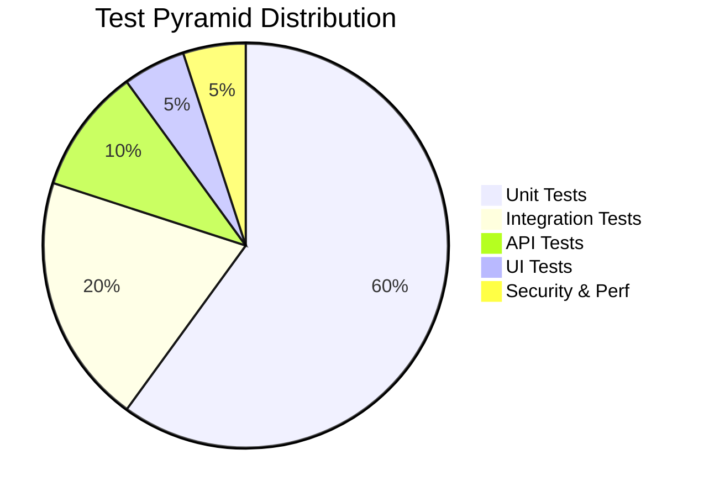

# Enterprise Attendance & Workforce Analytics Platform
## Software Requirements Specification (SRS)
### Document 17: Test Strategy & Test Cases Document

---

## 1. Executive Summary

This document outlines the comprehensive Test Strategy and detailed Test Cases for the Enterprise Attendance & Workforce Analytics Platform. Given the critical nature of attendance tracking and its downstream impact on workforce analytics, payroll (indirectly), and compliance, rigorous testing is mandatory. The platform relies on agentless telemetry collection and complex network-based classification rules to determine office presence across Indian offices (Chennai, Noida, Hyderabad, Gurugram, and Bangalore). 

The test strategy encompasses a multi-layered approach, starting from foundational unit tests to integration, API, UI, security, and performance testing. This document serves as the single source of truth for the QA team, developers, and stakeholders to ensure all business rules, especially the Indian-specific office presence logic, are validated against edge cases, network anomalies, and role-based access controls.

---

## 2. Test Strategy Overview

The testing strategy follows the standard **Test Automation Pyramid**, ensuring that the majority of testing is automated, fast, and reliable, while higher-level tests validate end-to-end functionality.

### 2.1 Test Pyramid Layers
1. **Unit Testing (Bottom Layer):** Focuses on individual components, methods, and the core Attendance Engine logic. Mocks are used extensively to isolate components.
2. **Integration Testing:** Validates the interaction between the application and external systems like Microsoft Entra ID (Graph API), Intune, and the SQL Server database.
3. **API Testing:** Ensures all REST API endpoints function correctly, handling valid/invalid requests, enforcing authentication, and returning correct HTTP status codes.
4. **UI Testing:** Validates the frontend (ASP.NET Core MVC/Blazor) views, ensuring data is displayed correctly and user interactions work as expected.
5. **Security Testing:** Verifies Role-Based Access Control (RBAC), data isolation, JWT validation, and protection against common web vulnerabilities (OWASP Top 10).
6. **Performance Testing (Top Layer):** Simulates high user load and massive telemetry ingestion to ensure the system meets performance SLAs.

---

## 3. Test Environment Requirements

To execute the test cases outlined in this document, the following environment setup is required.

### 3.1 Software Requirements
- **.NET 8 SDK:** Required for compiling and running the application and tests.
- **SQL Server:** LocalDB for unit/integration tests, or a dedicated QA SQL Server instance.
- **xUnit Framework:** The primary test runner and framework for .NET.
- **Moq:** Used for mocking dependencies (e.g., IGraphServiceClient, ITelemetryRepository).
- **FluentAssertions:** Used for expressive and readable assertions in test code.
- **SpecFlow (Optional):** For Behavior Driven Development (BDD) if required later.
- **Postman / Newman:** For automated API testing.
- **k6 / JMeter:** For performance and load testing.

### 3.2 Environment Configurations
- **Local Dev/Test:** Uses In-Memory database or LocalDB. Mocks external APIs.
- **QA Environment:** Deployed in an Azure App Service with a dedicated Azure SQL Database. Integrated with a sandbox Microsoft Entra ID tenant for real RBAC testing.
- **UAT Environment:** Pre-production environment with production-like data (anonymized) for stakeholder sign-off.

---

## 4. Detailed Test Cases

### 4.1 Attendance Engine Tests (TC-UE-001 to TC-UE-030)

These tests validate the core engine that processes telemetry events and generates attendance sessions.

| Test ID | Test Name | Description | Input | Expected Result | Priority |
|---------|-----------|-------------|-------|-----------------|----------|
| TC-UE-001 | First_Login_CreatesNewSession | First telemetry event of the day | Employee E1, 09:00 AM, Ramboll-CHN SSID | New session created, FirstSeen=09:00 | Critical |
| TC-UE-002 | Heartbeat_UpdatesLastSeen | Subsequent event within grace period | Session exists, new event at 09:15 | LastSeen updated to 09:15 | Critical |
| TC-UE-003 | GracePeriod_Within_MergesSession | Gap < 30 mins | Last event 10:00, new event 10:20 | Same session continued | Critical |
| TC-UE-004 | GracePeriod_Exceeded_ClosesSession | Gap > 30 mins | Last event 10:00, new event 11:30 | Old session closed, new session created | Critical |
| TC-UE-005 | Sleep_ClosesSession | Device sleep event | Active session, sleep event at 12:30 | Session closed, reason=Sleep | Critical |
| TC-UE-006 | Hibernate_ClosesSession | Device hibernate | Active session, hibernate event | Session closed, reason=Hibernate | Critical |
| TC-UE-007 | Shutdown_ClosesSession | Device shutdown | Active session, shutdown event | Session closed, reason=Shutdown | Critical |
| TC-UE-008 | NetworkLeave_ClosesSession | Device leaves corporate network | Active session, network change | Session closed, reason=NetworkLeave | Critical |
| TC-UE-009 | MultiDevice_Merge_NoDoubleCounting | Laptop A 9-12, Laptop B 12:30-18 | Two device sessions same employee | Single daily record, hours=8.5 | Critical |
| TC-UE-010 | MultiDevice_Overlap_Deduplication | Laptop A 9-13, Laptop B 12-18 | Overlapping sessions | No double counting overlap hours, total 9 hours | Critical |
| TC-UE-011 | NonCompliantDevice_Rejected | Intune non-compliant device telemetry | Event from non-compliant device | Event rejected, audit logged | Critical |
| TC-UE-012 | DuplicateEvent_Filtered | Same event from Defender and Intune | Two identical events within 60s | Only one processed | High |
| TC-UE-013 | EndOfDay_MergeAllSessions | Multiple sessions in a day | 3 sessions across 9AM-6PM | Single DailyAttendance record | Critical |
| TC-UE-014 | CrossMidnight_SessionSplit | Session crossing midnight | Event 23:00 to 01:00 next day | Split at 23:59:59 into two daily records | High |
| TC-UE-015 | Timezone_Handling_IST | Verify times are processed in IST | Event arrives in UTC 04:30 | Processed as IST 10:00 | Critical |
| TC-UE-016 | ShortSession_Discarded | Session duration < 5 minutes | Session from 10:00 to 10:02 | Session discarded as noise | Medium |
| TC-UE-017 | MissingLogout_AutoClosed | No end event received | Last seen 18:00, no more events | Session closed at 18:00 by EOD job | High |
| TC-UE-018 | WeekendEvent_Recorded | Event on Sat/Sun | Event on Saturday 10:00 | Recorded, marked as weekend attendance | Medium |
| TC-UE-019 | PublicHoliday_Recorded | Event on configured holiday | Event on Aug 15 | Recorded, marked as holiday attendance | Medium |
| TC-UE-020 | Disconnected_BatchUpload | Device offline, uploads batch | Batch of 10 delayed events | Processed chronologically, sessions built correctly | High |
| TC-UE-021 | EventOutOfOrder_Handled | Event arrives out of sequence | 10:15 arrives after 10:20 | Session timeline reconstructed correctly | High |
| TC-UE-022 | RapidNetworkSwitch_Handled | Switch from Wi-Fi to LAN | Wi-Fi drop 10:00, LAN connect 10:01 | Merged into single session | High |
| TC-UE-023 | LeaveDay_WithOfficePresence | Employee on leave but in office | Approved leave, but telemetry exists | Attendance recorded, conflict flagged | Medium |
| TC-UE-024 | LocationChange_SameDay | Travel between offices | Noida AM, Gurugram PM | Two location records, one daily total | High |
| TC-UE-025 | InvalidUser_Ignored | Telemetry for non-existent Entra ID | Event for unknown user | Discarded, logged to dead letter | Low |
| TC-UE-026 | Manager_NoApprovalNeeded | System auto-approves generated records | EOD job completes | Status = AutoApproved | Medium |
| TC-UE-027 | ManualOverride_Recalculation | HR manually edits session | HR adjusts start time | Daily total recalculated | High |
| TC-UE-028 | TelemetryDelay_NextDay | Delay > 24 hours | Yesterday's event arrives today | Backdated processing, daily record updated | High |
| TC-UE-029 | ZeroHourDay_NoRecord | Employee didn't come to office | No telemetry for the day | No attendance record created | High |
| TC-UE-030 | HalfDay_Threshold | Total hours < 4 | Session 09:00 to 12:00 (3 hrs) | Marked as Half Day | Medium |

### 4.2 Network Classification Tests (TC-NC-001 to TC-NC-015)

Validates the logic that distinguishes between Office, Remote, and Unknown networks based on Indian office configurations.

| Test ID | Test Name | SSID | Subnet | VPN | Expected Classification |
|---------|-----------|------|--------|-----|------------------------|
| TC-NC-001 | CorporateSSID_ClassifiesAsOffice | Ramboll-CHN | 10.100.x.x | No | OFFICE (Chennai) |
| TC-NC-002 | HomeWiFi_ClassifiesAsRemote | MyHomeNetwork | 192.168.1.x | No | REMOTE |
| TC-NC-003 | VPN_FromHome_ClassifiesAsRemote | N/A | VPN Tunnel | Yes | REMOTE (NOT Office!) |
| TC-NC-004 | VPN_FromOffice_ClassifiesAsOffice | Ramboll-NOI | 10.101.x.x | Yes | OFFICE (Noida) |
| TC-NC-005 | UnknownNetwork_ClassifiesAsUnknown | UnknownSSID | 203.x.x.x | No | UNKNOWN |
| TC-NC-006 | LAN_Connection_Chennai | Wired | 10.100.5.x | No | OFFICE (Chennai) |
| TC-NC-007 | LAN_Connection_Hyderabad | Wired | 10.102.5.x | No | OFFICE (Hyderabad) |
| TC-NC-008 | GuestWiFi_ClassifiesAsUnknown | Ramboll-Guest | 172.16.x.x | No | UNKNOWN |
| TC-NC-009 | SubnetMismatch_ValidSSID | Ramboll-BLR | 192.168.1.1 | No | SUSPICIOUS (Manual Review) |
| TC-NC-010 | InvalidVLAN_ClassifiesRemote | Ramboll-Corp | VLAN 999 | No | REMOTE |
| TC-NC-011 | Gurugram_ValidConfig | Ramboll-GUR | 10.103.x.x | No | OFFICE (Gurugram) |
| TC-NC-012 | Proxy_IP_Ignored | Any | 10.0.0.1 (Proxy) | No | Fallback to SSID/MAC |
| TC-NC-013 | IPv6_Corporate_Handled | Ramboll-CHN | 2001:db8:: | No | OFFICE (Chennai) |
| TC-NC-014 | MobileHotspot_ClassifiesRemote | iPhone-Bharath | 172.20.10.x | No | REMOTE |
| TC-NC-015 | ConfigUpdate_AppliesImmediately | Ramboll-NEW | 10.105.x.x | No | OFFICE (New Config) |

### 4.3 RBAC & Security Tests (TC-SEC-001 to TC-SEC-020)

Ensures that multi-level hierarchy access and standard security practices are enforced.

| Test ID | Test Name | Actor | Action | Expected Result |
|---------|-----------|-------|--------|----------------|
| TC-SEC-001 | Manager_ViewsDirectReport_Allowed | Manager B | View Employee C attendance | 200 OK |
| TC-SEC-002 | Manager_ViewsIndirectReport_Allowed | Manager A | View Employee C (A→B→C) | 200 OK |
| TC-SEC-003 | Manager_ViewsOutsideHierarchy_Forbidden | Manager A | View Employee X (not in subtree) | 403 Forbidden |
| TC-SEC-004 | Employee_ViewsOwnData_Allowed | Employee C | View own attendance | 200 OK |
| TC-SEC-005 | Employee_ViewsOtherEmployee_Forbidden | Employee C | View Employee D attendance | 403 Forbidden |
| TC-SEC-006 | JWT_Expired_Rejected | Any | API call with expired token | 401 Unauthorized |
| TC-SEC-007 | SQL_Injection_Prevented | Attacker | SQL injection in search field | Input sanitized, no data leak |
| TC-SEC-008 | XSS_Prevented | Attacker | Script tag in input field | Output encoded, no script execution |
| TC-SEC-009 | HR_ViewsAnyEmployee_Allowed | HR Role | View Employee X | 200 OK |
| TC-SEC-010 | Admin_ModifiesConfig_Allowed | Admin Role | Update Network Config | 200 OK |
| TC-SEC-011 | HR_ModifiesConfig_Forbidden | HR Role | Update Network Config | 403 Forbidden |
| TC-SEC-012 | Manager_ExportsHierarchy_Allowed | Manager A | Export team data | 200 OK (Contains B, C) |
| TC-SEC-013 | MissingToken_Rejected | Any | API call without Bearer | 401 Unauthorized |
| TC-SEC-014 | InvalidIssuer_Rejected | Any | Token from wrong tenant | 401 Unauthorized |
| TC-SEC-015 | CSRF_Protection_Enabled | Attacker | Cross-site request | 400 Bad Request / Blocked |
| TC-SEC-016 | RateLimiting_Enforced | Script | 1000 requests/sec | 429 Too Many Requests |
| TC-SEC-017 | PII_Data_Encrypted | DBA | Direct DB Access | Sensitive fields encrypted |
| TC-SEC-018 | AuditLog_Immutable | Admin | Delete Audit Record | Denied (Table trigger) |
| TC-SEC-019 | DepartmentHead_ViewsDept | Dept Head | View entire department | 200 OK |
| TC-SEC-020 | InactiveUser_AccessDenied | Ex-Employee | Login attempt | 403 Forbidden (Entra block) |

### 4.4 Integration Tests (TC-INT-001 to TC-INT-010)

| Test ID | Description | Components Validated |
|---------|-------------|----------------------|
| TC-INT-001 | Entra ID User Sync | Background Job, Graph API, Database |
| TC-INT-002 | Manager Hierarchy Build | Graph API -> Org Tree builder -> DB |
| TC-INT-003 | Telemetry Ingestion API to DB | REST API, Validation Pipeline, EF Core |
| TC-INT-004 | End of Day Aggregation Job | Quartz.NET, Attendance Engine, DB |
| TC-INT-005 | Email Notification Dispatch | Notification Service, SMTP/Graph Mail API |
| TC-INT-006 | Weekly Report Generation | Report Engine, DB Query, File System |
| TC-INT-007 | Intune Compliance Check | Telemetry Service, Intune Graph API |
| TC-INT-008 | Defender Alert Integration | Webhook Receiver, DB Storage |
| TC-INT-009 | Redis Cache Refresh | Entra Sync Job, Redis Cache |
| TC-INT-010 | Dead Letter Queue Retry | Background Job, Event Bus |

### 4.5 API Tests (TC-API-001 to TC-API-015)

Validating the REST API contracts, standard responses, and pagination.

| Test ID | Endpoint | Method | Scenario | Expected |
|---------|----------|--------|----------|----------|
| TC-API-001 | /api/v1/attendance | GET | Valid date range | 200 OK, JSON array |
| TC-API-002 | /api/v1/attendance | GET | Date range > 1 year | 400 Bad Request |
| TC-API-003 | /api/v1/attendance/{id} | GET | Valid ID | 200 OK, JSON object |
| TC-API-004 | /api/v1/attendance/{id} | GET | Non-existent ID | 404 Not Found |
| TC-API-005 | /api/v1/telemetry | POST | Valid payload | 202 Accepted |
| TC-API-006 | /api/v1/telemetry | POST | Missing device ID | 400 Bad Request |
| TC-API-007 | /api/v1/reports/team | GET | Valid manager ID | 200 OK, Paginated |
| TC-API-008 | /api/v1/reports/team | GET | Page > Max | 200 OK, Empty array |
| TC-API-009 | /api/v1/config/network| PUT | Valid config, Admin | 200 OK |
| TC-API-010 | /api/v1/config/network| PUT | Invalid subnet format | 422 Unprocessable Entity|
| TC-API-011 | /api/v1/users/sync | POST | Trigger manual sync | 202 Accepted |
| TC-API-012 | /api/v1/health | GET | System healthy | 200 OK, Status: Healthy |
| TC-API-013 | /api/v1/health/db | GET | DB disconnected | 503 Service Unavailable |
| TC-API-014 | /api/v1/dashboard | GET | Valid filters | 200 OK, Aggregate data |
| TC-API-015 | /api/v1/attendance | OPTIONS| CORS Preflight | 200 OK, Allow headers |

### 4.6 Performance Tests (TC-PERF-001 to TC-PERF-010)

| Test ID | Scenario | Load | Target Metric |
|---------|----------|------|---------------|
| TC-PERF-001 | API Endpoint Load (Dashboard) | 100 concurrent users | P95 Response < 500ms |
| TC-PERF-002 | API Endpoint Load (Dashboard) | 1000 concurrent users| P95 Response < 2000ms|
| TC-PERF-003 | Telemetry Ingestion Spike | 10,000 requests/min | 0% Error rate |
| TC-PERF-004 | DB Query Optimization (Deep Hierarchy)| Manager with 500 reports| Query execution < 1s |
| TC-PERF-005 | EOD Batch Job Processing | 50,000 events | Processing time < 10 mins|
| TC-PERF-006 | Entra ID Full Sync Job | 5,000 employees | Completion < 5 mins |
| TC-PERF-007 | Memory Leak Check | Sustained load (24h) | Flat memory usage curve|
| TC-PERF-008 | Concurrent Data Updates | 50 threads modifying DB | No deadlocks |
| TC-PERF-009 | Cache Hit Ratio | Random API accesses | Cache hit > 80% |
| TC-PERF-010 | Large Report Export (Excel) | 1 year data, 100 users | Streamed, < 5s TTFB |

---

## 5. Test Results Template

Use this template in the defect tracking system (Jira/Azure DevOps) or Excel for test execution cycles.

| Test ID | Test Name | Status (Pass/Fail/Blocked) | Actual Result | Tester | Date | Comments/Bug ID |
|---------|-----------|----------------------------|---------------|--------|------|-----------------|
| TC-UE-001 | First_Login_CreatesNewSession | [ ] | | | | |
| TC-UE-002 | Heartbeat_UpdatesLastSeen | [ ] | | | | |
| ... | ... | ... | ... | ... | ... | ... |

---

## 6. Edge Case Test Matrix

This matrix maps known complex edge cases to the relevant test cases to ensure comprehensive coverage.

| Edge Case Description | Mapped Test ID(s) | Notes |
|-----------------------|-------------------|-------|
| Employee connects via VPN from home | TC-NC-003 | Must NOT count as office attendance. |
| Employee has multiple laptops connected simultaneously | TC-UE-009, TC-UE-010 | Deduplication is critical to prevent >24h attendance. |
| Device telemetry gets delayed by a day | TC-UE-020, TC-UE-028 | Backdated event processing required. |
| User changes department mid-day | TC-INT-001 | Entra sync should handle gracefully, apply next day. |
| Session crosses midnight | TC-UE-014 | Split required for daily quota calculation. |
| Rapid bouncing between LAN and Wi-Fi | TC-UE-022 | Must merge sessions within grace period. |

---

## 7. Test Automation Strategy

The project emphasizes continuous testing integrated into the CI/CD pipeline (Azure DevOps/GitHub Actions).

### 7.1 Frameworks and Tools
- **Unit & Integration:** C# `xUnit`, `Moq` for isolation, `FluentAssertions` for fluent verification.
- **Database Testing:** EF Core In-Memory provider for fast unit tests; LocalDB/Testcontainers for true integration tests.
- **API Automation:** `Postman` collections exported and run via `Newman` CLI in the pipeline.
- **UI Automation (Optional/Future):** `Playwright` for .NET if UI complexity increases.

### 7.2 CI/CD Integration
- **Pull Requests:** Must pass all Unit and Integration tests. Minimum code coverage required: 80%.
- **Nightly Builds:** Run the full suite including performance tests (k6) and long-running integration tests.
- **Release Gates:** API test passes in UAT environment before promoting to Production.

---

## 8. Assumptions, Risks, and Dependencies

### 8.1 Assumptions
- Test data reflecting complex organizational hierarchies can be provisioned in the Sandbox Entra ID tenant.
- Intune and Defender APIs provide consistent latency and reliable telemetry formatting.

### 8.2 Risks
- **Data Privacy:** Test environments must NOT contain real employee PII. Data masking scripts must be perfect.
- **Flaky Tests:** Time-based tests (Grace Period, Sessions) are prone to flakiness. `TimeProvider` (abstracted clocks) must be used in all code to allow injecting fake time during tests.

### 8.3 Dependencies
- **Microsoft Entra ID Sandbox:** Required for RBAC and Sync testing.
- **Network Simulator:** A tool or script to generate dummy telemetry payloads mimicking various Indian office subnets.
- **QA Infrastructure:** Azure App Service and SQL Database matching production SKU specs for accurate performance testing.

---
*End of Document*
