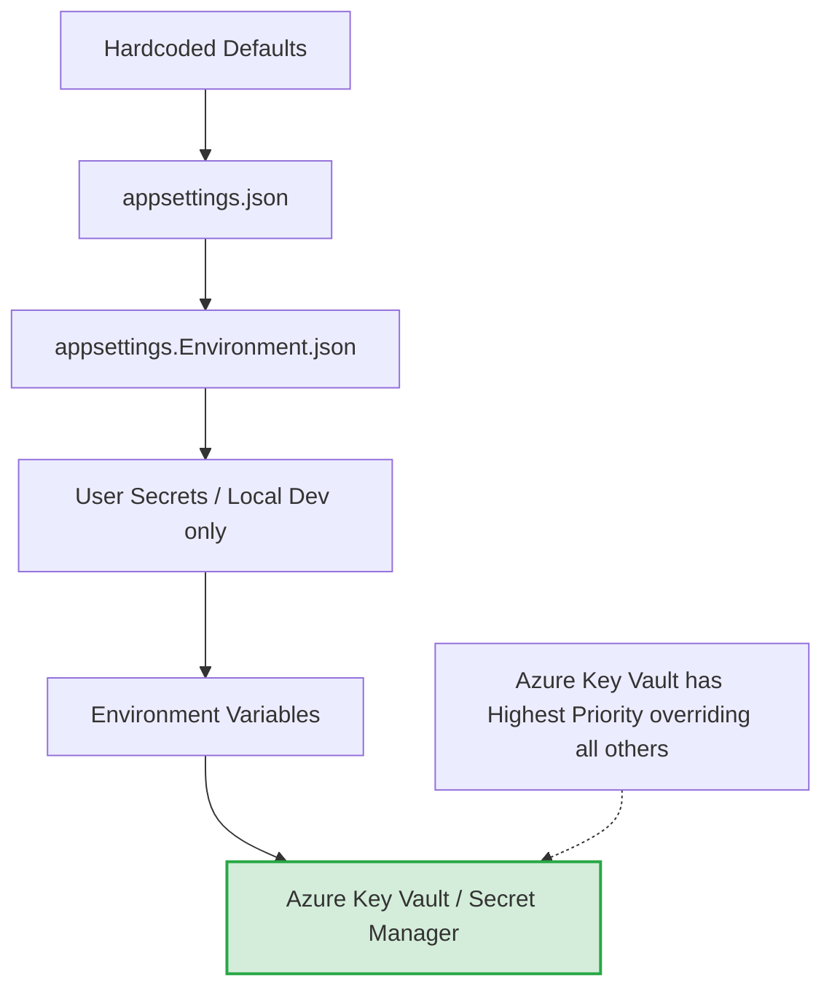
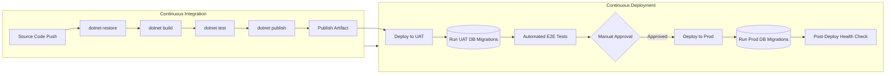

# Enterprise Attendance & Workforce Analytics Platform
## Software Requirements Specification: Deployment Strategy & Guide

---

### 1. Executive Summary

This Deployment Strategy & Guide outlines the end-to-end release management and operations methodology for the Enterprise Attendance & Workforce Analytics Platform. Given that the platform operates as a silent attendance tracking system determining office presence via network telemetry for Microsoft 365, ensuring zero-downtime deployments, strict data isolation, and robust environment segregation is paramount.

This document details the strategies, architectures, and checklists required to successfully deploy the platform across development, testing, staging (UAT), and production environments. It provides prescriptive guidance on database migrations, configuration management, CI/CD pipeline structures, observability, disaster recovery, and post-deployment validation. Adherence to these guidelines guarantees seamless integration with Microsoft Entra ID, Intune, and corporate network infrastructure, ensuring a reliable and resilient attendance tracking capability for all Indian office locations (Chennai, Noida, Hyderabad, Gurugram, Bangalore).

---

### 2. Deployment Architecture Diagram

The deployment architecture defines the progression of code from the developer's workstation through intermediate testing stages, culminating in the production environment.

```mermaid
flowchart TD
    %% Environments
    subgraph DevEnv [Development Environment]
        DevApp[Local Application]
        DevDB[(Local SQLite / SQL Server Express)]
        DevM365([Mock M365 Provider])
    end

    subgraph TestEnv [Testing Environment]
        TestApp[Test Application Server]
        TestDB[(SQL Server Test Database)]
        TestM365([Mock M365 Provider])
    end

    subgraph UATEnv [User Acceptance Testing (UAT)]
        UATApp[UAT Application Server]
        UATDB[(SQL Server UAT Database)]
        UATM365([Live M365 Test Tenant])
    end

    subgraph ProdEnv [Production Environment]
        ProdApp[Production Application Server]
        ProdDB[(SQL Server Production Database)]
        ProdM365([Live M365 Production Tenant])
        ProdNet[Corporate Network Infrastructure]
    end

    %% CI/CD Pipeline
    GitRepo[(Source Control Repository)]
    CIPipeline((CI Pipeline Build & Test))
    CDPipeline((CD Pipeline Release))

    %% Flow
    Developer((Developer)) --> GitRepo
    DevEnv -.-> GitRepo
    GitRepo --> CIPipeline
    CIPipeline --> CDPipeline
    CDPipeline --> TestEnv
    CDPipeline --> UATEnv
    CDPipeline --> ProdEnv
    
    TestApp --> TestDB
    UATApp --> UATDB
    ProdApp --> ProdDB
    
    TestApp -.-> TestM365
    UATApp -.-> UATM365
    ProdApp --> ProdM365
    ProdApp --> ProdNet

    classDef env fill:#f9f9f9,stroke:#333,stroke-width:2px,color:#000;
    classDef prod fill:#ffe6e6,stroke:#cc0000,stroke-width:2px,color:#000;
    class DevEnv,TestEnv,UATEnv env;
    class ProdEnv prod;
```

---

### 3. Environment Strategy

To ensure code stability and operational security, a four-tier environment strategy is employed. The separation ensures that production data is never exposed in lower environments and that integration with Microsoft 365 services is heavily tested before a live rollout.

| Environment | Purpose | Database | M365 Integration | URL Pattern |
|------------|---------|----------|-------------------|-------------|
| Development | Local application development and debugging by engineering teams. | LocalDB / SQLite | Mock Provider / Stub Data | `localhost:5000` / `localhost:5001` |
| Testing | Automated QA testing, integration testing, and initial quality checks. | SQL Server Test | Mock Provider | `test.attendance.ramboll.com` |
| UAT | User Acceptance Testing for HR and administrative stakeholders to validate features. | SQL Server UAT | Live M365 (Test Tenant) | `uat.attendance.ramboll.com` |
| Production | Live enterprise system serving all users and tracking real attendance. | SQL Server Prod | Live M365 (Prod Tenant) | `attendance.ramboll.com` |

#### Environment Governance Rules:
*   **Production Data Isolation**: Data from the Production environment MUST NOT be cloned to UAT or Testing environments without robust data masking and PII sanitization.
*   **M365 Scopes**: The UAT environment relies on a dedicated M365 Test Tenant to prevent test telemetry from polluting actual attendance analytics.
*   **Network Identifiers**: Testing and UAT environments use synthetic network identifiers (dummy SSIDs/Subnets) rather than actual office network configurations to test matching logic safely.

---

### 4. Deployment Options

The platform's container-ready, ASP.NET Core architecture supports multiple hosting modalities. Depending on enterprise infrastructure strategies, three distinct deployment options are evaluated.

#### Option A: Azure App Service + Azure SQL Database (PaaS)
Fully managed Platform-as-a-Service architecture hosted in Microsoft Azure.
*   **Compute**: Azure App Service (Windows or Linux).
*   **Data**: Azure SQL Database.
*   **Secrets**: Azure Key Vault integrated via Managed Identities.

#### Option B: IIS on Windows Server + SQL Server On-Premise (IaaS / On-Prem)
Traditional self-managed infrastructure within the corporate data center.
*   **Compute**: Windows Server VMs running IIS.
*   **Data**: Dedicated SQL Server Enterprise clustered instances.
*   **Secrets**: Windows Certificate Store and encrypted `appsettings`.

#### Option C: Docker Containers (Kubernetes)
Modern, containerized orchestration leveraging microservices principles.
*   **Compute**: Azure Kubernetes Service (AKS) or on-prem Kubernetes cluster.
*   **Data**: SQL Server on containers or external managed database.
*   **Secrets**: Kubernetes Secrets or external Vault integration.

#### Pros/Cons Comparison Table

| Feature | Option A (Azure PaaS) | Option B (IIS On-Prem) | Option C (Kubernetes) |
|---------|-----------------------|-------------------------|------------------------|
| **Scalability** | High (Auto-scaling built-in) | Low/Manual (Requires VM provisioning) | Very High (Horizontal Pod Autoscaling) |
| **Maintenance** | Low (Microsoft patches OS/DB) | High (OS, IIS, SQL Server patching required) | Medium (Control plane managed, nodes/pods need management) |
| **Network Proximity** | Medium (Requires ExpressRoute for local network reads) | High (Physically on the same corporate LAN) | High/Medium (Depends on cluster location) |
| **Deployment Complexity**| Low (Direct Git/ZIP deploy) | Medium (Requires WinRM/WebDeploy agents) | High (Requires Helm, Manifests, Container Registry) |
| **Cost Strategy** | OPEX (Pay-as-you-go) | CAPEX (Hardware already owned) | OPEX/CAPEX mixed |
| **M365 Integration** | Excellent (Native Entra ID synergy) | Good (Requires careful proxy/firewall setup) | Excellent |

**Recommendation**: **Option A (Azure PaaS)** is recommended if the organization leverages cloud-first strategies. Given the system's reliance on Entra ID and Intune (Microsoft Cloud ecosystem), hosting the platform in Azure App Service ensures lowest latency for authentication and directory sync operations. If reading on-premise RADIUS/Network logs requires local proximity, a hybrid **Option B** might be necessary for the ingestion worker.

---

### 5. Pre-Deployment Checklist

Before initiating any deployment to UAT or Production, the following checklist MUST be fully executed and signed off by the Release Manager.

1.  [ ] **Code Freeze**: Enforce code freeze on the target branch (e.g., `release/v1.2`).
2.  [ ] **Pull Requests Merged**: Ensure all approved PRs for the release are merged and tagged.
3.  [ ] **Build Success**: Verify CI pipeline has successfully built the artifact without errors or warnings.
4.  [ ] **Unit & Integration Tests**: Confirm 100% pass rate for automated unit and integration tests.
5.  [ ] **Security Scan**: Run SAST (Static Application Security Testing) tools; ensure 0 critical/high vulnerabilities.
6.  [ ] **Dependency Scan**: Verify no vulnerable third-party NuGet packages are included.
7.  [ ] **Database Migration Review**: Review the generated EF Core migration SQL script (`script.sql`) for destructive operations (e.g., `DROP TABLE`, `DROP COLUMN`).
8.  [ ] **Configuration Verification**: Cross-check `appsettings.Production.json` and Key Vault variables against required release configurations (new feature toggles, updated M365 client secrets).
9.  [ ] **Stakeholder Notification**: Send scheduled downtime/deployment notification to HR, IT, and Management stakeholders.
10. [ ] **Backup Verification**: Ensure recent, verified full backup of the Production database is available.
11. [ ] **Change Request Approval**: Verify the ITIL Change Advisory Board (CAB) has approved the deployment ticket.
12. [ ] **Network Rules Update**: If integrating new offices, ensure firewall/WAF rules are updated to allow new telemetry payloads.

---

### 6. Configuration Management

Configuration is handled hierarchically, prioritizing environment variables and secure key vaults over local file-based settings, aligning with Twelve-Factor App methodologies.

#### Configuration Hierarchy Diagram



#### `appsettings.json` Structure Example

```json
{
  "Logging": {
    "LogLevel": {
      "Default": "Information",
      "Microsoft.AspNetCore": "Warning",
      "EnterpriseAttendance": "Debug"
    }
  },
  "AllowedHosts": "*",
  "ConnectionStrings": {
    "DefaultConnection": "Server=tcp:prod-db.database.windows.net,1433;Initial Catalog=AttendanceDb;Persist Security Info=False;User ID=dbadmin;Password={Placeholder};MultipleActiveResultSets=False;Encrypt=True;TrustServerCertificate=False;Connection Timeout=30;"
  },
  "EntraId": {
    "Instance": "https://login.microsoftonline.com/",
    "Domain": "ramboll.com",
    "TenantId": "00000000-0000-0000-0000-000000000000",
    "ClientId": "11111111-1111-1111-1111-111111111111",
    "ClientSecret": "{Placeholder_Use_KeyVault}",
    "CallbackPath": "/signin-oidc"
  },
  "AttendanceRules": {
    "RequiredDaysPerWeek": 3,
    "MinimumSessionMinutesForFullDay": 240,
    "IndianOffices": ["Chennai", "Noida", "Hyderabad", "Gurugram", "Bangalore"]
  },
  "NetworkIdentifiers": {
    "ValidSSIDs": ["Ramboll-Corp", "Ramboll-Secure"],
    "ValidSubnets": ["10.1.0.0/16", "10.2.0.0/16"]
  },
  "BackgroundJobs": {
    "SyncEntraIdCron": "0 0 2 * * ?",
    "ProcessTelemetryCron": "0 */5 * * * ?"
  }
}
```

#### Environment-Specific Overrides
*   `appsettings.Development.json`: Overrides `LogLevel` to `Trace`, points to local SQLite database, sets `RequiredDaysPerWeek` to 1 for easier testing.
*   `appsettings.Production.json`: Strips out all sensitive keys (leaving `{Placeholder}` values). Actual sensitive data MUST be injected via Environment Variables or Azure Key Vault at runtime.

#### Secrets Management Strategy
*   **Azure Key Vault**: Used for Production and UAT. The Application accesses the vault using a Managed Identity (no credentials stored in code). Retrieves `ConnectionStrings:DefaultConnection` and `EntraId:ClientSecret`.
*   **Environment Variables**: Used in Docker/Kubernetes deployments or local IIS deployments where Key Vault is unavailable.
*   **User Secrets (`dotnet user-secrets`)**: Used strictly by developers on local machines to prevent accidental commits of test passwords.

---

### 7. Database Deployment

Database schema changes are managed strictly through Entity Framework Core Migrations. The database is treated as a foundational tier; changes must be additive and non-breaking whenever possible.

#### EF Core Migration Strategy
1.  **Code-First Approach**: Developers generate migrations using `dotnet ef migrations add <MigrationName>`.
2.  **Idempotent Scripts**: The CI pipeline generates an idempotent SQL script (`dotnet ef migrations script --idempotent`). This script checks if a migration has already been applied before executing.
3.  **Execution**: In UAT and Production, migrations are NOT applied automatically on startup (`context.Database.Migrate()` is forbidden in production). Migrations are applied explicitly as a step in the CI/CD pipeline using a dedicated release task (e.g., executing the SQL script via SQLcmd or Azure DevOps SQL task).

#### Seed Data Deployment
Seed data (e.g., initial RBAC Roles, Office Locations, default Network Identifiers) is handled within EF Core's `OnModelCreating` method using `HasData()`. For dynamic reference data (e.g., a massive initial import of Entra ID departments), a dedicated idempotent Seed Service is executed post-deployment.

#### Backup Before Migration
The CD pipeline must trigger a database backup or verify an automated point-in-time backup exists immediately before executing the EF Core migration script.

#### Rollback Plan (Database)
1.  **Code Rollback**: If a deployment fails, the application code is rolled back to the previous version.
2.  **Database Rollback**: EF Core down-migrations are generally avoided due to data loss risks. Instead:
    *   If the migration was purely additive (new columns/tables), the older application code will simply ignore them.
    *   If the migration was destructive and caused an outage, a Point-In-Time Restore (PITR) of the SQL database is initiated from the pre-deployment backup.

---

### 8. CI/CD Pipeline Design

The Continuous Integration and Continuous Deployment pipeline automates the journey from source code commit to live deployment.



#### GitHub Actions / Azure DevOps Pipeline Example Structure (YAML)
```yaml
stages:
- stage: Build
  jobs:
  - job: CompileAndTest
    steps:
    - task: DotNetCoreCLI@2
      inputs: { command: 'restore' }
    - task: DotNetCoreCLI@2
      inputs: { command: 'build', arguments: '--configuration Release' }
    - task: DotNetCoreCLI@2
      inputs: { command: 'test', arguments: '--no-build --configuration Release' }
    - task: DotNetCoreCLI@2
      inputs: { command: 'publish', arguments: '--configuration Release --output $(Build.ArtifactStagingDirectory)' }
    - task: PublishBuildArtifacts@1
      inputs: { PathtoPublish: '$(Build.ArtifactStagingDirectory)' }

- stage: DeployProduction
  dependsOn: Build
  condition: and(succeeded(), eq(variables['Build.SourceBranch'], 'refs/heads/main'))
  jobs:
  - deployment: DeployProd
    environment: 'Production'
    strategy:
      runOnce:
        deploy:
          steps:
          - task: SqlAzureDacpacDeployment@1
            inputs: { SqlFile: '$(Pipeline.Workspace)/drop/migrate.sql' } # Run Migration
          - task: AzureWebApp@1
            inputs: { package: '$(Pipeline.Workspace)/drop/app.zip' } # Deploy App
```

---

### 9. Post-Deployment Verification Checklist

Upon successful deployment to the Production environment, the operations team must verify system health using the following checklist:

1.  [ ] **Application Health Check Endpoint**: Verify `https://attendance.ramboll.com/health` returns `200 OK` and status `Healthy`.
2.  [ ] **Database Connectivity**: Verify `https://attendance.ramboll.com/health/ready` indicates database connection is successful.
3.  [ ] **M365 Graph API Connectivity**: Trigger a manual background job run for "Entra ID Sync" from the admin dashboard and verify it completes without authorization errors.
4.  [ ] **Authentication Verification**: Log in using a standard Employee test account via Microsoft SSO (Entra ID); ensure successful redirection and session creation.
5.  [ ] **Dashboard Rendering**: Verify the Employee Dashboard loads current week presence statistics without 500 errors.
6.  [ ] **Telemetry Ingestion Test**: Push a mock telemetry packet for a test user from a valid subnet (using Postman or an internal tool) and verify a session is created in the database.
7.  [ ] **Background Job Verification**: Access the Quartz.NET dashboard (or admin panel) and verify scheduled jobs (e.g., Nightly Session Merger, Entra Sync) are in a `Scheduled` state and not `Faulted`.
8.  [ ] **Log Output Verification**: Check Application Insights / Serilog sinks to ensure logs are actively flowing and no massive spikes in `ERROR` level logs are present post-deployment.

---

### 10. Monitoring & Logging

Observability is a critical pillar of this deployment strategy to ensure silent tracking operates flawlessly.

#### Sinks and Instrumentation
*   **Structured Logging**: Application utilizes Serilog. Logs are structured (JSON) to allow querying by `UserId`, `DeviceId`, `CorrelationId`, and `OfficeLocation`.
*   **Storage Sink**: Logs are pushed to Azure Application Insights or an on-premise ELK (Elasticsearch, Logstash, Kibana) stack.
*   **Audit Logging**: Security-related events (login, manual attendance override by manager, role changes) are stored in a dedicated `AuditLogs` SQL table for compliance.

#### Health Check Endpoints
ASP.NET Core Health Checks are exposed:
*   `/health/live`: Checks if the application process is running (used by load balancer).
*   `/health/ready`: Checks if dependencies (Database, Key Vault, Graph API) are reachable. Used by deployment pipelines to confirm the app is ready to serve traffic.

#### Alert Rules (Configured in Azure Monitor / Prometheus)
1.  **High Error Rate**: Alert triggered if HTTP 5xx responses exceed 5% of total traffic over a 5-minute window.
2.  **M365 Sync Failure**: Alert if the daily Entra ID sync job fails consecutively or takes longer than 60 minutes.
3.  **Telemetry Ingestion Drop**: Alert if network telemetry ingestion drops below expected baseline during office hours (indicates potential network monitoring failure or API key rotation issue).
4.  **Database CPU/DTU Spikes**: Alert if database utilization exceeds 85% for more than 10 minutes (prevents locking issues during end-of-day session merging).

---

### 11. Backup & Recovery

Data loss regarding attendance tracking poses compliance and payroll risks (depending on regional policies). A strict backup regimen is enforced.

*   **Database Backup Schedule**:
    *   Full back-ups: Weekly (Sunday 02:00 IST).
    *   Differential back-ups: Daily (02:00 IST).
    *   Transaction Log back-ups: Every 15 minutes.
*   **Application Backup**: The compiled application artifact is stored indefinitely in the Azure DevOps/GitHub package registry for rollback purposes.
*   **Disaster Recovery (DR) Plan**:
    *   **Architecture**: Active-Passive deployment across two geographic regions (e.g., Azure Central India and Azure South India).
    *   **Database Replication**: Geo-replication enabled on the SQL database to the secondary region.
*   **RTO (Recovery Time Objective)**: 4 Hours. The system must be back online within 4 hours of a critical disaster.
*   **RPO (Recovery Point Objective)**: 15 Minutes. In the event of a total failure, no more than 15 minutes of network telemetry data should be lost.

---

### 12. Rollback Strategy

In the event of a catastrophic failure post-deployment (P1 outage, data corruption, severe performance degradation), a swift rollback is executed.

#### Rollback Triggers:
*   Critical functionality completely broken (e.g., SSO Login failing globally).
*   Severe performance degradation impacting the wider corporate network.
*   More than 10% of users experiencing 500 errors.

#### Rollback Execution Steps:
1.  **Declare Incident**: Open a Major Incident ticket and halt further deployment activities.
2.  **Re-deploy Previous Artifact**: Using the CD pipeline, select the previously successful release tag (e.g., `v1.1`) and trigger a redeployment to the Production App Service.
3.  **Assess Database State**:
    *   If the failed deployment included *no* database migrations, the code rollback resolves the issue.
    *   If the failed deployment included *additive* database migrations, the code rollback resolves the issue (old code ignores new columns).
    *   If the failed deployment included *destructive or corrupting* database changes, initiate a Point-In-Time database restore to 5 minutes prior to the deployment window.
4.  **Post-Rollback Verification**: Re-run the Post-Deployment Verification Checklist against the rolled-back version.
5.  **Root Cause Analysis (RCA)**: Investigate the failure in the UAT or Testing environment to understand why the pipeline did not catch the issue.

---

### 13. SSL/TLS Certificate Management

Security of the payload and authentication tokens requires strictly enforced HTTPS.

*   **Policy**: TLS 1.2 is the minimum supported version. TLS 1.0/1.1 are explicitly disabled at the App Service / Load Balancer level.
*   **Certificate Provisioning**:
    *   Option A (Azure): App Service Managed Certificates are used for automated provisioning and renewal.
    *   Option B (On-Prem): Wildcard certificate for `*.attendance.ramboll.com` managed via corporate PKI (Public Key Infrastructure) or Let's Encrypt.
*   **Renewal**: Certificates are configured for auto-renewal 30 days prior to expiration.
*   **HSTS**: HTTP Strict Transport Security is enabled in the ASP.NET Core middleware (`app.UseHsts()`) with a max-age of 365 days.

---

### 14. Edge Cases, Assumptions, Risks, Dependencies

#### Edge Cases
*   **Mid-Deployment Traffic**: End-users actively connecting to the network during a deployment might generate telemetry. The ingest API endpoints must remain highly available, potentially leveraging slot swapping (Blue/Green deployment) to ensure zero dropped packets.
*   **Time Zone Discrepancies**: All backend storage and timestamp comparisons are strictly UTC. Conversion to IST (UTC+05:30) happens only at the presentation layer to prevent deployment servers located in different time zones from corrupting session logic.

#### Assumptions
*   The organization possesses a robust CI/CD platform (Azure DevOps or GitHub Enterprise).
*   The networking team can reliably output network connection logs (Radius/Syslog) to the ingestion endpoints provided by this application.
*   A dedicated M365 Test Tenant exists and mimics the production Entra ID schema for UAT.

#### Risks
*   **Configuration Drift**: Changes made manually in the Azure Portal / IIS Manager deviating from Source Control. *Mitigation: Restrict production portal access to read-only; mandate Infrastructure-as-Code (Terraform/Bicep).*
*   **Secret Expiration**: Entra ID Client Secrets expire (typically 1-2 years). If not tracked, SSO will suddenly fail. *Mitigation: Implement Key Vault alerting for secrets nearing expiration.*

#### Dependencies
*   **M365 Availability**: The deployment relies entirely on Microsoft Entra ID for authentication. An M365 outage blocks user login.
*   **Corporate Network Health**: Telemetry ingestion relies on the corporate LAN/WAN being operational. Network outages will result in missing attendance data for that period.
*   **SQL Server Availability**: Hard dependency on relational storage for tracking state and attendance calculation rules.

---
*End of Document*
