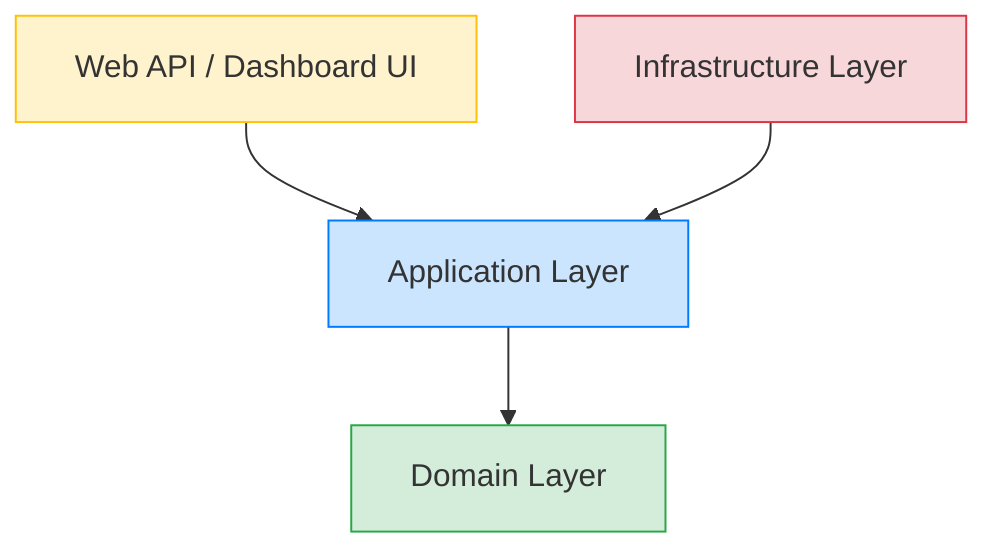

# Enterprise Attendance & Workforce Analytics Platform

## Coding Standards & Development Guidelines

### 1. Executive Summary

This document establishes the official coding standards, architectural conventions, and development guidelines for the Enterprise Attendance & Workforce Analytics Platform. Adherence to these standards is mandatory for all development team members. The primary goals are to ensure consistent code quality, improve maintainability, reduce technical debt, and facilitate seamless collaboration across distributed teams. 

This guide covers C# coding conventions, Clean Architecture structural rules, Entity Framework Core practices, API design, testing methodologies, and security requirements.

---

### 2. C# Coding Conventions

#### 2.1. Naming Conventions

Consistent naming is critical for readability. We strictly follow Microsoft's C# naming conventions.

| Element | Convention | Example | Notes |
|---------|------------|---------|-------|
| Classes/Records | PascalCase | `EmployeeService`, `DeviceTelemetry` | Use nouns. |
| Interfaces | PascalCase | `IAttendanceRepository` | Always prefix with 'I'. |
| Methods | PascalCase | `CalculateDailyAttendanceAsync` | Use verbs. |
| Properties | PascalCase | `FirstName`, `LastSeenAt` | |
| Local Variables | camelCase | `dailySessions`, `employeeId` | |
| Method Parameters | camelCase | `startDate`, `cancellationToken` | |
| Private Fields | _camelCase | `_dbContext`, `_logger` | Always prefix with underscore. |
| Constants | PascalCase | `DefaultGracePeriodMinutes` | Do NOT use ALL_CAPS. |

**Example:**
```csharp
public class EmployeeService : IEmployeeService
{
    private readonly IEmployeeRepository _employeeRepository;
    private readonly ILogger<EmployeeService> _logger;

    public EmployeeService(IEmployeeRepository employeeRepository, ILogger<EmployeeService> logger)
    {
        _employeeRepository = employeeRepository;
        _logger = logger;
    }

    public async Task<EmployeeDto> GetEmployeeByIdAsync(Guid employeeId, CancellationToken cancellationToken)
    {
        var employee = await _employeeRepository.GetByIdAsync(employeeId, cancellationToken);
        return MapToDto(employee);
    }
}
```

#### 2.2. Async/Await Patterns

The application is highly I/O bound. Proper asynchronous programming is essential.

- **Always use `async`/`await`** for I/O bound operations (Database, API calls, File System).
- **Append `Async` suffix** to all asynchronous method names (e.g., `SaveDataAsync`).
- **Always pass `CancellationToken`** to async methods and propagate it down to the lowest level.
- **Never use `.Result` or `.Wait()`**. This causes thread pool starvation and deadlocks. Use `await` all the way up.
- **Avoid `async void`** except for event handlers. Return `Task` instead.

#### 2.3. LINQ Usage

- Prefer method syntax (e.g., `.Where().Select()`) over query syntax for consistency.
- Avoid multiple enumerations. Use `.ToList()` or `.ToArray()` if the sequence will be iterated multiple times.
- Be mindful of deferred execution. Execute queries as late as possible, especially in EF Core, to allow SQL translation.

#### 2.4. Null Handling

- Enable C# 8.0+ Nullable Reference Types (`<Nullable>enable</Nullable>` in `.csproj`).
- Use the null-coalescing operator (`??`) and null-conditional operator (`?.`) where appropriate.
- Explicitly check for nulls at system boundaries (Controllers, Message Consumers) using pattern matching or Guard clauses.

```csharp
// Good
ArgumentNullException.ThrowIfNull(request);

// Also good
if (user is null)
{
    throw new NotFoundException(nameof(User), userId);
}
```

---

### 3. Project Structure Conventions

We utilize **Clean Architecture**. The dependency rule strictly states that inner layers must not depend on outer layers.



#### 3.1. Layer Rules

1.  **Domain Layer (`EnterpriseAttendance.Domain`)**: 
    - Contains Entities, Value Objects, Enums, Domain Exceptions, and Domain Interfaces (e.g., `IAttendanceRepository`).
    - **Zero dependencies** on any external frameworks (No EF Core, No ASP.NET Core).
2.  **Application Layer (`EnterpriseAttendance.Application`)**:
    - Contains Use Cases (CQRS Handlers), DTOs, Mapping profiles, and Application Interfaces.
    - Depends ONLY on the Domain layer.
3.  **Infrastructure Layer (`EnterpriseAttendance.Infrastructure`)**:
    - Contains EF Core DbContext, Repository implementations, external API clients (Graph API, Intune), and File I/O.
    - Depends on Application and Domain layers.
4.  **Presentation Layer (`EnterpriseAttendance.Api`)**:
    - Contains Controllers, Middlewares, Program.cs (DI Setup).
    - Depends on Application (and Infrastructure only for DI registration).

---

### 4. Entity Framework Core Conventions

#### 4.1. Entity Configuration

- Use `IEntityTypeConfiguration<TEntity>` classes (Fluent API) instead of Data Annotations for entity configuration. Keep entities clean.
- Place configurations in the Infrastructure layer.

```csharp
public class EmployeeConfiguration : IEntityTypeConfiguration<Employee>
{
    public void Configure(EntityTypeBuilder<Employee> builder)
    {
        builder.ToTable("Employees");
        builder.HasKey(e => e.Id);
        builder.Property(e => e.Email).IsRequired().HasMaxLength(255);
        builder.HasIndex(e => e.Email).IsUnique();
    }
}
```

#### 4.2. Migration Naming

- Use descriptive verbs and nouns for migrations: `AddEmployeeTable`, `AlterSessionAddConfidenceScore`.
- Never edit a migration that has been applied to a shared environment. Create a new migration instead.

#### 4.3. DbContext Usage

- Do not inject `DbContext` directly into Controllers or Application Services. Use Repositories.
- Enable Query Splitting for large `Include` chains (`.AsSplitQuery()`).
- Use `.AsNoTracking()` for read-only queries to improve performance.

---

### 5. API Controller Conventions

#### 5.1. Route Naming

- Use RESTful route conventions. Nouns, pluralized, kebab-case.
- `/api/v1/employees`
- `/api/v1/attendance-sessions`
- `/api/v1/employees/{id}/attendance-summary`

#### 5.2. Response Format

Always return consistent response wrappers or use standard HTTP status codes correctly.
- `200 OK`: Successful read/update.
- `201 Created`: Successful creation (include Location header).
- `204 No Content`: Successful deletion.
- `400 Bad Request`: Validation failure.
- `401 Unauthorized`: Missing/invalid token.
- `403 Forbidden`: Insufficient permissions.
- `404 Not Found`: Resource does not exist.

#### 5.3. Error Handling

- Controllers should NOT have `try-catch` blocks.
- Use a Global Exception Handler Middleware to catch domain exceptions and translate them into appropriate HTTP responses (e.g., ProblemDetails format).

#### 5.4. Validation

- Use FluentValidation in the Application Layer (e.g., in CQRS command pipeline).
- Do not put validation logic in controllers.

---

### 6. Service Layer Conventions

#### 6.1. Interface-First Design

- Every service must have an interface (e.g., `ITelemetryProcessor` -> `TelemetryProcessor`).
- Interfaces reside in the Application or Domain layer; implementations reside in Infrastructure.

#### 6.2. DI Registration

- Register services using extension methods in the respective layers.
- Example: `services.AddApplicationServices()`, `services.AddInfrastructureServices(configuration)`.
- Use correct lifetimes:
  - `Scoped` for DbContext and Repositories.
  - `Transient` for lightweight stateless services.
  - `Singleton` for caches or single-instance background workers.

---

### 7. Repository Pattern Conventions

#### 7.1. Generic vs Specific

- A generic repository (`IRepository<T>`) is permitted for basic CRUD.
- Complex queries must be in specific repositories (e.g., `IAttendanceRepository.GetOverlappingSessionsAsync(...)`).

#### 7.2. Unit of Work

- Repositories should NOT call `SaveChanges()`.
- Use a Unit of Work pattern (or coordinate `SaveChanges` via a CQRS Command Handler) to ensure transactional consistency across multiple repository operations.

---

### 8. Logging Standards

#### 8.1. Structured Logging

- Use Serilog for structured logging.
- Log semantic properties, not just strings.
  - **Bad**: `_logger.LogInformation($"Processing user {userId}");`
  - **Good**: `_logger.LogInformation("Processing user {UserId}", userId);`

#### 8.2. Log Levels

- **Trace/Debug**: Verbose details for local debugging (not enabled in prod).
- **Information**: Business process milestones (e.g., "Daily attendance calculation started").
- **Warning**: Recoverable errors, retries, or suspicious activity (e.g., "Intune API rate limited, retrying...").
- **Error**: Unhandled exceptions or business rule violations preventing an operation.
- **Fatal**: Application crash, database down.

#### 8.3. PII Protection

- **CRITICAL**: Never log PII (Personally Identifiable Information) such as full names, exact locations, plaintext passwords, or auth tokens.
- Use Hash values or internal GUIDs for user identification in logs.

---

### 9. Exception Handling Standards

#### 9.1. Custom Exceptions

- Create specific domain exceptions: `NetworkNotFoundException`, `InvalidSessionStateException`.
- Inherit from a base application exception class.

#### 9.2. Flow Control

- **Do NOT use exceptions for normal control flow.** Return Result objects (e.g., `Result<T>`) for expected failure cases (like validation). Throw exceptions only for truly exceptional situations.

---

### 10. Testing Standards

#### 10.1. Frameworks

- xUnit for the test framework.
- Moq or NSubstitute for mocking.
- FluentAssertions for assertions.

#### 10.2. Naming Convention

Use `Method_Scenario_ExpectedResult`.
Example: `CalculateHours_WithOverlappingSessions_MergesCorrectly()`

#### 10.3. Arrange-Act-Assert

Strictly organize tests using AAA comments.

```csharp
[Fact]
public async Task GetEmployee_WhenExists_ReturnsEmployeeDto()
{
    // Arrange
    var employeeId = Guid.NewGuid();
    _mockRepo.Setup(r => r.GetByIdAsync(employeeId, default))
             .ReturnsAsync(new Employee { Id = employeeId });

    // Act
    var result = await _sut.GetEmployeeByIdAsync(employeeId, default);

    // Assert
    result.Should().NotBeNull();
    result.Id.Should().Be(employeeId);
}
```

---

### 11. Security Coding Standards

- **No Hardcoded Secrets**: Use Azure Key Vault, Environment Variables, or User Secrets. Never commit passwords or connection strings to source control.
- **Input Validation**: Validate all inputs at the API boundary using FluentValidation.
- **Output Encoding**: If rendering HTML, ensure data is HTML encoded to prevent XSS (Blazor handles this automatically by default).
- **Authorization**: Use policy-based authorization (`[Authorize(Policy = "RequireManagerRole")]`), not just simple role checks.

---

### 12. Code Review Checklist

Before approving a PR, reviewers must check:
1. Does the code compile without warnings?
2. Are tests provided and passing?
3. Does it follow Clean Architecture dependency rules?
4. Are async/await patterns used correctly (no `.Result`)?
5. Are secrets externalized?
6. Is structured logging utilized for new workflows?
7. Is exception handling robust?
8. Are naming conventions followed?

---

### 13. Git Branching Strategy

We follow a GitFlow-inspired branching strategy.

- **`main`**: Represents production-ready code. Commits here trigger prod deployments.
- **`develop`**: Integration branch for features. Triggers staging/dev deployments.
- **`feature/<name>`**: Branched from `develop`. For new features. Must be squashed and merged back to `develop` via PR.
- **`release/vX.Y.Z`**: Branched from `develop` when preparing a release. Merged to `main` and `develop`.
- **`hotfix/<name>`**: Branched from `main`. For emergency prod fixes. Merged to `main` and `develop`.

*All PRs require at least 1 approval and passing CI pipelines before merging.*
