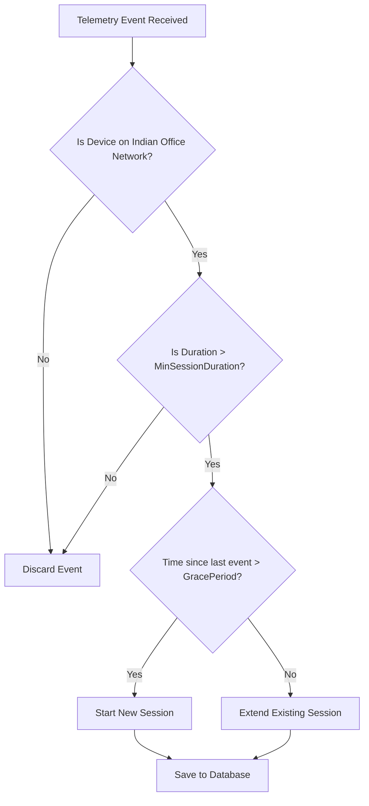

# Enterprise Attendance & Workforce Analytics Platform
## Configuration Guide (SRS)

## 1. Executive Summary

This Configuration Guide provides comprehensive instructions for system administrators, DevOps engineers, and deployment specialists to configure the Enterprise Attendance & Workforce Analytics Platform. The platform calculates Office Presence for Indian office locations by correlating Microsoft 365 (Entra ID, Intune, Defender) and network telemetry.

This document details exactly how to configure the system, where to enter Microsoft API credentials, how to set up office network identifiers (SSIDs, Subnets, VLANs), and how to tune all operational parameters such as attendance engine rules, database connections, and email integrations. **Crucially, this guide contains explicit instructions on transitioning the system from a localized Mock Mode to a Live Production Mode connecting directly to the Microsoft 365 ecosystem.**

## 2. Purpose

The purpose of this document is to ensure that the Enterprise Attendance platform can be securely, accurately, and reliably deployed and configured in any environment (development, staging, production). It serves as the definitive reference for all configuration parameters, explaining their purpose, acceptable values, and interdependencies.

## 3. Scope

The scope of this Configuration Guide covers:
- Core application configuration (`appsettings.json` and environment variables).
- Microsoft 365 API integration credentials.
- Office network classification rules (SSIDs, Subnets, etc.).
- Attendance engine business rule parameters.
- Database, logging, security, and email configurations.
- Step-by-step transition from Mock Mode to Live M365 Mode.

This guide focuses solely on the configuration of the backend services, background workers, and administrative UI components.

## 4. Actors/Stakeholders

| Role | Responsibility regarding Configuration |
|------|--------------------------------------|
| **System Administrator** | Manages application deployment, environment variables, database connections, and applies production configurations. |
| **M365/Security Admin** | Provisions Azure App Registrations, generates API credentials (Client ID, Secret), and assigns Graph API permissions. |
| **HR / Business Admin** | Tunes business rules via the Admin Dashboard (e.g., Target Office Days, Grace Periods). |
| **Network Administrator** | Provides the exact network identifiers (SSIDs, Subnets, VLANs, IP Ranges) for Indian office locations. |

## 5. Configuration File Structure

The application utilizes the standard ASP.NET Core configuration hierarchy. Settings are resolved in the following order (last one wins):

1. `appsettings.json` (Base configuration, checked into source control without secrets).
2. `appsettings.Development.json` (Local development overrides, usually `.gitignore`d).
3. `appsettings.Production.json` (Production deployment overrides).
4. **Environment Variables** (Used extensively in Docker/Kubernetes/Azure App Service deployments).
5. **Azure Key Vault** (Optional, highly recommended for production secrets like Client Secrets and DB connection strings).
6. Command-line arguments.

### 5.1 Environment Variable Mapping
Nested JSON configurations can be overridden using environment variables by replacing the colon (`:`) with a double underscore (`__`).
*Example*: `AzureAd:ClientSecret` becomes `AzureAd__ClientSecret`.

## 6. COMPLETE `appsettings.json` Reference

Below is the complete base configuration file required for the application. Administrators should use this structure to configure their specific environments.

```json
{
  "ConnectionStrings": {
    "DefaultConnection": "Server=localhost;Database=EnterpriseAttendance;Trusted_Connection=true;TrustServerCertificate=true;"
  },
  "AzureAd": {
    "TenantId": "<< PASTE YOUR AZURE TENANT ID HERE >>",
    "ClientId": "<< PASTE YOUR APP REGISTRATION CLIENT ID HERE >>",
    "ClientSecret": "<< PASTE YOUR CLIENT SECRET VALUE HERE >>",
    "Instance": "https://login.microsoftonline.com/",
    "GraphBaseUrl": "https://graph.microsoft.com/v1.0"
  },
  "TelemetrySettings": {
    "UseMockTelemetry": true,
    "SyncIntervalMinutes": 15,
    "UserSyncIntervalHours": 6,
    "DeviceSyncIntervalHours": 4,
    "BatchSize": 1000
  },
  "AttendanceEngine": {
    "GracePeriodMinutes": 30,
    "MinSessionDurationMinutes": 5,
    "EndOfDayHour": 23,
    "EndOfDayMinute": 59,
    "WorkdayStartHour": 9,
    "WorkdayStartMinute": 30,
    "WorkdayEndHour": 18,
    "WorkdayEndMinute": 30,
    "TargetOfficeDaysPerWeek": 3,
    "RequireCompliantDevice": true,
    "MergeOverlappingSessions": true
  },
  "IndianOfficeFilter": {
    "Enabled": true,
    "AllowedCountry": "India",
    "AllowedOfficeLocations": [
      "Chennai",
      "Noida",
      "Hyderabad",
      "Gurugram",
      "Bangalore"
    ]
  },
  "Email": {
    "Provider": "MockInbox",
    "SmtpHost": "",
    "SmtpPort": 587,
    "SmtpUsername": "",
    "SmtpPassword": "",
    "SenderEmail": "attendance@ramboll.com",
    "SenderName": "Ramboll Attendance System",
    "UseMicrosoftGraphMail": false
  },
  "Serilog": {
    "MinimumLevel": {
      "Default": "Information",
      "Override": {
        "Microsoft": "Warning",
        "System": "Warning",
        "Microsoft.EntityFrameworkCore.Database.Command": "Warning"
      }
    },
    "WriteTo": [
      {
        "Name": "Console"
      },
      {
        "Name": "File",
        "Args": {
          "path": "logs/enterprise-attendance-.txt",
          "rollingInterval": "Day",
          "retainedFileCountLimit": 30
        }
      }
    ],
    "Enrich": ["FromLogContext", "WithMachineName", "WithThreadId"]
  },
  "Jwt": {
    "Issuer": "EnterpriseAttendance",
    "Audience": "EnterpriseAttendanceClient",
    "SecretKey": "<< GENERATE A 256-BIT SECRET KEY >>",
    "ExpirationMinutes": 60,
    "RefreshTokenExpirationDays": 7
  },
  "Cors": {
    "AllowedOrigins": [
      "http://localhost:3000",
      "https://attendance.ramboll.com"
    ]
  }
}
```

## 7. Step-by-Step: How to Switch from Mock Mode to Live M365 Mode

By default, the application may be configured to run in Mock Mode for local development and testing without requiring real M365 connectivity. To transition the system to Live Production Mode and track real attendance, follow these exact steps:

### **Step 1: Locate the Configuration File**
Open `appsettings.json` (or `appsettings.Production.json` if deploying to a server) in your preferred text editor.

### **Step 2: Disable Mock Telemetry**
Navigate to the `"TelemetrySettings"` section.
Change `"UseMockTelemetry": true` to `"UseMockTelemetry": false`.
```json
"TelemetrySettings": {
  "UseMockTelemetry": false,
  ...
}
```

### **Step 3: Paste Tenant ID**
Navigate to the `"AzureAd"` section.
Obtain your Azure AD Tenant ID from the Azure Portal (Azure Active Directory > Overview).
Paste it into `"TenantId"`.
```json
"AzureAd": {
  "TenantId": "d38a5b...-YOUR-TENANT-ID",
  ...
}
```

### **Step 4: Paste Client ID**
Obtain the Client ID (Application ID) from your App Registration in the Azure Portal.
Paste it into `"ClientId"`.
```json
"AzureAd": {
  "ClientId": "8b5a1c...-YOUR-CLIENT-ID",
  ...
}
```

### **Step 5: Paste Client Secret**
Create a new Client Secret in the App Registration (Certificates & secrets).
Copy the **Value** (not the Secret ID). **THIS IS CRITICAL**.
Paste it into `"ClientSecret"`.
```json
"AzureAd": {
  "ClientSecret": "YOUR_SECRET_VALUE_COPIED_FROM_AZURE",
  ...
}
```

### **Step 6: Configure Email Integration (Optional but recommended)**
To send actual notification emails, configure the `"Email"` section.
Set `"Provider": "Smtp"` and fill in the SMTP details, OR set `"UseMicrosoftGraphMail": true` if you have granted `Mail.Send` Application permissions to your App Registration.

### **Step 7: Restart the Application**
Save the configuration file.
Restart the IIS Application Pool, Docker container, or Azure App Service to apply the new settings.

### **Step 8: Verify Live Connectivity**
1. Log in to the Enterprise Attendance Admin Dashboard.
2. Navigate to the **System Health** panel.
3. Verify that the "M365 Graph API Connection" status is **Green / Connected**.
4. Trigger a manual sync from the Dashboard to pull live data.

---

## 8. Office Network Configuration Guide

The core logic of the attendance system relies on accurately mapping network telemetry to physical office locations.

### 8.1 Adding an Office Location
Offices can be added via the database seed data or the Admin Dashboard.
Only locations in the Indian offices list (Chennai, Noida, Hyderabad, Gurugram, Bangalore) will be actively processed for attendance.

### 8.2 Network Identifiers Configuration
For each office, administrators must define the specific network footprints. This is done via the **Network Configuration** tab in the Admin Dashboard.

| Identifier Type | Description | Example |
|-----------------|-------------|---------|
| **SSID** | Wi-Fi network name broadcasted in the office. | `RAMBOLL_CORP_WIFI`, `RAM-BLR-5G` |
| **BSSID** | MAC address of the wireless access points (Optional, for high precision). | `00:1A:2B:3C:4D:5E` |
| **Subnet / CIDR**| IP range assigned to the office LAN or Wi-Fi. | `10.45.10.0/24` |
| **VLAN ID** | Virtual LAN tag used for corporate devices. | `VLAN-100`, `205` |
| **Public IP** | The egress IP address of the office router. | `203.0.113.45` |

### 8.3 Example Configurations

**Ramboll Chennai:**
- Location Name: `Chennai`
- Allowed SSIDs: `RAM-CHE-CORP`, `RAM-CHE-GUEST` (Note: Only devices enrolled in Intune connecting to these SSIDs count).
- Subnets: `10.21.0.0/16`, `192.168.100.0/24`

**Ramboll Gurugram:**
- Location Name: `Gurugram`
- Allowed SSIDs: `RAM-GUR-WIFI`
- Subnets: `10.55.0.0/16`

### 8.4 Testing Network Classification
Administrators can use the "Test Classification" utility in the Admin Dashboard:
1. Enter a mock IP Address (e.g., `10.21.5.50`).
2. Enter a mock SSID (e.g., `RAM-CHE-CORP`).
3. Click "Evaluate".
4. The system will output which Office (if any) this telemetry maps to.

---

## 9. Business Rules Configuration

These parameters in the `AttendanceEngine` section of `appsettings.json` (or database overrides) dictate how attendance is calculated.

- **`GracePeriodMinutes` (Default: 30)**: The number of minutes a device can be disconnected from the network before the session is considered "closed". E.g., walking to the cafeteria and dropping Wi-Fi for 20 minutes will keep the session active.
- **`MinSessionDurationMinutes` (Default: 5)**: Network connections shorter than this duration are discarded as blips/drive-bys.
- **`EndOfDayHour` / `EndOfDayMinute` (Default: 23:59)**: The time at which all active sessions are forcibly closed and aggregated into the daily attendance record.
- **`TargetOfficeDaysPerWeek` (Default: 3)**: The compliance target for hybrid work.
- **`RequireCompliantDevice` (Default: true)**: If true, Intune must report the device as "Compliant". If false, any Entra-joined device on the network counts.



---

## 10. Email Configuration

The system sends notifications (e.g., weekly summaries, non-compliance alerts) to managers and employees.

### 10.1 SMTP Configuration
If using standard SMTP (e.g., SendGrid, Mailgun, or corporate SMTP relay):
```json
"Email": {
  "Provider": "Smtp",
  "SmtpHost": "smtp.office365.com",
  "SmtpPort": 587,
  "SmtpUsername": "alerts@ramboll.com",
  "SmtpPassword": "your-smtp-password",
  "UseMicrosoftGraphMail": false
}
```

### 10.2 Microsoft Graph Mail Configuration
Recommended approach for enterprise integration without managing SMTP passwords. Uses the App Registration credentials.
```json
"Email": {
  "Provider": "Graph",
  "UseMicrosoftGraphMail": true,
  "SenderEmail": "no-reply-attendance@ramboll.com"
}
```
*Requirement:* The App Registration must have `Mail.Send` Application permission in Azure AD.

---

## 11. Database Configuration

The application uses Entity Framework Core with SQL Server.

### Connection String Format
In `appsettings.json`, under `ConnectionStrings:DefaultConnection`.

- **Local Development (LocalDB):**
  `"Server=(localdb)\\mssqllocaldb;Database=EnterpriseAttendance;Trusted_Connection=True;MultipleActiveResultSets=true"`
- **SQL Server / Azure SQL:**
  `"Server=tcp:your-server.database.windows.net,1433;Initial Catalog=EnterpriseAttendance;Persist Security Info=False;User ID=sqladmin;Password=YourPassword;MultipleActiveResultSets=False;Encrypt=True;TrustServerCertificate=False;Connection Timeout=30;"`

### Migrations
Database schema is managed via EF Core Migrations. The system can be configured to auto-apply migrations on startup (recommended for Dev, not recommended for Prod).
```bash
dotnet ef database update
```

---

## 12. Logging Configuration

The system uses Serilog for structured logging.

### 12.1 Sinks
By default, logs are written to:
1. **Console**: For real-time monitoring in Docker/stdout.
2. **File**: Rolling daily text files in the `logs/` directory.

### 12.2 Log Levels
Configure the `"MinimumLevel"` in the `"Serilog"` section.
- **Development**: `"Information"` (or `"Debug"`)
- **Production**: `"Warning"` (to reduce I/O), with overrides for critical system components to `"Information"`.

### 12.3 Advanced Sinks (e.g., Application Insights)
To send logs to Azure Application Insights, add the sink to the Serilog configuration and provide the Instrumentation Key via environment variable `APPINSIGHTS_INSTRUMENTATIONKEY`.

---

## 13. Environment Variable Overrides

For secure deployments (Docker, Kubernetes, Azure App Service), never commit secrets to `appsettings.json`. Use environment variables instead.

| JSON Path | Environment Variable | Purpose |
|-----------|----------------------|---------|
| `AzureAd:ClientSecret` | `AzureAd__ClientSecret` | M365 API Authentication |
| `Jwt:SecretKey` | `Jwt__SecretKey` | Securing API Endpoints |
| `ConnectionStrings:DefaultConnection`| `ConnectionStrings__DefaultConnection` | Database Access |
| `Email:SmtpPassword` | `Email__SmtpPassword` | SMTP Authentication |
| `TelemetrySettings:UseMockTelemetry` | `TelemetrySettings__UseMockTelemetry` | Toggle Live Mode |

*Example Docker run command:*
```bash
docker run -e "AzureAd__ClientSecret=YOUR_SECRET" -e "TelemetrySettings__UseMockTelemetry=false" -p 8080:80 enterprise-attendance
```

---

## 14. Security Configuration

### 14.1 JWT Authentication
The backend API is secured using JSON Web Tokens (JWT) for communication with the frontend UI.
- **`SecretKey`**: MUST be at least 256-bits (32 characters). Generate a secure random string for production.
- **`ExpirationMinutes`**: Keep short (e.g., 60 minutes) for security.
- **`RefreshTokenExpirationDays`**: Controls how long a user stays logged in without re-authenticating.

### 14.2 HTTPS and Certificates
The platform must only be accessed over HTTPS.
Ensure that the reverse proxy (IIS, Nginx, or Azure Front Door) is configured with a valid SSL/TLS certificate. The ASP.NET Core application will enforce HTTPS redirection.

### 14.3 CORS (Cross-Origin Resource Sharing)
Ensure `Cors:AllowedOrigins` contains the exact URLs where the frontend is hosted to prevent unauthorized cross-origin requests.

---

## 15. Troubleshooting Guide

### Common Configuration Errors

| Symptom | Cause | Resolution |
|---------|-------|------------|
| System Health shows "M365 Graph API Error: Unauthorized (401)" | Incorrect Tenant ID, Client ID, or Client Secret. | Verify credentials in `appsettings.json` against Azure Portal. Ensure secret is the **Value**, not the ID. |
| System Health shows "M365 Graph API Error: Forbidden (403)" | Missing API Permissions. | Grant Admin Consent for the required Application permissions in Azure AD. |
| Database connection fails on startup | Invalid Connection String or firewall blocking port 1433. | Check `ConnectionStrings__DefaultConnection`. Verify SQL Server firewall allows the app's IP. |
| Attendance records are not generating | System is in Mock Mode OR Indian Office Filter is misconfigured. | Set `UseMockTelemetry` to `false`. Verify network identifiers map correctly to Indian locations. |
| Users cannot log in to Dashboard | Invalid JWT configuration or CORS issue. | Check `Jwt:SecretKey` length. Verify `Cors:AllowedOrigins` includes the frontend URL. |

---

## 16. Configuration Validation

On application startup, a background service (`ConfigurationValidationService`) verifies the integrity of the settings.

If critical configurations are missing or invalid, the application will **fail to start** (fail-fast) and write a critical error to the event log/console.

Validations include:
- `AzureAd` fields cannot be null/empty if `UseMockTelemetry` is false.
- `Jwt:SecretKey` must be at least 32 characters.
- `TargetOfficeDaysPerWeek` must be between 1 and 7.
- `ConnectionStrings:DefaultConnection` cannot be empty.

---

## 17. Assumptions

- Administrators have access to the Azure Portal to manage App Registrations.
- Network administrators can provide accurate and up-to-date SSIDs, subnets, and VLANs.
- The hosting environment supports environment variables for secret injection.
- A SQL Server instance is provisioned and accessible.

## 18. Future Enhancements

- Integration with Azure Key Vault for direct, native secret management without environment variables.
- Dynamic reloading of `AttendanceEngine` settings without requiring an application restart (using `IOptionsSnapshot`).
- GUI-based setup wizard for initial deployment.

## 19. Acceptance Criteria

- [ ] All configuration parameters are documented with descriptions and default values.
- [ ] Explicit instructions for transitioning from Mock to Live mode are provided.
- [ ] Environment variable mapping is clearly explained.
- [ ] Office network configuration logic is detailed with examples.
- [ ] Security requirements (secrets, JWT, HTTPS) are specified.

## 20. Risks

- **Misconfiguration of Credentials**: Pasting the Secret ID instead of the Secret Value is a common mistake that will prevent M365 integration.
- **Inaccurate Network Data**: If network admins provide incorrect subnets, attendance will not be tracked, leading to false non-compliance reports.
- **Exposure of Secrets**: Checking `appsettings.Production.json` into source control with real secrets will cause a security breach.

## 21. Dependencies

- Microsoft Entra ID (Azure AD) for Application Registration.
- Entity Framework Core for Database schema management.
- Serilog for structured logging.

## 22. References

- [Microsoft Graph API Documentation](https://learn.microsoft.com/en-us/graph/)
- [ASP.NET Core Configuration](https://learn.microsoft.com/en-us/aspnet/core/fundamentals/configuration/)
- [Serilog Configuration](https://github.com/serilog/serilog/wiki/Configuration-Basics)
- Project Architecture Document (refer to local doc).
